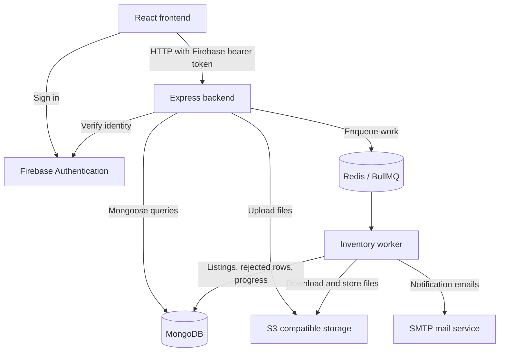

**MotorX: codebase walkthrough, from startup to tests**

This explains the local working tree at `D:\MotorX\MotorX`, inspected on 2026-09-28. All paths below are relative to that repository root. It describes code and configured automation, not a verification that a deployed site or GitHub workflow is currently healthy. The preceding task's uncommitted admin collection/account changes are included; their verification was interrupted.

Read this document for the architecture and important execution paths. Use [CODEBASE_FILE_FUNCTION_INDEX.md](CODEBASE_FILE_FUNCTION_INDEX.md) for every indexed source file, named function/component, parameters, leading explanation comments, direct named calls, route registrations, and declared test cases. That companion covers 314 TypeScript/TSX/MJS files and 819 named functions/methods/components, including local helpers. Anonymous event/effect callbacks remain inside their containing functions. Generated dependencies, build outputs, binary assets, and private environment values are not reproduced.

**1. What runs in this project**

MotorX is an npm-workspace monorepo: several applications share one repository and one set of common contracts.

| Path | Responsibility | Runs where |
| --- | --- | --- |
| [package.json](../package.json) | Declares `apps/*` and `packages/*` workspaces; root test command delegates to workspaces | Developer machine or CI |
| [apps/frontend/package.json](../apps/frontend/package.json) | React, React Router, Vite, Axios, React Query, browser Firebase SDK | UI executes in the browser |
| [apps/backend/package.json](../apps/backend/package.json) | Express HTTP API, Mongoose, Firebase Admin, BullMQ producers, storage access | Node.js server |
| [apps/worker/package.json](../apps/worker/package.json) | CSV/image processing, queue consumption, scheduled maintenance, email delivery | Separate Node.js process |
| [packages/shared-contracts/package.json](../packages/shared-contracts/package.json) | Shared TypeScript contracts, Zod schemas, constants, utility functions | Imported by the applications |



MongoDB stores application records. Redis supports queueing and rate limits. S3-compatible storage holds files. Firebase handles identity/password authentication. These are separate responsibilities; the frontend does not directly open the application's MongoDB connection.

**2. Root files and infrastructure**

| File/directory | What to read it for |
| --- | --- |
| [README.md](../README.md), [DEVELOPER_SETUP.md](../DEVELOPER_SETUP.md) | Existing setup, operation, and development instructions |
| `package-lock.json` | Exact dependency resolution used by `npm ci`; generated package metadata, not application logic |
| [.nvmrc](../.nvmrc) and workspace `package.json` files | Project Node version and runnable scripts; the root engine requires Node 24 |
| [.env.example](../.env.example), [apps/backend/.env.example](../apps/backend/.env.example) | Names/examples of configuration inputs; actual `.env` values stay private |
| [compose.yml](../compose.yml) | Main service wiring: backend, worker, frontend, Redis, MinIO, initialization, dependencies, and health checks |
| [compose.dev.yml](../compose.dev.yml) | Development commands and source mounts |
| [compose.watch.yml](../compose.watch.yml) | Compose file watching/synchronization and development commands |
| [compose.test.yml](../compose.test.yml) | Isolated test project, disposable Mongo replica set, test commands and temporary storage |
| [compose.ec2.yml](../compose.ec2.yml) | EC2-specific Compose overrides |
| [infrastructure/docker/backend.Dockerfile](../infrastructure/docker/backend.Dockerfile) | Backend build/runtime stages |
| [infrastructure/docker/worker.Dockerfile](../infrastructure/docker/worker.Dockerfile) | Worker build/runtime stages |
| [infrastructure/docker/frontend.Dockerfile](../infrastructure/docker/frontend.Dockerfile), [frontend.production.Dockerfile](../infrastructure/docker/frontend.production.Dockerfile) | Frontend development versus production image |
| [infrastructure/nginx/nginx.conf](../infrastructure/nginx/nginx.conf) | Production frontend web-server configuration |
| [infrastructure/aws/github-actions-deploy-role.yml](../infrastructure/aws/github-actions-deploy-role.yml) | AWS role configuration for deployment automation |
| [.github/workflows/ci.yml](../.github/workflows/ci.yml) | Build/test/security automation |
| [.github/workflows/deploy.yml](../.github/workflows/deploy.yml) | Production release workflow and deployment conditions |
| [.github/dependabot.yml](../.github/dependabot.yml) | Dependency-update automation configuration |
| `.gitignore`, `.dockerignore` | Files excluded from Git or Docker build contexts |
| `.gitleaks.toml`, `.gitleaksignore` | Secret-scanner rules and recorded exclusions |
| [scripts/smoke/live-stack-smoke.py](../scripts/smoke/live-stack-smoke.py) | Script for checking a running stack |
| [scripts/drills/kill-worker-mid-import.sh](../scripts/drills/kill-worker-mid-import.sh) | Recovery drill for worker interruption during import |
| `docs/`, `team-work-plan.md`, root requirements/design PDFs | Documentation, reports, evidence and planning; not server request handlers |

The IDE's `.npm-cache/_update-notifier-last-checked` is npm cache housekeeping. It is not MotorX business logic, database configuration, or a test scheduler.

**3. How the backend connects to MongoDB**

Read these in order:

1. [apps/backend/src/config/env.ts](../apps/backend/src/config/env.ts): imports `dotenv/config`, defines `envSchema`, and executes `envSchema.parse(process.env)`. That validates configuration and exports `env`. `MONGODB_URI` is one of those inputs. Production-specific checks also validate the URI's suitability.
2. [apps/backend/src/config/database.ts](../apps/backend/src/config/database.ts): `connectDatabase()` calls Mongoose using that URI.
3. [apps/backend/src/server.ts](../apps/backend/src/server.ts): awaits `connectDatabase()` before calling `app.listen(...)`.
4. Model files, such as [listing.model.ts](../apps/backend/src/modules/marketplace/listing.model.ts), register schemas on Mongoose. Repository functions use those models through the established connection.

The actual connection function is:

```ts
export async function connectDatabase(): Promise<void> {
  await mongoose.connect(env.MONGODB_URI, {
    serverSelectionTimeoutMS: 10_000,
  });
}
```

`mongoose.connect` is asynchronous, so `await` waits for a successful connection. `serverSelectionTimeoutMS` limits how long server selection can wait. Because the startup connection is awaited before `app.listen`, failed database initialization prevents the API from starting to accept HTTP requests.

`disconnectDatabase()` closes Mongoose. `shutdown(signal)` in `server.ts` stops accepting requests, allows in-flight requests time to finish, and closes MongoDB, the queue, and Redis. It has a deadline so shutdown cannot wait indefinitely.

The worker is a separate process, so it opens its own connection. See [apps/worker/src/config/database.ts](../apps/worker/src/config/database.ts): `connectWorkerDatabase()` and `disconnectWorkerDatabase()`. `startWorker()` in [worker.ts](../apps/worker/src/worker.ts) awaits its connection before consuming jobs.

**A database model is different from the connection.** In `listing.model.ts`, `listingSchema` defines fields such as `dealerId`, `title`, `price`, `status`, `attributes`, `sourceUploadJobId`, and `sourceRowNumber`. Index declarations support lookup and uniqueness rules. `ListingModel` provides methods such as `find`, `create`, and `findOneAndUpdate`. Opening the connection belongs to `database.ts`; describing documents belongs to the model.

For example, the compound import-row index makes an upload/row pair unique, supporting safe import retries. The partial registration-number index prevents two draft/active listings from claiming the same normalized registration number.

**4. Backend startup and request layers**

[apps/backend/src/app.ts](../apps/backend/src/app.ts) constructs the Express application and registers middleware and routes. It is separate from `server.ts` so tests can import the app without running the production startup/listen code.

Its setup includes Helmet headers, request logging, CORS, JSON parsing, proxy trust configuration, API rate limiting, health endpoints, feature routers, and the error handler.

Most backend features follow this pattern:

```text
HTTP request
  -> *.routes.ts       URL + HTTP method + ordered middleware
  -> *.validation.ts   input rules used by validateRequest
  -> *.controller.ts   extract request values and send HTTP response
  -> *.service.ts      business rules and multi-step operations
  -> *.repository.ts   database reads/writes
  -> *.model.ts        document schema and indexes
  -> MongoDB
```

These are conventions, not absolute restrictions: the auth router has inline handlers, and some services directly use models.

| Shared file | Important function / role |
| --- | --- |
| [shared/middleware/validateRequest.ts](../apps/backend/src/shared/middleware/validateRequest.ts) | `validateRequest({ body, params, query })` returns middleware that parses chosen request sections with Zod and forwards HTTP 400 errors for invalid input |
| [shared/utils/asyncHandler.ts](../apps/backend/src/shared/utils/asyncHandler.ts) | `asyncHandler` forwards asynchronous handler failures to Express error handling |
| [shared/responses/apiResponse.ts](../apps/backend/src/shared/responses/apiResponse.ts) | `sendSuccess` builds the standard success response |
| [shared/errors/AppError.ts](../apps/backend/src/shared/errors/AppError.ts) | Application error class carrying HTTP status, error code and optional field errors |
| [shared/errors/errorCodes.ts](../apps/backend/src/shared/errors/errorCodes.ts) | Common machine-readable error identifiers |
| [shared/middleware/errorHandler.ts](../apps/backend/src/shared/middleware/errorHandler.ts) | `errorHandler` turns known errors into the API error envelope, logs unexpected errors, and avoids exposing their internal messages |
| [shared/utils/pagination.ts](../apps/backend/src/shared/utils/pagination.ts) | `buildPaginationMeta(page, limit, total)` calculates total pages |
| [shared/middleware/rateLimits.ts](../apps/backend/src/shared/middleware/rateLimits.ts) | API/upload budgets, daily quotas and concurrent-upload controls |

Mounted paths come from `app.ts`:

| Prefix | Router purpose |
| --- | --- |
| `/api/v1/auth` | Current account/profile |
| `/api/v1/listings` | Dealer listing operations and public buyer listing operations |
| `/api/v1/search` | Search |
| `/api/v1/listing-images` | Listing image responses |
| `/api/v1/dealers` | Dealer application/profile |
| `/api/v1/dealer/uploads` | Dealer CSV/image upload operations |
| `/api/v1/admin` | Administrator operations |
| `/api/v1/notifications` | Account notifications |

The dealer listing router mounts before the buyer router so `/mine` is not mistaken for a public `/:listingId` route.

**5. Login, identity, account status and roles**

The browser-side pieces are [features/auth/services/firebaseAuth.ts](../apps/frontend/src/features/auth/services/firebaseAuth.ts), [authApi.ts](../apps/frontend/src/features/auth/services/authApi.ts), and [context/AuthProvider.tsx](../apps/frontend/src/features/auth/context/AuthProvider.tsx).

`AuthProvider` exposes `login`, `registerBuyer`, `registerDealerApplication`, `logout`, and `refreshUser`. `loadUserWithDealerStatus()` obtains the backend account and, for a buyer, attempts to load any dealer application. `switchAccount()` clears React Query data when the account changes so another person does not inherit the previous account's cached data.

The frontend [shared/services/apiClient.ts](../apps/frontend/src/shared/services/apiClient.ts) creates the Axios client. Its request interceptor obtains `getIdToken()` from the current Firebase user and sends `Authorization: Bearer ...`. For `FormData`, it removes the JSON content-type header so the browser can provide the multipart boundary. Its response interceptor turns API errors into useful frontend error messages.

For protected backend routes, follow this sequence:

| Function and file | Check performed |
| --- | --- |
| `verifyFirebaseToken()` — [verifyFirebaseToken.ts](../apps/backend/src/shared/middleware/verifyFirebaseToken.ts) | Parses bearer token and verifies Firebase identity. `verifyWithCache()` uses a bounded cache keyed by a token hash; validity is bounded by TTL and token expiry |
| `loadLocalUser()` — [loadLocalUser.ts](../apps/backend/src/shared/middleware/loadLocalUser.ts) | Uses the verified identity to find/create the MotorX account |
| `findOrCreateAuthUser()` — [authUser.repository.ts](../apps/backend/src/modules/auth-users/authUser.repository.ts) | Looks up Firebase UID, updates selected profile/login fields, defaults new users to active buyers |
| `requireAuthenticated()` — [requireAuthenticated.ts](../apps/backend/src/shared/middleware/requireAuthenticated.ts) | Requires both Firebase identity and local account; rejects inactive/suspended accounts |
| `requireRole(...roles)` — [requireRole.ts](../apps/backend/src/shared/middleware/requireRole.ts) | Returns middleware allowing only the listed local MotorX roles |

For example, `requireRole('admin')` creates a function that Express invokes for each request. `next()` allows the following middleware/handler to run. `next(new AppError(...))` forwards the failure to the error handler.

The role comes from the local database account, not from a role submitted by the browser. Firebase authentication alone does not make someone an administrator.

[RoleGuard.tsx](../apps/frontend/src/features/auth/components/RoleGuard.tsx) handles frontend page access and redirects. Backend middleware independently protects the API even if someone bypasses the UI.

**6. A complete example: dealer creates a listing**

1. [ListingForm.tsx](../apps/frontend/src/portals/dealer/pages/ListingForm.tsx) collects vehicle fields and handles submit/edit behavior.
2. [listingApi.ts](../apps/frontend/src/features/listings/services/listingApi.ts) sends the HTTP request through `apiClient`.
3. [listing.routes.ts](../apps/backend/src/modules/marketplace/listing.routes.ts) maps `POST /api/v1/listings` to the dealer-only middleware chain, `createListingBodySchema`, then `createListing`.
4. [listing.controller.ts](../apps/backend/src/modules/marketplace/listing.controller.ts): `createListing(request, response)` uses `request.localUser._id` as the owner, calls `createDealerListing`, and responds with HTTP 201.
5. [listing.service.ts](../apps/backend/src/modules/marketplace/listing.service.ts): `createDealerListing` checks capacity, normalizes the registration number, checks for an active duplicate, attempts embedding generation, adds trusted ownership/timestamps, and calls `createListingRecord`.
6. [listing.repository.ts](../apps/backend/src/modules/marketplace/listing.repository.ts): `createListingRecord` persists through the Mongoose model.
7. `serializeListing()` returns the public DTO shape: string IDs, formatted dates, ordered images, vehicle attributes, and other intended fields.

Related service functions:

| Function | Responsibility |
| --- | --- |
| `assertDealerListingCapacity` | Enforce the draft/active listing limit |
| `assertRegistrationNotActivelyListed` | Early duplicate-registration check |
| `rethrowAsRegistrationConflict` | Turn database uniqueness failures into a consistent conflict error |
| `getDealerListings` | Paginated dealer inventory with optional filters |
| `getDealerListing` | Retrieve one owned listing |
| `getDealerListingStats` | Inventory/status/stale counts |
| `updateDealerListing` | Change editable fields |
| `changeDealerListingStatus` | Apply allowed status changes |
| `applyBulkListingAction` | Publish, mark sold, archive, confirm availability, reduce price, or delete within the dealer's selected scope |
| `deleteDealerListing` | Delete an owned listing and handle related cleanup |

Listing lifecycle statuses are `draft`, `active`, `sold`, and `archived`. These differ from CSV job statuses.

**7. Backend feature map**

For every module in this table, the companion index breaks down each file and function.

| Directory | Operations and files to start with |
| --- | --- |
| [modules/auth-users](../apps/backend/src/modules/auth-users) | `authUser.routes.ts`: GET/PATCH `/me`; repository synchronizes identity; model stores account role/status/profile |
| [modules/dealers](../apps/backend/src/modules/dealers) | `dealer.service.ts`: `submitDealerApplication`, `getMyDealerApplication`, `updateMyDealerProfile`, `serializeReviewState`; document middleware/content/storage files validate and store verification files |
| [modules/marketplace](../apps/backend/src/modules/marketplace) | Dealer listing CRUD/status/bulk actions; `listingImage.*` handles photos and thumbnails; `publicVisibility.ts` filters public access to hidden dealers |
| [modules/buyers](../apps/backend/src/modules/buyers) | `browseListingsAsBuyer`, `viewListingAsBuyer`, `similarListingsForBuyer`, `recommendedListingsForBuyer`; `buyer.similarity.ts` scores recommendations |
| [modules/inventory](../apps/backend/src/modules/inventory) | Accept uploads, store files, create durable jobs, enqueue processing, report progress/rejections, retry failed processing |
| [modules/search](../apps/backend/src/modules/search) | Analyze text, apply structured filters, produce embeddings, combine lexical/vector search candidates |
| [modules/notifications](../apps/backend/src/modules/notifications) | Store and return account notifications; service helpers create notifications for business events |
| [modules/admin](../apps/backend/src/modules/admin) | Users, dealer reviews, listing moderation, bulk job monitoring, audit history and system health |

`viewListingAsBuyer()` only exposes the dealer's public business profile alongside a public listing. Full account information in the new admin detail endpoint is a separate admin-only view.

Administrator operations include `getUsersForAdmin`, `changeUserStatusAsAdmin`, `getListingsForAdmin`, `removeListingAsAdmin`, `getUploadsForAdmin`, `getAuditLogsForAdmin`, and `reviewDealerApplicationAsAdmin`. Changes such as dealer approval and account suspension use transactions to keep related database writes/audit records consistent. Dealer approval also checks the applicant's current Firebase email-verification state.

`getDealerDocumentForAdmin()` checks the application/document, observes document retention state, and records access. Its controller streams the protected file with restrictive caching/content headers.

The newly added collection/account path is:

```text
UploadMonitoring -> UploadCollection -> adminApi.listUploadRecords
  -> GET /api/v1/admin/uploads/:uploadId/records
  -> getAdminUploadRecords -> getUploadRecordsForAdmin
  -> listAdminUploadRecords -> ListingModel or RejectedRecordModel

UserManagement / ListingMonitoring / UploadCollection -> AccountDetails
  -> adminApi.getUserDetails -> GET /api/v1/admin/users/:userId
  -> getAdminUserDetails -> getUserDetailsForAdmin
  -> findAdminUser + findAdminDealer
```

**8. Bulk CSV upload, step by step**

The HTTP request accepts the file and returns a job. The separate worker does the lengthy processing.

| Stage | File and functions |
| --- | --- |
| Choose file/category | [InventoryUpload.tsx](../apps/frontend/src/portals/dealer/pages/InventoryUpload.tsx) |
| Send multipart file | [inventoryApi.ts](../apps/frontend/src/features/inventory/services/inventoryApi.ts): `uploadCsv(category, file, onProgress)` |
| Authenticate/limit/parse/validate | [inventory.routes.ts](../apps/backend/src/modules/inventory/inventory.routes.ts), `inventory.middleware.ts`, `inventory.validation.ts`; Multer runs before body validation |
| Handle HTTP upload | [inventory.controller.ts](../apps/backend/src/modules/inventory/inventory.controller.ts): `uploadDealerInventory` |
| Accept durably | [inventory.service.ts](../apps/backend/src/modules/inventory/inventory.service.ts): `createInventoryUpload`, `enqueueOrDefer` |
| Store source file | [inventory.storage.ts](../apps/backend/src/modules/inventory/inventory.storage.ts): `storeInventoryCsv` |
| Record job | [inventory.repository.ts](../apps/backend/src/modules/inventory/inventory.repository.ts): `createUploadJob`; [uploadJob.model.ts](../apps/backend/src/modules/inventory/uploadJob.model.ts) defines fields |
| Queue work | [inventory.queue.ts](../apps/backend/src/modules/inventory/inventory.queue.ts): `enqueueInventoryUpload` |
| Consume | [worker.ts](../apps/worker/src/worker.ts): `startWorker`, `processInventoryJob` |
| Dispatch CSV job | [inventoryUpload.job.ts](../apps/worker/src/jobs/inventoryUpload.job.ts): `processInventoryUploadJob` |
| Process | [uploadJob.service.ts](../apps/worker/src/services/uploadJob.service.ts): `extractInventoryUpload`, `downloadInventoryStream`, `processInventoryBatch` |
| Display results | [UploadDetails.tsx](../apps/frontend/src/portals/dealer/pages/UploadDetails.tsx); admin `UploadMonitoring`/`UploadCollection` |

If the source file was stored but creating the durable Mongo job fails, the service attempts file cleanup. After the Mongo job exists, a queue outage does not discard that accepted upload: `enqueueOrDefer` allows reconciliation to queue it later.

The processing functions divide the work further:

| File | Function / purpose |
| --- | --- |
| [pipeline/extract.ts](../apps/worker/src/pipeline/extract.ts) | `extractCsvBatches`: stream CSV in bounded batches |
| [pipeline/transform.ts](../apps/worker/src/pipeline/transform.ts) | `prepareInventoryBatch`: preserve source row numbers/data while separating valid and invalid rows |
| [pipeline/normalize.ts](../apps/worker/src/pipeline/normalize.ts) | `normalizeInventoryRow` and helpers such as `normalizeNumber`, `normalizeEnumValue`, `titleCase`: standardize CSV values |
| [pipeline/validate.ts](../apps/worker/src/pipeline/validate.ts) | `validateInventoryRow`: validate normalized category-specific vehicle data |
| [pipeline/detectDuplicates.ts](../apps/worker/src/pipeline/detectDuplicates.ts) | `createListingDuplicateKey`, `detectExactDuplicates`: identify duplicates |
| [pipeline/persist.ts](../apps/worker/src/pipeline/persist.ts) | `persistValidRows`: add trusted dealer/job/row references and save draft listings; `persistRejectedRows`: save correction details |
| [pipeline/generateEmbedding.ts](../apps/worker/src/pipeline/generateEmbedding.ts) | `generateEmbedding`: configured hosted embedding generation or local fallback when no hosted key exists |
| [repositories/listing.repository.ts](../apps/worker/src/repositories/listing.repository.ts) | Listing persistence and imported-row lookup |
| [repositories/rejectedRecord.repository.ts](../apps/worker/src/repositories/rejectedRecord.repository.ts) | Rejected-row persistence |
| [repositories/uploadJob.repository.ts](../apps/worker/src/repositories/uploadJob.repository.ts) | Claim/renew lease, progress checkpoints, completion/failure/retry state |

An imported row initially creates a **draft** listing. A completed import does not mean the vehicle is sold or publicly active. Rejected rows contain original values and error reasons. Completed job states are `completed` or `completedWithErrors`; pending, processing and failed jobs have separate meanings.

`extractInventoryUpload()` claims the job, holds a lease, streams batches, checkpoints progress and updates the final outcome. Imported-row references prevent retries from blindly recreating earlier rows. `jobLease.ts` detects loss of ownership; `activeLeases.ts` tracks work this process holds; `transientError.ts` distinguishes retryable failures. `runLeaseReaper()` recovers stuck or unqueued work.

**9. Worker jobs beyond CSV**

| File | Operation |
| --- | --- |
| [jobs/inventoryImages.job.ts](../apps/worker/src/jobs/inventoryImages.job.ts) | `processInventoryImagesJob` dispatches photo ZIP work |
| [services/imageProcessing.service.ts](../apps/worker/src/services/imageProcessing.service.ts) | Image archive processing and matching photos to imported vehicles |
| [services/imageReencode.ts](../apps/worker/src/services/imageReencode.ts) | Image conversion helpers |
| [jobs/reaper.job.ts](../apps/worker/src/jobs/reaper.job.ts) | `runLeaseReaper`: job recovery/reconciliation and worker heartbeat |
| [jobs/documentRetention.job.ts](../apps/worker/src/jobs/documentRetention.job.ts) | `runDocumentRetention`: remove verification files after the configured retention period |
| [jobs/staleListingReminder.job.ts](../apps/worker/src/jobs/staleListingReminder.job.ts) | `runStaleListingReminders`: remind dealers about stale inventory |
| [jobs/emailOutbox.job.ts](../apps/worker/src/jobs/emailOutbox.job.ts) | `runEmailOutbox`: deliver queued emails |
| [services/notification.service.ts](../apps/worker/src/services/notification.service.ts) | Produce upload and related notification outcomes |
| [services/emailTemplate.ts](../apps/worker/src/services/emailTemplate.ts) | Email rendering helpers |
| [config/mailer.ts](../apps/worker/src/config/mailer.ts) | Mail transport configuration |
| [health.ts](../apps/worker/src/health.ts) | `startWorkerHealthServer`: worker health endpoint |

`startWorker()` starts maintenance timers as well as the BullMQ consumer. Its shutdown function clears those timers, drains work and releases remaining owned leases before dependency cleanup. These recurring jobs run business operations; they are not automated tests.

**10. Search and recommendations**

[search.queryAnalyzer.ts](../apps/backend/src/modules/search/search.queryAnalyzer.ts) interprets query text into intent, filters and corrections. [search.service.ts](../apps/backend/src/modules/search/search.service.ts) contains `searchListings(query)`:

- Structured/non-relevance searches use `listStructuredListings`.
- Relevant free text can combine lexical candidates and vector candidates.
- Embedding/vector failures fall back to lexical results.
- Results are ranked and paginated, and include metadata describing search mode and interpretation.

[search.repository.ts](../apps/backend/src/modules/search/search.repository.ts) supplies `buildListingFilter`, `buildListingSort`, `listStructuredListings`, `listSearchCandidates`, and `listVectorCandidates`. Public queries select active listings and apply dealer visibility filtering. Vector queries use the configured Atlas vector index; ordinary MongoDB connection success alone does not establish that vector search is configured.

[search.embedding.ts](../apps/backend/src/modules/search/search.embedding.ts) and [packages/shared-contracts/src/search/embedding.ts](../packages/shared-contracts/src/search/embedding.ts) define embedding generation/shared representation helpers. [backfill-search-embeddings.mjs](../apps/backend/scripts/backfill-search-embeddings.mjs) updates older data through an explicit maintenance script.

Buyer recommendations are separate. `similarListingsForBuyer()` scores candidate vehicles against one seed; `recommendedListingsForBuyer()` uses recently viewed IDs sent by the browser. The related UI files are [VehicleSuggestions.tsx](../apps/frontend/src/features/recommendations/VehicleSuggestions.tsx) and [recentlyViewed.ts](../apps/frontend/src/features/recommendations/recentlyViewed.ts).

**11. Frontend startup and page organization**

1. [index.html](../apps/frontend/index.html) provides the root element.
2. [src/main.tsx](../apps/frontend/src/main.tsx) imports global CSS, finds the root, and renders `<App />` under React StrictMode.
3. [app/App.tsx](../apps/frontend/src/app/App.tsx) mounts `AppProviders`, `BrowserRouter`, lazy-loaded pages, `Suspense`, routes and role guards.
4. [app/providers.tsx](../apps/frontend/src/app/providers.tsx): `AppProviders` wraps theme, translations, query caching, auth, and vehicle comparison state.

| Directory/files | Responsibility |
| --- | --- |
| `portals/buyer/pages/Marketplace.tsx`, `VehicleDetails.tsx`, `ComparePage.tsx` | Browse/search, detail/contact view, comparison |
| `portals/dealer/pages/DealerDashboard.tsx`, `ListingManager.tsx`, `ListingForm.tsx` | Dealer summary, inventory management, listing create/edit |
| `portals/dealer/pages/InventoryUpload.tsx`, `UploadDetails.tsx`, `DealerProfile.tsx` | CSV/ZIP submission, processing results, dealer profile |
| `portals/admin/pages/AdminDashboard.tsx`, `UserManagement.tsx`, `DealerApprovals.tsx` | Admin summary, account moderation, application review |
| `portals/admin/pages/ListingMonitoring.tsx`, `UploadMonitoring.tsx`, `AuditLogs.tsx` | Cross-dealer listings, upload jobs, audit history |
| `portals/admin/pages/AccountDetails.tsx`, `UploadCollection.tsx` | Newly added account and collection drill-downs |
| `portals/*/layout/*Layout.tsx` | Portal navigation and surrounding page layout |
| `features/auth/pages/` and `components/` | Login, registration, pending application, guards and verification notices |
| `features/*/services/*Api.ts` | Feature-specific API calls |
| `features/buyers/hooks/useBuyerListings.ts`, `useBuyerListing.ts` | Buyer data-fetching hooks |
| `features/listings/components/` | Cards, galleries, photos, cropping, status and price-reduction UI |
| `features/compare/` | Comparison state, toggles and tray |
| `features/notifications/` | Notification API and UI |
| `shared/components/` | Responsive tables, pagination controls, shared portal layout |
| `shared/services/queryClient.ts` | Shared React Query client |
| `shared/utils/` | Formatting, phone helpers and safe browser-storage access |
| `shared/i18n/` | Translation provider/hook/switcher and English, Sinhala, Tamil messages |
| `app/theme/` | Theme state and toggle |
| `index.css` | Global visual styles |
| `vite.config.ts`, `tsconfig.json` | Build/dev tool and TypeScript configuration |

A typical React page has state (`useState`), asynchronous loading (`useEffect` or a query hook), event handlers, and JSX describing the visible UI. A handler such as `toggleStatus()` updates one account; the component function renders the screen. The companion index lists component-local named handlers separately.

**12. Shared contracts**

| File/directory | Shared responsibility |
| --- | --- |
| [src/index.ts](../packages/shared-contracts/src/index.ts) | Package exports |
| [src/enums/index.ts](../packages/shared-contracts/src/enums/index.ts) | Shared allowed-value constants/types |
| [src/dtos/index.ts](../packages/shared-contracts/src/dtos/index.ts) | Data transfer shapes for API consumers |
| [src/interfaces/index.ts](../packages/shared-contracts/src/interfaces/index.ts) | Common interfaces |
| [src/vehicle/attributeSchemas.ts](../packages/shared-contracts/src/vehicle/attributeSchemas.ts) | Category-specific vehicle attribute validation |
| [src/vehicle/listingSchemas.ts](../packages/shared-contracts/src/vehicle/listingSchemas.ts) | Listing validation shared across applications |
| [src/vehicle/csvTemplates.ts](../packages/shared-contracts/src/vehicle/csvTemplates.ts) | CSV headers/examples and `buildCsvTemplateContent` |
| [src/queue/inventoryJobs.ts](../packages/shared-contracts/src/queue/inventoryJobs.ts) | Inventory queue contracts |
| [src/media/imageConstraints.ts](../packages/shared-contracts/src/media/imageConstraints.ts) | Shared image constraints |
| [src/utils/registrationNumber.ts](../packages/shared-contracts/src/utils/registrationNumber.ts) | Registration-number normalization |
| [src/utils/mongoUri.ts](../packages/shared-contracts/src/utils/mongoUri.ts) | Database URI checks |
| [src/search/embedding.ts](../packages/shared-contracts/src/search/embedding.ts) | Search text/vector helpers |

TypeScript types help the compiler check code; Zod schemas validate actual incoming values at runtime. A value having an interface name in code does not mean an untrusted HTTP request has been validated.

**13. How test files are written**

MotorX uses Vitest. Tests generally sit beside the implementation and end in `.test.ts` or `.test.tsx`. The configurations discover those filename patterns; merely adding a normally matching test file makes it eligible for the appropriate workspace test run.

| File | Test setup |
| --- | --- |
| [apps/backend/vitest.config.ts](../apps/backend/vitest.config.ts) | Node environment; `src/**/*.test.ts`; 15-second test/hook timeouts |
| [apps/worker/vitest.config.ts](../apps/worker/vitest.config.ts) | Node environment; `src/**/*.test.ts`; 15-second test/hook timeouts |
| [apps/frontend/vitest.config.ts](../apps/frontend/vitest.config.ts) | jsdom browser simulation, React plugin, `@` alias, setup file, `.test.ts`/`.test.tsx`, up to two workers |
| [apps/frontend/src/test/setup.ts](../apps/frontend/src/test/setup.ts) | Registers DOM matchers and cleans rendered components after each test |

The usual structure is arrange, act, assert: prepare inputs/dependencies, call the behavior, then check the result.

This is an existing unit test from [pagination.test.ts](../apps/backend/src/shared/utils/pagination.test.ts):

```ts
import { describe, expect, it } from 'vitest';
import { buildPaginationMeta } from './pagination.js';

describe('buildPaginationMeta', () => {
  it('calculates the final partial page', () => {
    expect(buildPaginationMeta(2, 20, 41)).toEqual({
      page: 2,
      limit: 20,
      total: 41,
      totalPages: 3,
    });
  });
});
```

`describe` groups tests. `it` declares one expected behavior. `expect` checks the actual result. This test needs no running HTTP server or database.

For frontend behavior, [RoleGuard.test.tsx](../apps/frontend/src/features/auth/components/RoleGuard.test.tsx) mocks `useAuth`, renders a dealer route under `MemoryRouter`, and checks whether a visitor sees the page, login screen, restricted message, or application-status page. `renderDealerPage()` is the reusable test helper. `vi.hoisted` creates the mock available to `vi.mock`; `render` mounts React; `screen.getByText` queries visible output.

[LoginForm.test.tsx](../apps/frontend/src/features/auth/components/LoginForm.test.tsx), [ListingForm.test.tsx](../apps/frontend/src/portals/dealer/pages/ListingForm.test.tsx), and the admin/dealer page test files check UI actions with mocked external calls. `userEvent` simulates typing/clicking; `findBy...` waits for asynchronous UI output. These are simulated-browser component tests, not a real browser opening the production site.

For real database behavior, [admin.repository.test.ts](../apps/backend/src/modules/admin/admin.repository.test.ts) uses:

```ts
beforeAll(connectTestDb);
afterEach(clearTestDb);
afterAll(disconnectTestDb);
```

It creates dealer records, calls the repository, and checks the returned order. See [src/test/db.ts](../apps/backend/src/test/db.ts):

- `validateTestMongoUri` verifies an allowed host/scheme and a dedicated `motorx_test` database name.
- `getSafeTestMongoUri` requires `TEST_MONGODB_URI`; it refuses to substitute the application database URI.
- `connectTestDb` opens the test connection.
- `clearTestDb` deletes records between tests.
- `disconnectTestDb` closes the connection.

Those tests deliberately delete fixture data, which is why they must target disposable test data. Tests sharing that database run with `--maxWorkers=1` in CI.

[accessControl.journey.test.ts](../apps/backend/src/test/accessControl.journey.test.ts) and other `*.journey.test.ts` files use Supertest to call the Express app, real MongoDB for persistence, and mocked Firebase/storage boundaries. This exercises routing, authorization, services and repositories together. It still does not exercise a real browser or real Firebase login.

Worker tests cover CSV extraction/normalization/validation, retry/lease behavior, image processing, retention, email outbox and recovery. See the function index for every test's declared behavior. A test file's existence does not prove its latest execution passed.

**14. Commands to run tests locally**

Run these from `D:\MotorX\MotorX`. On this Windows setup, use `npm.cmd` and `npx.cmd` because PowerShell may block the `.ps1` wrappers.

```powershell
# Build the package whose dist exports are imported by the applications.
npm.cmd run build --workspace @motorx/shared-contracts

# One pure unit test, without a running application stack.
npm.cmd test --workspace @motorx/backend -- src/shared/utils/pagination.test.ts

# One frontend component test.
npm.cmd test --workspace @motorx/frontend -- src/features/auth/components/RoleGuard.test.tsx

# All frontend tests.
npm.cmd test --workspace @motorx/frontend
```

Full backend/worker runs need their test dependencies. In particular, start a dedicated test MongoDB replica set and configure its URI before database tests; the URI assignment alone does not start MongoDB:

```powershell
$env:TEST_MONGODB_URI = 'mongodb://127.0.0.1:27017/motorx_test?replicaSet=rs0'
npm.cmd test --workspace @motorx/backend -- --maxWorkers=1
npm.cmd test --workspace @motorx/worker -- --maxWorkers=1
```

Use `compose.test.yml` for the repository's isolated Docker test infrastructure, merged with `compose.yml`. Its backend and worker commands run their respective suites serially within each service; avoid running both suites against the same test database simultaneously. The frontend has a separate test profile and must be invoked with a test command if using it for component tests. The workflow in `ci.yml` is also an exact reference for a fresh test environment.

Root `npm.cmd test` delegates to workspace test scripts. The shared-contracts `test` script currently prints that it has no standalone tests; some shared behavior is exercised from application tests.

The backend provides an explicit watch script:

```powershell
npm.cmd run test:watch --workspace @motorx/backend
```

For frontend watch mode, run the configured Vitest from its workspace directory:

```powershell
Set-Location D:\MotorX\MotorX\apps\frontend
npx.cmd vitest
```

`test:coverage` scripts generate coverage reports. TypeScript builds check types/produce output; they do not replace behavior tests. `tsx watch` restarts backend/worker application code after changes; it is not Vitest watch mode.

**15. When tests run automatically**

The current automation is in [.github/workflows/ci.yml](../.github/workflows/ci.yml). It is configured for pushes to `main`/`dewni`, pull requests targeting those branches, manual dispatch, and Monday 03:00 UTC schedules. Actual executions depend on GitHub Actions being enabled and the workflow/environment being available.

Its build/test job:

1. Checks out code and starts a disposable MongoDB 7 replica set.
2. Sets up Node 24 and installs locked dependencies with `npm ci`.
3. Runs dependency audit and Compose configuration validation.
4. Builds shared contracts, backend, worker and frontend.
5. Runs backend tests with one worker.
6. Runs worker tests with one worker.
7. Runs frontend tests.

A separate job scans for leaked secrets. Docker image jobs depend on successful build/test, then build and scan backend/worker/frontend images. A failure can stop later dependent jobs.

[deploy.yml](../.github/workflows/deploy.yml) is configured to react to a successful CI workflow on `main` while excluding scheduled CI runs; it also supports manual dispatch. Deployment has additional environment/commit checks. The existence of the file does not confirm production secrets, approvals or infrastructure are configured.

**Tests do not automatically run just because the system is serving users.**

| Mechanism | Trigger | What it does |
| --- | --- | --- |
| `npm test` / `vitest run` | Explicit command or CI step | Runs tests once |
| Vitest watch mode | You start the watcher; relevant files change | Reruns tests during development |
| GitHub CI | Configured push/PR/manual/schedule event | Builds/tests/scans code |
| Backend `/health/live` | Health probe | Checks process liveness |
| Backend `/health/ready` | Health probe | Checks dependency readiness; Mongo failure gives 503, Redis outage can report degraded operation |
| Docker `healthcheck.test` | Container health interval | Runs a health-check command; the YAML key `test` does not mean the Vitest suite |
| Worker maintenance timers | Process startup/configured intervals | Reap leases, enforce retention, send reminders/emails |

Runtime request validation is also not a test suite: it validates each incoming request so invalid data is rejected while the system operates.

**16. Navigation details that prevent confusion**

- `apps/frontend/src/app/App.tsx` mounts real frontend routes. `app/router.tsx`, portal `*.routes.tsx`, and `config/routes.ts` also contain route metadata/helpers; a path listed there alone does not mount a page.
- `SystemHealth.tsx` exists, and the backend has `/api/v1/admin/system-health`, but the inspected `App.tsx` does not mount a separate frontend system-health page.
- `apps/backend/src/app.ts` mounts real backend routes. `src/routes.ts` is a descriptive object; for example, its `/health` string alone is not an Express registration.
- Admin persistence imports `AdminAuditLogModel` from `admin.model.ts`. The separate `audit-log.model.ts` defines a different model; do not assume it is the model used by those repository operations.
- Worker `pipeline/categorize.ts` and `pipeline/enrich.ts` exist as helpers, but the inspected import-processing path uses normalization, validation, duplicate detection and persistence; those two filenames do not prove that they execute in that path.
- Backend `shared/middleware/notFound.ts` exists, but the inspected `app.ts` does not mount it. File existence and runtime wiring are different.
- `scripts/` and migration/backfill files run when explicitly invoked; they do not automatically execute on every request. Inspect their entry points before using them.

**17. A practical reading order**

Start with backend `server.ts`, `config/env.ts`, `config/database.ts`, and `app.ts`. Then trace one feature through its route, controller, service, repository and model. Read the corresponding frontend API adapter and page next. Follow the bulk upload into the worker after that. Finally, read the feature's unit/component/integration tests and `ci.yml` so you know both what the code does and how that behavior is checked.

For a particular function, search its name in [the full file/function index](CODEBASE_FILE_FUNCTION_INDEX.md), open the linked file, and use its listed line number. Direct calls help you choose the next implementation to inspect; they are a source-navigation aid rather than a complete runtime call graph.

**Checks performed while preparing this guide**

All local links in both documents resolved. The backend `pagination.test.ts` example passed 2 tests, and the frontend `RoleGuard.test.tsx` example passed 4 tests. The complete application suites, production deployment, and preceding admin feature changes were not verified by these two example runs.
