# MotorX — Master Test Plan and Test Evaluation Report

Second-Hand Vehicle Marketplace with Intelligent Search and Automated Inventory Processing

Version 3.1 • 28 September 2026

| Item | Detail |
| --- | --- |
| Project ID (PID) | 11 |
| Group number | 23 |
| Mentor | Mr. Bhanuka Siriwardana |
| Department | Computer Science and Engineering, University of Moratuwa |

**Group members**

| Index number | Name |
| --- | --- |
| 230616B | Silva T.D.R. |
| 230621K | Somarathna M.D.A.M. |
| 230633A | Thadshakan J. |

## Revision History

| Date | Version | Description | Author |
| --- | --- | --- | --- |
| 21 Sep 2026 | 1.0 | First MotorX plan on the supplied template: target items, eight technique tables, 48 cases and an automated baseline of 77 passing tests. | Group 23 |
| 26 Sep 2026 | 2.0 | All suites re-run on Node 24 against a real MongoDB replica set, Redis and MinIO. HTTP journeys, frontend component tests, the 5,000-row benchmark, the crash drill and a live smoke test added; new features covered; the merge with branch version4 retested. | Group 23 |
| 27 Sep 2026 | 3.0 | Reorganised into test levels, test types and a level × type matrix, with a case inventory and sections on environments, criteria, schedule, defects and test data, plus appendices A–G. EC2 deployment tested (E2E-A3, CT-04, CT-05); deployment findings F-11 to F-14 added; contract and consistency checks CT-01 to CT-07 introduced. Code coverage measured; screenshot evidence from the EC2 deployment added (Appendix H) with findings F-15 to F-17. | Group 23 |
| 28 Sep 2026 | 3.1 | Tool outputs added to Section 5.1: test logs (5.1.1), user interface test details (5.1.2), type-check and dependency audit (5.1.3) browser performance (5.1.4) server monitoring (5.1.5) and database performance (5.1.6); finding F-18 recorded; the 5.1 assessment now counts plain HTTP on EC2 (F-15) against acceptance; figures numbered automatically; frontend component tests UT-42–UT-48 added (frontend coverage 38% → 69%). R-05 closed after the production build. | Group 23 |

## Table of Contents

1. Evaluation Mission and Test Motivation
  - 1.1 What this cycle must demonstrate
2. Target Test Items
  - 2.1 Items under test
  - 2.2 Items outside this cycle
3. Test Approach
  - 3.1 How the approach is organised
  - 3.2 Test Levels
  - 3.3 Testing Techniques and Types
  - 3.4 Level × Technique Matrix
4. Test Case Inventory
5. Deliverables
  - 5.1 Test Evaluation Summaries
  - 5.1.1 Test Logs
  - 5.1.2 User Interface Test Details
  - 5.1.3 Code Inspection and Dependency Audit
  - 5.1.4 Browser Performance (Lighthouse and Network)
  - 5.1.5 Server Monitoring
  - 5.1.6 Database Performance
  - 5.2 Reporting on Test Coverage
6. Risks, Dependencies, Assumptions, and Constraints
7. References
8. Responsibilities, Staffing and Training Needs
9. Test Environment Specification
10. Entry, Exit and Suspension Criteria
11. Test Schedule and Phasing
12. Defect Severity and Priority Definitions
13. Test Data Policy
Appendix A – Unit and Component Test Cases
Appendix B – Integration and Contract Test Cases
Appendix C – End-to-End Test Cases
Appendix D – Non-functional Cases and Execution Results
Appendix E – Evidence Index
Appendix F – Defect Log
Appendix G – Traceability Matrix
Appendix H – Screenshot Evidence

## 1. Evaluation Mission and Test Motivation

MotorX is Group 23’s marketplace for used vehicles in Sri Lanka. Buyers browse and search without an account, dealers must be vetted by an administrator before they can list stock, and administrators approve dealers, moderate listings and watch the system. The code is a TypeScript monorepo with four npm workspaces: a React single-page application (in English, Sinhala and Tamil), an Express API organised as feature modules, a separate BullMQ worker for heavy background jobs, and a shared-contracts package of Zod schemas and types that the other three import. MongoDB Atlas holds the records; Redis carries the job queue and the rate-limit counters; photos, CSV files and dealer documents are kept in S3-compatible storage (MinIO in the deployed stack); Firebase provides sign-in; a Hugging Face sentence-embedding model with Atlas Vector Search supports search by meaning; and e-mail leaves through SMTP via an outbox. For this cycle the system runs on a single Amazon EC2 instance with Docker Compose [1]–[3].

Most of the catalogue never passes through a person’s hands. A dealer submits one CSV file, and optionally a ZIP of photos, and the worker validates, normalises, de-duplicates, embeds and stores thousands of vehicles by itself. When that goes wrong it goes wrong quietly — a car listed twice, a photo on the wrong car, a row that simply disappears — and the first person to notice may be a buyer phoning about a car that is not there. A second pressure is privacy: many competing dealers share one database and one API, so every dealer’s drafts, uploads, documents and notifications must stay out of every other dealer’s reach.

This cycle therefore has three aims. First, to replace claims with evidence: every quality statement in this report points to an executed test, an evidence file or a numbered finding. Second, to find the defects that would do the most damage at submission and in a live demonstration — data leaking between dealers, lost or duplicated stock, jobs that do not recover after a crash, a deployment that exposes internal services, and pages that break on phones. Third, to keep “planned”, “executed” and “passed” clearly separate, so that the team, the mentor and the examiners can see exactly what has and has not been shown.

Position at the time of writing: 348 automated tests executed and all passed (backend 147, worker 94, frontend 50); three system-level procedures executed, including a smoke run against the EC2 deployment; five of seven contract and consistency checks passed and one failed; 0 of the 15 browser journeys executed. Fourteen findings are recorded in Appendix F.

### 1.1 What this cycle must demonstrate

- A vehicle obeys the same category and powertrain rules whichever way it enters: the listing form, a CSV row or a bulk action (petrol and diesel need an engine size; electric needs battery data).
- A registration number can be open — draft or active — only once, including when two requests race and when an import is repeated.
- A worker that is killed during an import is replaced and the job finishes with exactly one listing per CSV row.
- No dealer can read, edit, publish, re-price or delete another dealer’s listings, uploads, documents or notifications by trying their IDs.
- A suspended dealer’s vehicles disappear from browse, search and details and come back when the account is reinstated.
- Photos and documents are rebuilt from their pixels or checked by content before anyone can download them: no GPS location, no hidden payload, no disguised program.
- Importing about 5,000 vehicles meets PSR-05, and ordinary API calls on the deployed stack stay well inside PSR-01.
- The buyer site can be used on a phone and in Sinhala and Tamil; compare, similar vehicles, recommendations and the dealer stock tools behave as specified.
- The deployed EC2 stack answers its health checks and exposes only the website and the API.
- Every result can be traced to an SRS requirement, or is clearly marked as an extension beyond the SRS.

## 2. Target Test Items

The items below are what this cycle tests. Paths are relative to the repository root, so each item can be found in the code.

### 2.1 Items under test

| Test item | Where it lives | Behaviour under test |
| --- | --- | --- |
| Identity and access | apps/backend/src/modules/auth-users; shared/middleware; apps/frontend/src/features/auth | Firebase token check with a 2-minute cache and revocation; local user record; role guards; suspension; rate limits; clearing cached data when the signed-in account changes. |
| Dealer onboarding | modules/dealers; modules/admin (review) | Applications with content-checked documents; verified e-mail required before approval; rejection with a reason and resubmission; profile edits; documents deleted 90 days after a decision. |
| Listings and photos | modules/marketplace; scripts/migrateListingImages.ts | Category-specific validation; status lifecycle; one open listing per plate; photos re-encoded with an 800 px copy; the public photo route; the photo migration. |
| Buyer discovery | modules/buyers; modules/search; frontend buyer portal | Filters; natural-language parsing and typo correction; lexical and vector ranking with fallback; similar vehicles; recommendations from recently viewed IDs; side-by-side comparison. |
| Inventory import | modules/inventory; apps/worker (pipeline, services, jobs) | Upload acceptance, including while Redis is down; queueing; CSV extraction, normalisation, validation and transformation; duplicates; rejected rows; leases and checkpoints; ZIP photo matching; retries; the reaper for lost jobs. |
| Dealer stock tools (extension) | marketplace listing service; frontend ListingManager and UploadDetails | Bulk publish, mark sold, archive, confirm, re-price and delete; publish every draft of one upload; stale-stock counts and the weekly reminder. |
| Administration and notifications | modules/admin; modules/notifications; worker e-mail outbox | Dashboard and deep links; upload and audit filters; suspension; audited document views; in-app inbox; e-mail retries. |
| Frontend experience (extension) | apps/frontend shared components and portals | Drawer menu, filter sheet, swipeable gallery, contact bar with WhatsApp, tables shown as cards on phones, Sinhala and Tamil text. |
| Shared contracts | packages/shared-contracts | Zod schemas, DTO types, queue job options and IDs, image limits — used by all three applications. |
| Runtime and delivery | infrastructure/docker; compose.yml, compose.test.yml, compose.ec2.yml; .github/workflows | Node 24 images; the isolated test stack; the EC2 override; CI build, tests and security scans; health endpoints. |

### 2.2 Items outside this cycle

- Payments, finance, chat and saved searches — not part of the implemented system.
- The internal behaviour of Firebase, MongoDB Atlas, Hugging Face and AWS themselves.
- The Amazon ECS deployment path defined in .github/workflows/deploy.yml; the live system for this cycle is a single EC2 instance.
- RR-01 (99% monthly availability), which short test runs cannot show and which needs monitoring over time.

## 3. Test Approach

MotorX combines three kinds of software with very different ways of failing: request-and-response code in the API, long-running background jobs in the worker, and a browser application used on phones as well as desktops. A single testing style would suit one of these and miss problems in the others, so the approach mixes five kinds of work: quick isolated tests for rules, real-database tests for anything the database enforces, HTTP journeys for authorisation and complete use cases, drills and smoke runs on running containers for recovery and deployment, and browser sessions performed by people for what users actually see. Every finding that has been fixed is now guarded by an automated test or a scripted check, listed against it in Appendix F.

The defects the approach is designed to catch fall into seven groups: rule defects (a vehicle wrongly accepted or refused); identity defects (two open listings for one plate, one CSV row imported twice); interruption defects (a lost lease, a lost queue message, work done twice after a restart); isolation defects (one dealer reaching another’s data, a suspended account still visible); content-safety defects (location data or code hidden in an upload); configuration defects (an internal port exposed, a host name refused, a stored address that no longer resolves); and presentation defects (pages that do not fit a phone, text left untranslated).

### 3.1 How the approach is organised

Each test is described by two independent properties: where it runs, and what quality it provides evidence for. The first gives the four test levels in Section 3.2, from one function in isolation to a person using the deployed site. The second gives the eight test types in Section 3.3, which follow the supplied template; for each type this report also names the ISO/IEC 25010 product-quality characteristic it supports — functional suitability, performance efficiency, compatibility, usability, reliability, security, maintainability or portability — so the evidence can be read against a published quality model [4].

The two properties are kept apart because in MotorX they genuinely cut across each other. Dealer isolation, a security property, is checked by a React route-guard test, by HTTP journeys that swap one dealer’s IDs for another’s, and by browser journey E2E-11: one quality, three levels. In the other direction, a single HTTP journey file makes security, functional and data-integrity assertions in the same run: one level, three qualities. Section 3.4 shows, for every pairing, which cases actually provide the evidence.

### 3.2 Test Levels

Four levels are used. For each, the table states its scope in MotorX, the tools, what it achieved in this cycle and what it leaves to the other levels.

#### 3.2.1 Unit and Component Testing

At this level one function, schema, service or React component is tested with everything outside the process replaced — MongoDB, Redis, object storage, Firebase, SMTP and the network. The worker’s import and photo services are also tested here with mocked repositories; that is what makes it possible to “crash” between two batches or fail the third photo upload on demand, which is hard to arrange with real services.

| Aspect | MotorX |
| --- | --- |
| Scope | Backend validation schemas, similarity scoring, image and document sanitisation, the token cache, queue publishing and the photo migration (with an in-memory bucket); worker pipeline stages, retry classification, lease renewal, the reaper, e-mail outbox, document retention, stale-stock reminders, and the import and photo services; frontend pages and components rendered in jsdom with the API replaced. |
| Tools | Vitest 4 (backend, worker) and Vitest 5 with jsdom (frontend); Testing Library and user-event; vi.mock at process boundaries; sharp to generate test images. |
| Evidence this cycle | 291 tests in 48 files; all passed (Appendix A). |
| Left to other levels | Real queries and indexes; the order in which Express middleware runs; CSS layout; timing between real processes. |

#### 3.2.2 Integration Testing

Integration tests cross a real boundary. For MotorX the most important one is MongoDB: unique partial indexes, transactions and atomic updates are enforced by the database, so a mocked repository cannot prove them. These tests run against a MongoDB 7 replica set — transactions need one — in a separate Compose project, motorx-test, which shares nothing with the development stack. A second group, the HTTP journeys, starts the real Express application and sends requests through every middleware to the real database; only Firebase token verification and the S3 client are replaced, because both are external services that cannot be created fresh for each test.

| Aspect | MotorX |
| --- | --- |
| Scope | Repositories (applications, pending order, registration identity), listing updates, audited document access, rate limits on real Redis, lease ownership and idempotent writes, photo URL updates on keys containing dots; HTTP journeys for access control, the dealer lifecycle, stock tools and discovery. |
| Tools | Vitest, Mongoose, supertest; compose.test.yml (mongo:7 with replica set rs0, redis:7, MinIO); a guard that accepts only a motorx_test database on a local host; one test file at a time (--maxWorkers=1). |
| Evidence this cycle | 56 tests: 24 data-integration and 32 HTTP-journey; all passed (Appendix B). IT-12 to IT-15 — real Firebase, real SMTP, the queue with a live worker, and a relevance dataset — are planned. |
| Left to other levels | Real Firebase and SMTP behaviour, browser rendering, and behaviour under many simultaneous users. |

#### 3.2.3 Contract and Consistency Testing

MotorX has no network contracts between separately deployed services; its contracts are shared definitions that several parts of the code must agree on. The backend, the worker and the frontend all import packages/shared-contracts; the backend and the worker each declare their own Mongoose models for the same collections; the Sinhala and Tamil dictionaries must match the English one; the API and the worker’s reaper must use the same BullMQ job IDs; and the Compose files must publish exactly the intended ports. A change on one side can pass every test around it and still break the other side, so these agreements get their own checks (CT-01 to CT-07).

| Aspect | MotorX |
| --- | --- |
| Scope | Shared types compiled into every consumer; translation parity; queue job IDs; published ports; the frontend host allow-list; model agreement between API and worker; stored photo addresses versus the deployment. |
| Tools | TypeScript through npm run build in every workspace; the i18n parity test; docker compose config; curl with a Host header; the smoke script. |
| Evidence this cycle | 5 of 7 checks passed; CT-07 failed (finding F-01); CT-06 is not automated (risk R-07). |
| Left to other levels | Whether the behaviour behind a correct definition is itself correct — that is for unit and integration tests. |

#### 3.2.4 End-to-End Testing

End-to-end tests use the assembled, running system. Two kinds were executed: a recovery drill that kills a worker container during an import on the isolated stack, and a read-only smoke run against live data — once on the development stack and once on the EC2 deployment. The fifteen browser journeys need a person, real Firebase sign-in and real e-mail; they are written as numbered steps in Appendix C, and their results are entered in manual-results.csv as each one is performed. Automating them with Playwright is planned but was not built in this cycle.

| Aspect | MotorX |
| --- | --- |
| Scope | E2E-A1 crash drill; E2E-A2 development-stack smoke; E2E-A3 EC2 smoke; E2E-01 to E2E-15 browser journeys covering sign-up, dealer onboarding, listings, CSV and ZIP import, discovery, comparison, stock tools, moderation, notifications, phones, languages and a Lighthouse audit. |
| Tools | Bash drill script; Python smoke script; Chrome, Edge and Firefox with DevTools device mode; Lighthouse; a real phone where available. |
| Evidence this cycle | 3 system procedures executed (A1 passed; A2 16 of 17 checks; A3 15 of 17 checks); 0 of 15 browser journeys executed. |
| Left to other levels | Exhaustive input combinations (unit level) and sustained load (NF-03). |

### 3.3 Testing Techniques and Types

Each type below uses the template’s six fields, followed by its outcome in this cycle. The ISO/IEC 25010 characteristic it supports is given in brackets.

#### 3.3.1 Data and Database Integrity Testing (reliability; functional correctness)

The API and the worker write to the same MongoDB collections, so neither process alone can be trusted to keep the data consistent. MotorX relies on the database for three guarantees: at most one open (draft or active) listing per normalised registration number, at most one listing per CSV row of an upload, and review decisions written in the same transaction as their audit entry. This type checks those guarantees where they are enforced.

| Template field | MotorX application |
| --- | --- |
| Technique Objective | Confirm that vehicle, dealer, upload and audit records stay correct and unique however they are written — by a form, a CSV import, a bulk action, a retried job or two requests at the same moment. |
| Technique | Run repository and service code against the isolated replica set and read the collections back after each operation; insert the same plate in different spellings; replay the same batch and the same rejected row; take over an expired lease and try writing with the old owner; kill a worker mid-import (E2E-A1) and compare listings with distinct source rows; update photo URLs on keys that contain dots. |
| Oracles | The index definitions in listing.model.ts; expected counts computed from each fixture; the rule that sold and archived listings never block a relist; the drill’s count of distinct source rows. |
| Required Tools | Vitest, Mongoose, the MongoDB 7 replica set in compose.test.yml, mongosh for inspection, the drill script. |
| Success Criteria | No duplicate open listing and no row imported twice in any test; counts after the drill equal the source rows; every audited action has its audit entry. |
| Special Considerations | The guard in apps/backend/src/test/db.ts refuses any database except motorx_test on a local host, so these tests cannot reach Atlas. Files run one at a time because each clears shared collections. |
| Outcome in this cycle | 24 data-integration tests passed; the drill passed with 60,000 of 60,000 rows; one tooling defect found and fixed (F-08). |

#### 3.3.2 Function Testing (functional suitability)

The SRS sets out well over a hundred functional requirements for users, dealers, listings, uploads, ETL, search, notifications and administration. Many are enforced in more than one place — the same vehicle rules apply to the listing form, the CSV pipeline and bulk actions — so function testing checks each rule where it is implemented and then checks the whole use case through the API.

| Template field | MotorX application |
| --- | --- |
| Technique Objective | Show that each implemented requirement gives the specified result for valid input and the specified refusal for invalid input, for every kind of user. |
| Technique | Equivalence classes and boundary values for vehicle attributes (six categories across the fuel types), prices, years, page sizes and upload files; state-transition tests for listing status and for applications (pending, rejected, pending again, approved); decision tables for bulk actions (which statuses each action may change); HTTP journeys that assert the stored result, not only the status code. |
| Oracles | The SRS v1.0 text; the shared Zod schemas; the allowed-transition table in listing.service.ts; docs/api-contract.md. |
| Required Tools | Vitest, supertest, Testing Library. |
| Success Criteria | Every executed case passes; every requirement area in Appendix G has an executed case or is shown as a gap. |
| Special Considerations | Behaviour beyond the SRS is tested to the same standard but reported as an extension, so it never inflates SRS coverage. |
| Outcome in this cycle | All automated function tests pass; confirmation in a browser is still outstanding (E2E-01 to E2E-11). |

#### 3.3.3 User Interface Testing (usability; compatibility)

One React application serves three audiences on very different screens: buyers on phones, dealers at desks with large inventories, and administrators. This cycle added a drawer menu for small screens, a bottom-sheet filter panel, swipeable photos, tables that become cards, and Sinhala and Tamil text, so the interface needs checking both for what it shows and for whether it can be operated.

| Template field | MotorX application |
| --- | --- |
| Technique Objective | Confirm that every page can be reached, read and operated by touch, mouse and keyboard at phone, tablet and desktop widths, in all three languages, including its loading, empty and error states. |
| Technique | Component tests find elements the way assistive technology does — by role, label and name — and drive them with user-event: focus moving into and back out of the drawer and the price dialog, Escape to close, a swipe changing the photo while a vertical drag does not, translated labels. People then follow E2E-12 (widths 360, 390, 768 and 1440 px, keyboard only) and E2E-13 (native readers of Sinhala and Tamil). |
| Oracles | Visible labels and roles; WCAG 2.1 guidance on focus and target size (44 px) [5]; the translation dictionaries; screenshots of each state. |
| Required Tools | Vitest 5, jsdom, Testing Library, user-event; Chrome DevTools device mode; Lighthouse; a physical phone. |
| Success Criteria | All component tests pass; nothing scrolls sideways at 360 px; every control is reachable by keyboard; native readers accept the wording. |
| Special Considerations | jsdom does not apply CSS, so any claim about layout is accepted only from a real browser. |
| Outcome in this cycle | 50 component tests passed; browser checks E2E-12, E2E-13 and E2E-15 are pending. |

#### 3.3.4 Performance Profiling (performance efficiency)

Two operations drive MotorX’s cost: importing a large CSV (parsing, validating, embedding and inserting thousands of rows) and answering searches that combine filters, text and vectors. Profiling measures each one on its own, before any concurrency, so that later load results can be explained rather than only observed.

| Template field | MotorX application |
| --- | --- |
| Technique Objective | Measure single-user response times of key API calls and the throughput of a 5,000-row import against PSR-01 to PSR-06. |
| Technique | A benchmark imports 5,000 generated car rows through the real worker pipeline into the replica set and MinIO, twice in a row; the smoke script times each request on the development stack and on the EC2 deployment. |
| Oracles | PSR-05 (about 5,000 records within 2 minutes); PSR-01 and PSR-02 (2 seconds); PSR-03 (5 seconds for semantic search). |
| Required Tools | Vitest benchmark (RUN_BENCHMARKS=1), smoke-script timings, docker stats. |
| Success Criteria | The benchmark finishes under 120 s with 5,000 of 5,000 rows; single API requests stay well under 2 s. |
| Special Considerations | Laptop measurements do not predict EC2 or Atlas behaviour; the embedding mode is recorded with each run. |
| Outcome in this cycle | 5,000 rows in 11.1 s and 11.2 s (≈450 rows/s); single API requests on EC2 took 121–228 ms. |

#### 3.3.5 Load Testing (performance efficiency; reliability)

Buyers browse continuously, while dealers occasionally upload thousands of rows at once. The worker runs in its own container, so an import should not slow browsing (PSR-06), but both share MongoDB Atlas, Redis and — on EC2 — one small machine. Load testing is where that separation is confirmed or disproved.

| Template field | MotorX application |
| --- | --- |
| Technique Objective | Find how many simultaneous buyers the deployed stack serves within PSR-01 while an import runs, and at what number of users response times begin to climb steeply. |
| Technique | Planned k6 stages of 5, 20 and 50 virtual users, 10 minutes each after a warm-up, with a traffic mix of 70% browsing, 20% search and 10% vehicle details; a 5,000-row import is started during the 20-user stage; the rate limit is raised for the load generator’s address for the duration. |
| Oracles | PSR-01 at the 95th percentile; error rate under 1% (proposed); memory, CPU and queue depth returning to normal after the run. |
| Required Tools | k6 [6], docker stats on the EC2 host, Atlas metrics. |
| Success Criteria | The agreed normal-load stage meets PSR-01, and the user count at which responses slow sharply is written down. |
| Special Considerations | Never run while others are demonstrating on the same stack. On burstable EC2 instance types, CPU credits must be recorded with each run or the results mislead. |
| Outcome in this cycle | Not executed (NF-03). |

#### 3.3.6 Security and Access Control Testing (security)

MotorX holds business documents (registration certificates, identity proof), commercially sensitive stock and personal contact details. Its main threats come from other users of the same system — a dealer probing a competitor’s data, a suspended account still acting — and from hostile files uploaded as photos, CSVs or documents.

| Template field | MotorX application |
| --- | --- |
| Technique Objective | Confirm that every protected action checks who is asking, which role they hold and whether they own the resource, and that uploaded content cannot carry hidden data or code to other users. |
| Technique | HTTP journeys act as a buyer, two dealers, an administrator and a suspended user and try each other’s resources by ID; token tests cover caching, revocation and expiry; document tests use PDFs containing JavaScript, launch actions and embedded files, and programs renamed .pdf; image tests use GPS-tagged, rotated, oversized and fake images; rate-limit tests exceed budgets with Redis up and down; CI runs Gitleaks on the full history, Trivy on each image and npm audit; the EC2 security group and published ports are reviewed. |
| Oracles | PSR-08 to PSR-16; 401, 403, 404 or 429 with no data changed; OWASP ASVS 4.0.3 access-control and file-handling requirements as an external reference [7]. |
| Required Tools | supertest, Vitest, sharp, Gitleaks, Trivy, npm audit; the AWS console for the security group. |
| Success Criteria | No read or write across dealers in any journey; unsafe files refused; no unaddressed high finding from the scanners; only SSH (from one address), 80, 443, 3000 and 4173 reachable on EC2. |
| Special Considerations | Firebase itself is replaced in the journeys; real tokens are exercised only by the smoke runs and the browser journeys. Multi-factor sign-in for administrators is not implemented and is recorded as an accepted risk (R-09). |
| Outcome in this cycle | 64 security-related automated tests passed; protected routes returned 401 on EC2; the old deployment’s exposure of Redis and MinIO was found and removed (F-14). |

#### 3.3.7 Failover and Recovery Testing (reliability)

MotorX’s long jobs run in a worker that Docker may restart, a memory limit may kill, or a deployment may stop. Leases, checkpoints, a reaper and an e-mail outbox exist so that such interruptions neither lose nor repeat work — but those mechanisms only act when something fails, so this type makes things fail on purpose.

| Template field | MotorX application |
| --- | --- |
| Technique Objective | Show that interrupted imports, lost queue messages, temporary storage or database errors and failed e-mails end either in a completed job with correct counts or in a clearly failed job the dealer can retry. |
| Technique | Kill a worker container mid-import (E2E-A1); simulate failures between batches, lease loss, exhausted attempts and lost queue messages with mocks (UT-20, UT-22, UT-24); make Redis unreachable while an upload is accepted (UT-07); fail SMTP five times in a row (UT-25). An unplanned outage also occurred on 26 Sep: Atlas became unreachable through DNS, the backend refused to start rather than run without its database, and it became healthy once name resolution returned. |
| Oracles | Recovery expectations in docs/RESILIENCE.md; row counts; job states; the retry schedule of 1 minute, 5 minutes, 30 minutes and 2 hours. |
| Required Tools | The drill script, Docker, Vitest fake timers. |
| Success Criteria | No row lost or repeated; every job ends in a terminal or resumable state. |
| Special Considerations | Drills run only on the isolated test stack. There is no second production instance to switch to, so this is restart-and-resume, not automatic failover. |
| Outcome in this cycle | The drill passed in 4 min 43 s; all recovery tests pass. |

#### 3.3.8 Configuration Testing (portability; compatibility)

MotorX now runs in four configurations: developers’ laptops, an isolated test stack, GitHub Actions and a single EC2 instance behind an Elastic IP. A setting that is right in one can be wrong in another — ports bound to localhost, a development server that refuses unknown host names, photo addresses recorded with the host that was current at upload time. This type checks each configuration before and after deployment.

| Template field | MotorX application |
| --- | --- |
| Technique Objective | Confirm the same code builds and behaves correctly in every configuration and browser, and that deployment-specific settings are right. |
| Technique | Build all workspaces on Node 24; run the suites in containers matching CI; resolve the Compose files and inspect port bindings; test the Vite host allow-list with and without its setting; run the smoke script against each deployed stack; open the site from its configured origin so CORS is exercised; record browser versions during the journeys. |
| Oracles | The Compose files, the .env keys each service reads, CI results and smoke results. |
| Required Tools | docker compose config, npm, GitHub Actions, the smoke script, curl. |
| Success Criteria | Builds pass; only ports 3000 and 4173 are public; the site loads by its EC2 host name; smoke runs pass on every stack. |
| Special Considerations | The EC2 stack and the developers’ laptops share one Atlas database, so any data-changing check on either affects both (risk R-01). |
| Outcome in this cycle | Build, port and host checks passed; EC2 smoke 15 of 17 checks (F-01); CI exposed a test that only passed with real Firebase credentials (F-11, fixed). |

### 3.4 Level × Technique Matrix

Each cell lists the cases that provide evidence for a test type at a level; “—” means that pairing is not used. Case details are in Appendices A to D.

| Test type | Unit / component | Integration | Contract / consistency | End-to-end |
| --- | --- | --- | --- | --- |
| 3.3.1 Data integrity | UT-08, UT-20, UT-21 | IT-01–IT-04, IT-07, IT-11 | CT-06 | E2E-A1, E2E-06 |
| 3.3.2 Function | UT-03–UT-08, UT-12–UT-14, UT-16–UT-19 | IT-08–IT-10 | CT-01 | E2E-01–E2E-11, E2E-14 |
| 3.3.3 User interface | UT-28–UT-40 | — | CT-02, CT-05 | E2E-12, E2E-13, E2E-15 |
| 3.3.4 Performance profiling | — | NF-01 | — | E2E-A2, E2E-A3, NF-02 |
| 3.3.5 Load | — | — | — | NF-03 |
| 3.3.6 Security | UT-01, UT-02, UT-05, UT-09, UT-10, UT-15, UT-28, UT-30 | IT-05, IT-06, IT-08 | CT-04 | E2E-02, E2E-11, E2E-A3, NF-05 |
| 3.3.7 Failover and recovery | UT-07, UT-20, UT-22–UT-26 | IT-07 | CT-03 | E2E-A1 |
| 3.3.8 Configuration | UT-02 | — | CT-01, CT-04, CT-05, CT-07 | E2E-A2, E2E-A3, NF-05 |

Three observations follow from the matrix. Most of the executed evidence sits in the unit and integration columns, which is where MotorX’s riskiest rules — plate uniqueness, lease ownership, dealer isolation — can be tested precisely. Load is the only type with nothing executed at any level, which makes the number of simultaneous users the system can serve the largest open question in this report. And the thinnest column, contract and consistency, found or confirmed three of the four deployment problems of this cycle (F-01, F-12, F-14), which argues for extending it — CT-06 in particular — before the ECS path is used.

## 4. Test Case Inventory

The cases below are grouped by the part of MotorX they exercise; a case can appear under more than one heading. The result in brackets is the latest recorded; full specifications are in the appendices.

### 4.1 Identity and access

- UT-01 — Test database target safety (passed)
- UT-02 — Production database URI guard (passed)
- UT-15 — Token verification cache (passed)
- UT-28 — Role-protected pages (passed)
- UT-29 — Email verification banner (passed)
- UT-30 — Per-account data isolation (passed)
- IT-06 — Rate limits with real Redis (passed)
- IT-08 — Access control across dealers and roles (passed)
- IT-12 — Real Firebase identity (not run)
- E2E-01 — Buyer registration, sign-in and session (not run)
- E2E-11 — Administrator moderation and suspension (not run)

### 4.2 Dealer onboarding and profiles

- UT-04 — Dealer application validation (passed)
- UT-05 — Dealer document content checks (passed)
- UT-26 — Document retention (passed)
- UT-31 — Dealer application from an existing account (passed)
- UT-32 — Dealer profile editing (passed)
- IT-01 — Dealer application persistence (passed)
- IT-02 — Pending applications oldest first (passed)
- IT-05 — Audited document access (passed)
- IT-09 — Dealer lifecycle and admin monitoring (passed)
- E2E-02 — Dealer application and approval (not run)
- E2E-03 — Rejection, correction and resubmission (not run)

### 4.3 Listings and photos

- UT-08 — Listing validation and identity (passed)
- UT-09 — Image signature check (passed)
- UT-10 — Image re-encoding (passed)
- UT-11 — Photo migration and small copies (passed)
- IT-03 — Registration uniqueness in MongoDB (passed)
- IT-04 — Listing update persistence (passed)
- IT-11 — Photo URL updates in MongoDB (passed)
- CT-07 — Stored photo addresses match the deployment (failed)
- E2E-04 — Create, edit, publish and photograph a vehicle (not run)
- E2E-05 — Recover from a failed photo upload (not run)

### 4.4 Buyer discovery

- UT-12 — Search query analysis (passed)
- UT-13 — Vehicle similarity scoring (passed)
- UT-14 — Pagination metadata (passed)
- UT-36 — Vehicle page on phones (passed)
- UT-37 — Compare vehicles (passed)
- IT-10 — Bulk tools, stale stock and discovery (passed)
- IT-15 — Search relevance on a labelled dataset (not run)
- E2E-07 — Buyer search, filters and dealer contact on a phone (not run)
- E2E-08 — Similar vehicles, recommendations and compare (not run)
- NF-06 — Search relevance on labelled queries (not run)

### 4.5 Inventory import and the worker

- UT-06 — CSV upload validation (passed)
- UT-07 — Upload acceptance and controlled retry (passed)
- UT-16 — CSV extraction (passed)
- UT-17 — Vehicle normalization (passed)
- UT-18 — Batch transformation (passed)
- UT-19 — Category and powertrain rules (passed)
- UT-20 — CSV ETL orchestration (passed)
- UT-21 — ZIP photo processing (passed)
- UT-22 — Job lease renewal (passed)
- UT-23 — Retry classification (passed)
- UT-24 — Lost-job reconciliation (passed)
- UT-41 — Queue publishing for repeat photo uploads (passed)
- IT-07 — Lease ownership and idempotent writes (passed)
- IT-14 — CSV and ZIP through queue and live worker (not run)
- CT-03 — Queue job IDs agree between API and worker (passed)
- E2E-A1 — Worker killed during a 60,000-row import (passed)
- E2E-06 — CSV import, corrections and ZIP photos (not run)
- NF-01 — 5,000-row import throughput (passed)

### 4.6 Dealer stock tools

- UT-27 — Stale-stock reminders (passed)
- UT-33 — Upload details and publish-all (passed)
- UT-34 — Bulk and stale-stock tools (passed)
- IT-10 — Bulk tools, stale stock and discovery (passed)
- E2E-09 — Bulk actions and stale stock (not run)
- E2E-10 — Stale-stock reminder notification (not run)

### 4.7 Administration and notifications

- UT-03 — Admin request validation (passed)
- UT-25 — Email outbox delivery (passed)
- UT-35 — Admin approvals, dashboard and monitoring (passed)
- IT-02 — Pending applications oldest first (passed)
- IT-05 — Audited document access (passed)
- IT-09 — Dealer lifecycle and admin monitoring (passed)
- IT-13 — Real SMTP delivery and failure (not run)
- E2E-11 — Administrator moderation and suspension (not run)
- E2E-14 — Notification centre and email status (not run)

### 4.8 Phones, languages and accessibility

- UT-36 — Vehicle page on phones (passed)
- UT-38 — Mobile navigation and card tables (passed)
- UT-39 — Sinhala and Tamil (passed)
- UT-40 — WhatsApp number formatting (passed)
- CT-02 — Sinhala and Tamil dictionaries agree with English (passed)
- E2E-07 — Buyer search, filters and dealer contact on a phone (not run)
- E2E-12 — Responsive layout and keyboard use (not run)
- E2E-13 — Sinhala and Tamil (not run)
- E2E-15 — Mobile performance audit (not run)

### 4.9 Shared contracts, configuration and deployment

- CT-01 — Shared contracts compile into every consumer (passed)
- CT-04 — Deployment publishes only the website and the API (passed)
- CT-05 — Frontend accepts the address users open (passed)
- CT-06 — API and worker agree on shared collection shapes (not run)
- CT-07 — Stored photo addresses match the deployment (failed)
- E2E-A2 — Read-only smoke of the development stack (failed)
- E2E-A3 — Read-only smoke of the EC2 deployment (failed)
- NF-02 — Response-time percentiles (not run)
- NF-03 — Concurrent buyers during an import (not run)
- NF-04 — Upload limits and unsafe files (passed)
- NF-05 — Build and supply-chain checks (passed)

## 5. Deliverables

The artefacts below are produced by this test effort and are what its success is judged on. Paths are relative to the repository root.

- This report: docs/MotorX_Test_Plan_Report.docx (Word, on the supplied template) and docs/MotorX_Test_Plan_Report.md.
- Case register: docs/MotorX_Test_Case_Register.csv — all 94 cases with level, requirement, steps, expected and actual result, tester, date and finding.
- Executed-test register: docs/test-evidence/automated-test-register.csv — every automated test (348) with its file, status and duration.
- Raw results: docs/test-evidence/backend-results.json, worker-results.json and frontend-results.json (Vitest JSON).
- Performance and smoke evidence: benchmark-output.txt, live-smoke-output.txt, live-smoke-results.json and ec2-smoke-results.json.
- Configuration evidence: compose-ec2-ports.txt and vite-allowed-hosts.txt.
- Code coverage: coverage-backend.json, coverage-worker.json and coverage-frontend.json (v8 summaries per file).
- Build and environment: build-output.txt and run-metadata.json.
- Manual results sheet: docs/test-evidence/manual-results.csv, filled in during browser journeys, with screenshots under test-evidence/screenshots and Lighthouse reports under test-evidence/lighthouse.
- Test tooling: scripts/drills/kill-worker-mid-import.sh, scripts/smoke/live-stack-smoke.py and the report generator, which is kept outside the repository.
- Defect log and traceability matrix: Appendices F and G.

### 5.1 Test Evaluation Summaries

The summary is regenerated after every test session from the registers, so the figures always match the evidence. “Not run” items never count towards the pass rate, which is passed ÷ executed.

| Category | Total | Executed | Passed | Failed / blocked | Not run | Pass rate |
| --- | --- | --- | --- | --- | --- | --- |
| Unit and component tests | 291 | 291 | 291 | 0 | 0 | 100% |
| Integration tests — data (IT-01–IT-07, IT-11) | 24 | 24 | 24 | 0 | 0 | 100% |
| Integration tests — HTTP journeys (IT-08–IT-10) | 32 | 32 | 32 | 0 | 0 | 100% |
| Integration cases — external services (IT-12–IT-15) | 4 | 0 | 0 | 0 | 4 | — |
| Contract and consistency checks (CT-01–CT-07) | 7 | 6 | 5 | 1 | 1 | 83% |
| End-to-end — system procedures (E2E-A1–A3) | 3 | 3 | 1 | 2 | 0 | 33% |
| End-to-end — browser journeys (E2E-01–E2E-15) | 15 | 0 | 0 | 0 | 15 | — |
| Performance (NF-01, NF-02) | 2 | 1 | 1 | 0 | 1 | 100% |
| Load (NF-03) | 1 | 0 | 0 | 0 | 1 | — |
| Security and supply chain (NF-04, NF-05) | 2 | 2 | 2 | 0 | 0 | 100% |
| Search quality (NF-06) | 1 | 0 | 0 | 0 | 1 | — |
| Total | 382 | 359 | 356 | 3 | 23 | 99% |
| Security view — subset of the rows above, not added to the total | 64 | 64 | 64 | 0 | 0 | 100% |

Rows count automated tests where tests exist and cases or checks elsewhere, so the total mixes the two and is best read row by row. Every failure recorded so far has the same cause: photos whose files live only on another machine (F-01).

Assessment: the automated evidence is broad and fully green, the EC2 deployment is healthy with its internal services closed to the internet, and every tested recovery path works. The build is not yet ready for full acceptance for three reasons: 15 of the 15 browser journeys have not been executed, F-01 is only partly fixed, and the EC2 site is still served over plain HTTP (F-15). Load (NF-03) and response-time percentiles (NF-02) are the largest measurement gaps; if they cannot be run in time they will be reported as unmet rather than estimated.

#### 5.1.1 Test Logs

The outputs of the testing tools are recorded here as each tool is run, starting with the test logs. Each workspace’s Vitest suite was run in a terminal: the backend and worker inside the isolated test stack (MongoDB replica set, Redis and MinIO in Docker, never Atlas) and the frontend on the developer laptop. Every run ended green, and the totals match the executed-test register: 147 + 94 + 107 = 348 tests.

| Workspace | Command | Test files | Tests | Result |
| --- | --- | --- | --- | --- |
| Backend | docker compose -f compose.yml -f compose.test.yml run --rm backend | 26 passed | 147 passed | Passed |
| Worker | docker compose -f compose.yml -f compose.test.yml run --rm worker | 13 passed, 1 skipped | 93 passed, 1 skipped | Passed |
| Frontend | npm run test --workspace @motorx/frontend | 20 passed | 107 passed | Passed |

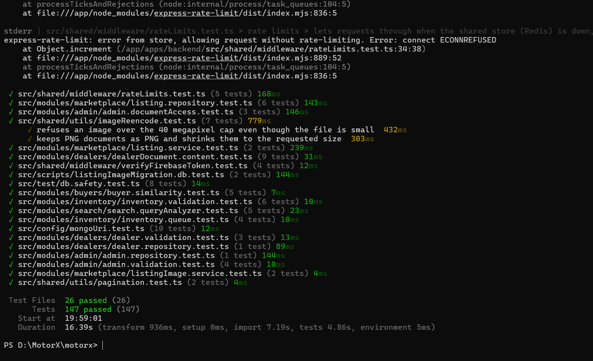

*Figure 1: Backend test log (Vitest 4.1.10): 26 test files, 147 tests passed*

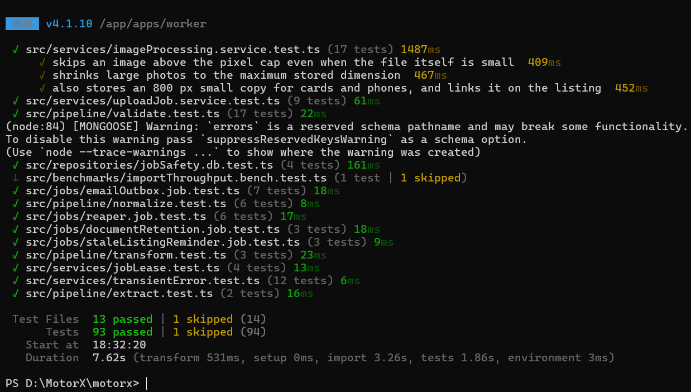

*Figure 2: Worker test log (Vitest 4.1.10): 93 tests passed, the 5,000-row benchmark skipped*

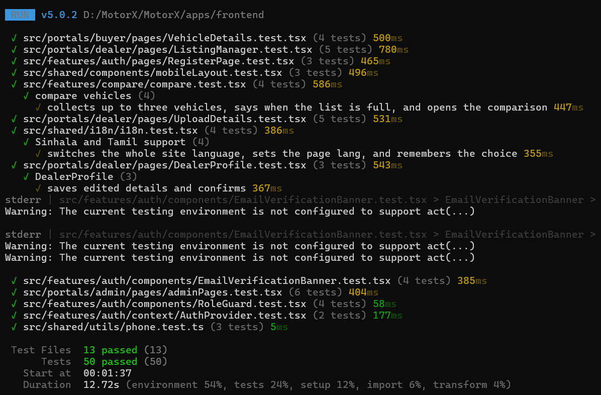

*Figure 3: Frontend test log (Vitest 5.0.2) before the new component tests were added: 13 test files, 50 tests passed*

The frontend screenshot was taken before seven component test files were added on 28 September 2026 for the listing form, CSV upload and dealer dashboard, admin pages, sign-in, notifications, marketplace and the API services (UT-42 to UT-48). The suite now has 107 tests in 20 files, all passing, as recorded in frontend-results.json.

The one skipped worker test is the 5,000-row import benchmark (NF-01), which runs only when RUN_BENCHMARKS=1 because it takes several seconds against a real database; its separate runs are recorded in benchmark-output.txt. The messages printed in between are expected and do not fail any test: the rate-limit test switches Redis off on purpose to prove requests still get through (ECONNREFUSED), Mongoose warns that one schema has a field named “errors”, and React’s test renderer prints act() warnings for the e-mail verification banner.

#### 5.1.2 User Interface Test Details

User-interface journeys were recorded and replayed with the Recorder panel of Chrome DevTools, which records what a user clicks and types and then plays it back against the live site, in the way the Selenium IDE is used for web testing. The journey “motorx vehicle comparison” was recorded on the EC2 deployment and replayed on the desktop profile (973 × 908 px, no throttling, 5-second timeout per step).

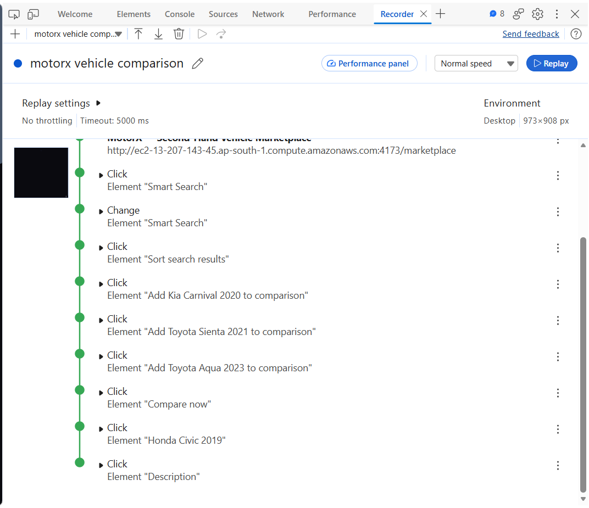

*Figure 4: Chrome DevTools Recorder: the “motorx vehicle comparison” journey replayed on the EC2 site, every step completed*

| Step | Action | What it checks |
| --- | --- | --- |
| 1 | Open /marketplace | The marketplace loads on the public site |
| 2–3 | Click and type in Smart Search | The natural-language search box accepts a query |
| 4 | Change the sort order | Sorting control works on the results |
| 5–7 | Add Kia Carnival 2020, Toyota Sienta 2021 and Toyota Aqua 2023 to comparison | Compare toggles on the result cards, found by their accessible labels |
| 8 | Click Compare now | The compare tray opens the comparison page |
| 9–10 | Open Honda Civic 2019 and its Description | Navigation to a vehicle and its details |

Every step completed on replay (green), so the buttons, fields and links of this journey can be found and used by their visible names and labels, which also indicates that they are exposed correctly to assistive technology. The recording can be exported from the Recorder and replayed after each deployment as a quick regression check. It supports the buyer journeys E2E-07 and E2E-08 but does not replace them: those also cover a phone layout, the contact bar and recommendations, and their results stay as recorded in Appendix C.

#### 5.1.3 Code Inspection and Dependency Audit

For code inspection, the TypeScript compiler checks all three workspaces for type errors, and npm audit checks the production dependencies against the public advisory database. Both were run on 28 September 2026 from the repository root. The screenshot shows the start of the output; the full output, including the third advisory (uuid), is kept in test-evidence/typecheck-and-audit.txt.

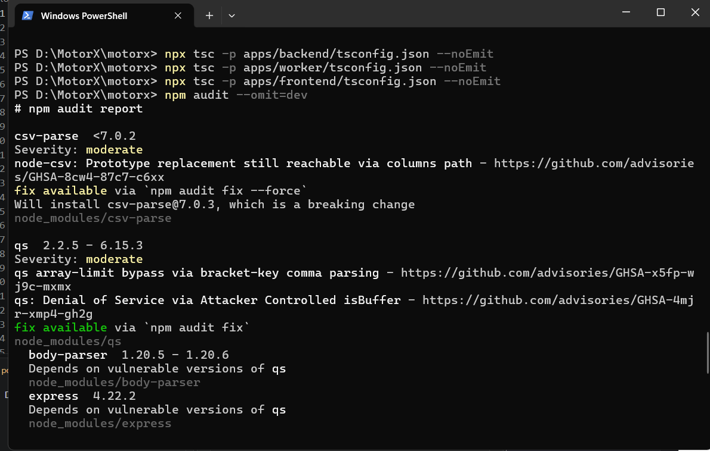

*Figure 5: Type-check of the three workspaces (no output means no errors) and the start of npm audit for the production dependencies*

Result: the three type-checks printed nothing, so the backend, worker and frontend compile without type errors. The audit found 12 moderate advisories and no high or critical ones, which meets the NF-05 criterion of no unaddressed high or critical vulnerability. The 12 come from three packages; the other nine entries are packages that depend on them. The table records whether MotorX reaches each one.

| Package | Advisory | Does MotorX reach it? | Action |
| --- | --- | --- | --- |
| csv-parse 5.6.0 (worker) | Prototype replacement through the columns option (GHSA-8cw4-87c7-c6xx) | Yes. The worker reads dealer CSV files with columns: true, so the header row of an uploaded file reaches the affected code. Only approved, signed-in dealers can upload, which limits who could try. | Upgrade to csv-parse 7.x (a major version) or reject reserved header names such as __proto__, with a worker test (F-18). |
| qs 6.15.3, through Express 4.22.2 and body-parser (backend) | Array-limit bypass and a denial of service (GHSA-x5fp-wj9c-mxmx, GHSA-4mjr-xmp4-gh2g) | Yes. Express parses the query string of every request with qs, including the public search endpoints. | Run npm audit fix, which updates qs within 6.x, then rerun the backend tests (F-18). |
| uuid 9.0.1, inside firebase-admin 13.10.0 | Missing buffer bounds check when a caller passes its own buffer (GHSA-w5hq-g745-h8pq) | Not directly. MotorX code does not import uuid; it is used inside the Google Cloud client libraries that firebase-admin depends on. | Upgrade firebase-admin to 14.5 (a major version) in a later cycle. |

#### 5.1.4 Browser Performance (Lighthouse and Network)

Lighthouse in Chrome DevTools was run twice against the EC2 deployment. The first run audited the marketplace page while EC2 served the frontend from the Vite development server. The second, on 28 September 2026, audited the home page after EC2 was switched to the production build, served by nginx with compression and long-term caching of the built files (compose.ec2.yml, infrastructure/nginx/nginx.conf).

| Run | Page | Frontend served by | Performance | Accessibility | Best practices | SEO |
| --- | --- | --- | --- | --- | --- | --- |
| Before | /marketplace | Vite development server | 26 | 94 | 56 | 92 |
| After | / (home) | Production build on nginx | 84 | 94 | 56 | 92 |

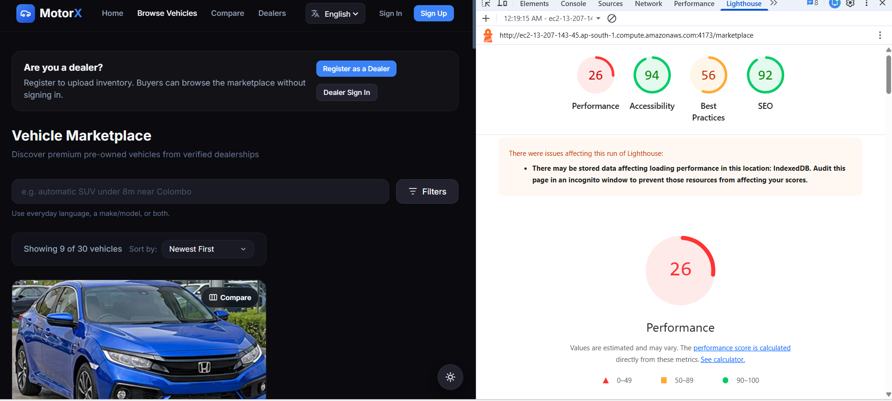

*Figure 6: Lighthouse before: marketplace page served by the Vite development server (Performance 26)*

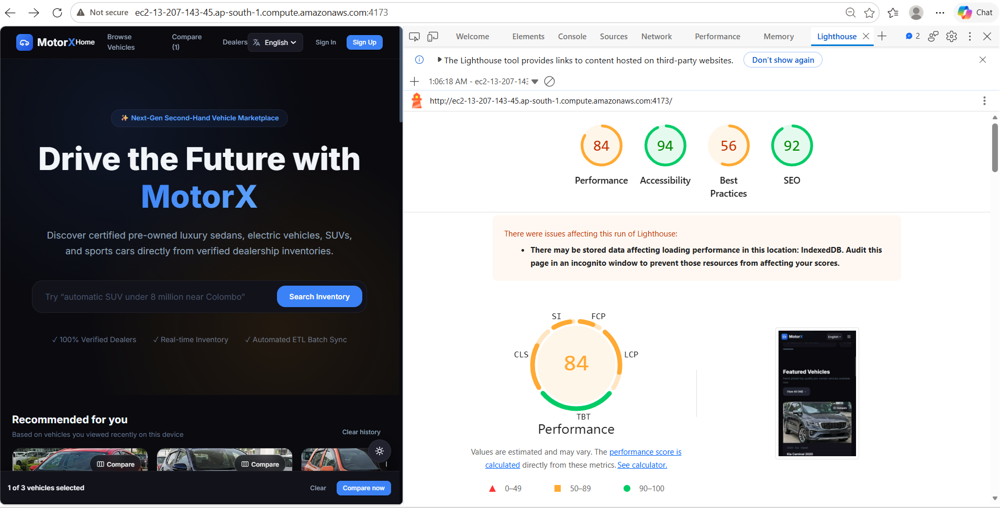

*Figure 7: Lighthouse after: home page served from the production build on nginx (Performance 84)*

Performance rose from 26 to 84. The main cause is the change of server: the development server sends hundreds of separate, uncompressed modules, while the production build sends a few compressed bundles that the browser can cache. The two runs audited different pages, so the comparison is indicative; auditing the marketplace and a vehicle page on the production build completes E2E-15, which stays open until then. Both runs warned that data stored in the browser (IndexedDB, used by Firebase sign-in) may have lowered the scores; an incognito window avoids this. Best practices stays at 56, largely because the site is still served over plain HTTP (F-15). Accessibility and SEO did not change.

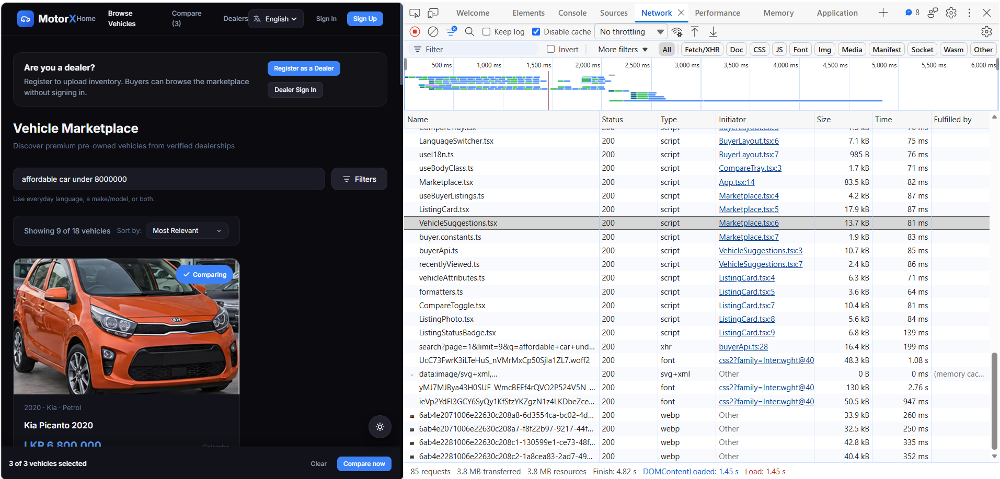

*Figure 8: Chrome DevTools Network panel for a marketplace search with the cache disabled, captured on the development server*

Figure 8 was captured with the cache disabled while searching for “affordable car under 8000000”: 85 requests, 3.8 MB transferred, DOMContentLoaded and load at 1.45 s, and the last request finished at 4.82 s. The request list names individual source files (.tsx), so it was taken on the development server, before the production build. The search API call returned in 199 ms and each listing photo, served as WebP, in 250–352 ms. The slowest items are the three Inter font files from Google Fonts (48–130 kB, up to 2.76 s); hosting the font with the site, or loading only the weights in use, would shorten the first load.

#### 5.1.5 Server Monitoring

The running EC2 deployment was inspected over SSH on 28 September 2026 with three commands: docker compose ps (which services run and whether their health checks pass), docker stats (processor and memory use per container) and a request to the backend readiness endpoint.

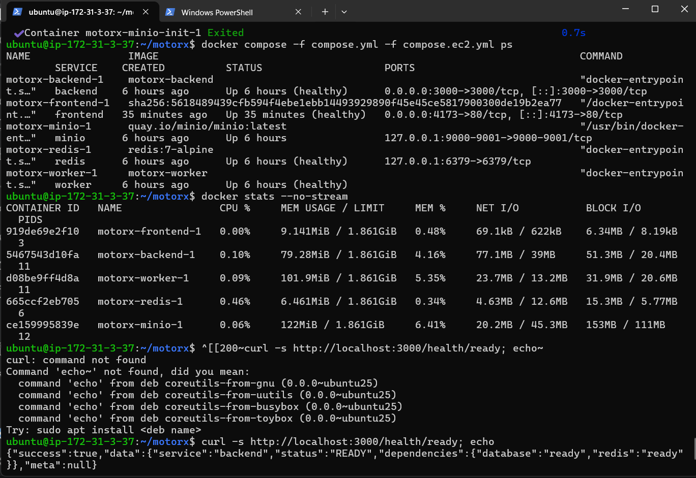

*Figure 9: EC2 server monitoring: container status, resource use per container and the backend readiness check*

| Container | Status | Published on | CPU | Memory |
| --- | --- | --- | --- | --- |
| frontend (nginx, production build) | Up, healthy | 0.0.0.0:4173 → 80 | 0.00% | 9.1 MiB |
| backend (API) | Up, healthy | 0.0.0.0:3000 | 0.10% | 79.3 MiB |
| worker | Up, healthy | not published | 0.09% | 101.9 MiB |
| redis | Up, healthy | 127.0.0.1:6379 only | 0.46% | 6.5 MiB |
| minio | Up | 127.0.0.1:9000–9001 only | 0.06% | 122 MiB |

All five services were running and every health check passed; the readiness endpoint answered READY with the database and Redis both ready. Together the containers used about 320 MiB of the instance’s 1.86 GiB and almost no processor time while idle, so the instance has room for normal use; the heavy moment is building images, which is why they are built one at a time (F-13). The output also confirms two earlier results on the live server: the website is now served by nginx from the production build (port 4173 maps to 80, R-05), and Redis and MinIO accept connections only from the machine itself (F-14). The first attempt at the readiness request in the screenshot failed only because the command was pasted with stray characters; the retry below it is the result.

#### 5.1.6 Database Performance

The shared MongoDB Atlas cluster was examined in two ways on 27–28 September 2026: MongoDB Compass explained the query behind the marketplace’s default view, and the Atlas monitoring page showed the load on the cluster over one hour.

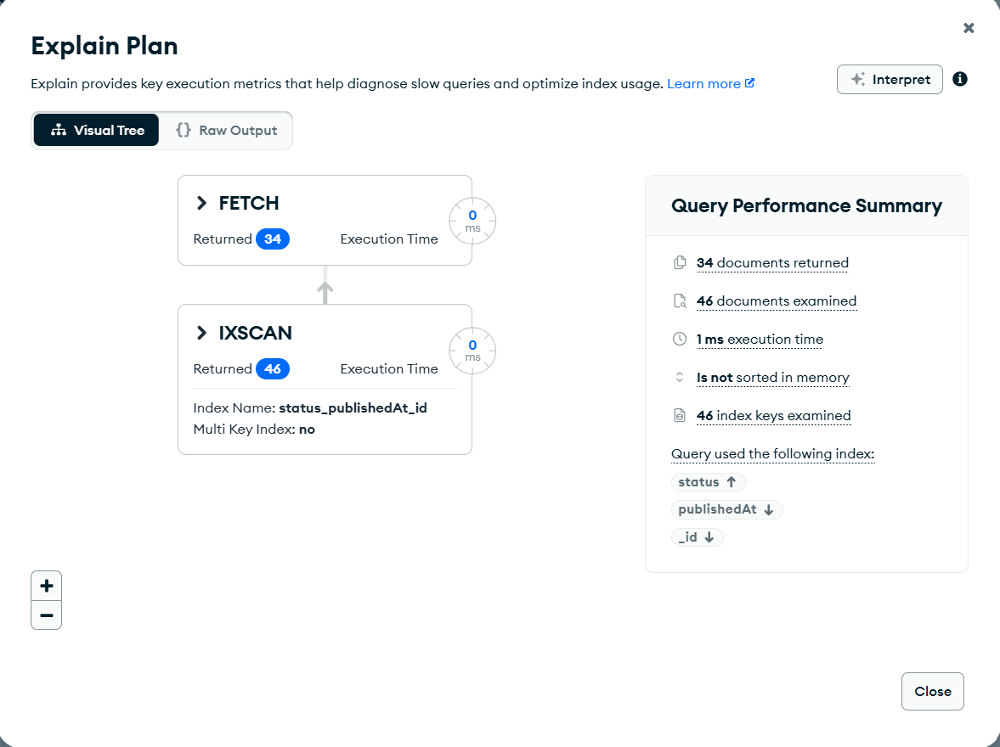

*Figure 10: Compass explain plan for active cars, newest first: an index scan on status_publishedAt_id, 34 documents returned in 1 ms*

The query was the one the marketplace sends by default, with filter { status: "active", category: "car" } and sort { publishedAt: -1 }. MongoDB answered it from the status_publishedAt_id index (IXSCAN) rather than reading the whole collection: it examined 46 index keys and 46 documents of the 113 in the collection, returned 34, and took 1 ms. Because the index already holds listings in publishing order, no sort was done in memory. The 12 extra documents examined are active listings of other vehicle types, which are filtered out after they are read; an index on status, category and publishedAt together would remove that step, but at this data size it is not worth the extra write cost.

| Measure | Result |
| --- | --- |
| Plan | IXSCAN on status_publishedAt_id, then FETCH |
| Index keys / documents examined | 46 / 46 (collection holds 113) |
| Documents returned | 34 |
| Execution time | 1 ms |
| Sorted in memory | No |

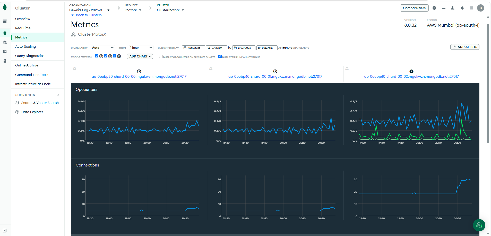

*Figure 11: Atlas cluster metrics for ClusterMotorX (MongoDB 8.0.32, AWS Mumbai), 19:27–20:27 on 27 September 2026: operations per second and connections on the three replica-set members*

Over that hour the three members of the replica set (two secondaries and the primary) handled well under one operation per second each, and the primary held about 20 connections, rising to about 30 near the end of the window as more services connected. The cluster is far from its limits at the current load. These figures are observations, not a load test: NF-03 remains the planned test of behaviour under many simultaneous users.

### 5.2 Reporting on Test Coverage

Coverage is reported in three ways: how many tests and cases ran and passed (Section 5.1 and Appendix D), which requirements have evidence (Appendix G), and how much of the code the tests executed. The third was measured with @vitest/coverage-v8, running each workspace’s full suite (npm run test:coverage): the backend and worker on 27 September 2026 in the isolated test stack, and the frontend on 28 September 2026 after its new component tests were added. Every test passed during the measurement.

| Workspace | Statements | Branches | Functions | Lines |
| --- | --- | --- | --- | --- |
| Backend | 66.9% (1114/1665) | 53.7% (582/1084) | 63.4% (284/448) | 72.6% (934/1287) |
| Worker | 62.2% (448/720) | 55.5% (221/398) | 49.4% (88/178) | 63.2% (350/554) |
| Frontend | 69.0% (1410/2043) | 68.4% (1193/1745) | 63.4% (477/752) | 71.2% (1144/1606) |

Reading the figures: in the backend and worker the business rules are well exercised — buyer recommendations 98%, dealer module 88%, worker services, pipeline and jobs 82–90% of statements. The unexecuted code is mostly start-up and wiring (server.ts, worker.ts, configuration), the one-off migration command line and some repository helpers; these run in every deployment and are checked by the smoke runs rather than by unit tests. The frontend rose from 38% to 69% of statements (39% to 68% of branches) after component tests were written for the pages that had none: the dealer listing form, CSV upload and dashboard, the admin user, listing, audit-log and system-health pages, sign-in, the notification centre, the marketplace, and every API service module. What remains untested in the frontend is mainly the application shell and routing (App.tsx), the photo cropper, which draws on a canvas that the test browser cannot provide, and parts of registration and the sign-in session provider; these are exercised by the browser journeys instead. No coverage threshold is enforced; the figures are the baseline for the next cycle.

| Report | Produced from | Refreshed | Read by |
| --- | --- | --- | --- |
| Automated results | Vitest JSON output of the three workspaces | On every push by CI; locally before each regeneration of this report | The developer who made the change |
| Case and test registers | The report generator (kept outside the repository) | Whenever any result or case changes | Whole team; mentor |
| Manual journey results | manual-results.csv, screenshots, Lighthouse reports | At the end of each browser test session | Team; merged into this report |
| Requirement traceability (Appendix G) | The generator, from the case list | With every regeneration | Mentor and examiners |
| Security scans | Gitleaks, Trivy and npm audit in CI | Every push, and a weekly scheduled run | The member who leads security |
| Deployment evidence | Smoke script against each stack; compose port check | After every deployment | Whoever deployed |
| Code coverage | @vitest/coverage-v8 (npm run test:coverage in each workspace) | Measured 27 Sep 2026; to be repeated before each release | Developers |

Each report above feeds the generic test report below, which gives for every test field the date it was run, who ran it, how many tests or cases were executed, and how many passed and failed. Percentages are of the executed items; items not yet run are named in the comments rather than counted as failures.

| Date | Tester | Test field | Executed | Pass | Fail | Pass % | Fail % | Comments |
| --- | --- | --- | --- | --- | --- | --- | --- | --- |
| 27 Sep 2026 | CI and developers (automated) | Unit and component tests | 291 | 291 | 0 | 100.0% | 0.0% | All executed |
| 27 Sep 2026 | CI and developers (automated) | Integration tests — data (IT-01–IT-07, IT-11) | 24 | 24 | 0 | 100.0% | 0.0% | All executed |
| 27 Sep 2026 | CI and developers (automated) | Integration tests — HTTP journeys (IT-08–IT-10) | 32 | 32 | 0 | 100.0% | 0.0% | All executed |
| — | Group 23 testers | Integration cases — external services (IT-12–IT-15) | 0 | 0 | 0 | — | — | 4 not yet run |
| 27 Sep 2026 | Group 23 testers | Contract and consistency checks (CT-01–CT-07) | 6 | 5 | 1 | 83.3% | 16.7% | 1 not yet run; 1 failed (see Appendix F) |
| 27 Sep 2026 | Group 23 testers | End-to-end — system procedures (E2E-A1–A3) | 3 | 1 | 2 | 33.3% | 66.7% | All executed; 2 failed (see Appendix F) |
| — | Group 23 testers | End-to-end — browser journeys (E2E-01–E2E-15) | 0 | 0 | 0 | — | — | 15 not yet run |
| 27 Sep 2026 | Group 23 testers | Performance (NF-01, NF-02) | 1 | 1 | 0 | 100.0% | 0.0% | 1 not yet run |
| — | Group 23 testers | Load (NF-03) | 0 | 0 | 0 | — | — | 1 not yet run |
| 27 Sep 2026 | Group 23 testers | Security and supply chain (NF-04, NF-05) | 2 | 2 | 0 | 100.0% | 0.0% | All executed |
| — | Group 23 testers | Search quality (NF-06) | 0 | 0 | 0 | — | — | 1 not yet run |
| — | — | Total | 359 | 356 | 3 | 99.2% | 0.8% | 23 not yet run |

## 6. Risks, Dependencies, Assumptions, and Constraints

| ID | Risk | Likelihood / impact | Mitigation | Contingency |
| --- | --- | --- | --- | --- |
| R-01 | The laptops and the EC2 stack share one Atlas database, so a data-changing test or migration on either changes the demo data. | Observed / High | Data-changing tests only on the motorx-test stack; migrations dry-run first; demo data created by test accounts. | Give EC2 its own Atlas database. |
| R-02 | Browser journeys not all executed before submission. | Medium / High | Journeys scripted step by step and split between members (Section 8). | Report unexecuted journeys as such, alongside the API-level evidence. |
| R-03 | Photos for 22 listings exist only in the EC2 MinIO volume. | Medium / High | Never run docker compose down -v on EC2; back up the volume. | Re-upload photos through the dealer portal. |
| R-04 | The EC2 instance is too small to build all images at once (ETXTBSY, memory). | Observed / Medium | Build one service at a time with swap enabled. | Build images in CI and pull them on EC2. |
| R-05 | The EC2 frontend ran the Vite development server rather than a production build. | Closed (28 Sep) | compose.ec2.yml now builds the production image served by nginx with compression and caching; Lighthouse Performance rose from 26 to 84 (Section 5.1.4). | Revert to the previous image if the production build fails on EC2. |
| R-06 | External services unavailable during testing or the demo (Atlas DNS, Firebase, Hugging Face, Gmail SMTP). | Observed / High | Readiness endpoint; outbox retries; lexical search fallback; automated tests do not depend on them. | Show recorded evidence; repeat live checks when service returns. |
| R-07 | API and worker Mongoose models of shared collections drift apart (CT-06 not automated). | Medium / High | Review both models in every change touching a shared collection. | Add an automated model-comparison check. |
| R-08 | Sinhala and Tamil text has not been reviewed by native speakers. | Medium / Medium | Native readers in E2E-13. | Fall back to English for any text they reject. |
| R-09 | Administrator accounts have no multi-factor sign-in. | Accepted / High | Strong passwords, few admin accounts, audit log of every admin action. | Enable Firebase multi-factor authentication. |
| R-10 | Secrets exposed through shared .env files or screenshots. | Low / High | Gitleaks in CI; .env never committed; screenshots checked before sharing. | Rotate the affected keys immediately. |
| R-11 | Burstable EC2 CPU credits distort performance and load results. | Medium / Medium | Record instance type and credit balance with each run. | Repeat runs on a fixed-performance instance. |

Dependencies: Docker Desktop on the test laptop; the locked npm dependency set; internet access to Atlas, Firebase and Hugging Face for live checks; the EC2 instance and its Elastic IP; members’ time for browser journeys.

Assumptions: the team keeps the module ownership in team-work-plan.md; the Firebase project used for browser journeys holds only test accounts; the demonstration data on Atlas was created by the team and contains no real customer records.

Constraints: three members who are also the developers; a laptop whose memory limits parallel test runs; one EC2 instance serving as both staging and demonstration; no browser automation installed in this cycle, so browser journeys are manual.

## 7. References

[1] Group 23, “MotorX Software Requirements Specification,” v1.0, Aug. 2026.

[2] Group 23, “MotorX Software Architecture Document,” v1.0, Aug. 2026.

[3] Group 23, MotorX source repository, commit ffac7f9 and later (README.md, docs/RESILIENCE.md, docs/api-contract.md, compose files, .github/workflows).

[4] ISO/IEC 25010:2023, “Systems and software engineering — Systems and software Quality Requirements and Evaluation (SQuaRE) — Product quality model.”

[5] W3C, “Web Content Accessibility Guidelines (WCAG) 2.1.” Available: https://www.w3.org/TR/WCAG21/ (Accessed on 27 Sep. 2026).

[6] Grafana Labs, “k6 documentation.” Available: https://grafana.com/docs/k6/latest/ (Accessed on 27 Sep. 2026).

[7] OWASP Foundation, “Application Security Verification Standard 4.0.3.” Available: https://owasp.org/www-project-application-security-verification-standard/ (Accessed on 27 Sep. 2026).

[8] ISO/IEC/IEEE 29119-3:2021, “Software and systems engineering — Software testing — Part 3: Test documentation.”

[9] Vitest, “Guide.” Available: https://vitest.dev/guide/ (Accessed on 27 Sep. 2026).

[10] Testing Library, “About Queries.” Available: https://testing-library.com/docs/queries/about/ (Accessed on 27 Sep. 2026).

[11] MongoDB, “Partial Indexes” and “Transactions,” MongoDB Manual. Available: https://www.mongodb.com/docs/manual/ (Accessed on 27 Sep. 2026).

[12] Taskforce.sh, “BullMQ documentation.” Available: https://docs.bullmq.io/ (Accessed on 27 Sep. 2026).

[13] Docker, “Merge Compose files.” Available: https://docs.docker.com/compose/how-tos/multiple-compose-files/merge/ (Accessed on 27 Sep. 2026).

[14] Vite, “Server Options — server.allowedHosts.” Available: https://vite.dev/config/server-options (Accessed on 27 Sep. 2026).

[15] Google, “Lighthouse overview.” Available: https://developer.chrome.com/docs/lighthouse/overview (Accessed on 27 Sep. 2026).

[16] Microsoft, “Playwright — Installation.” Available: https://playwright.dev/docs/intro (Accessed on 27 Sep. 2026). Planned for automating Appendix C.

[17] Supplied template “6 Template for Test plan.docx” (Rational Unified Process master test plan).

## 8. Responsibilities, Staffing and Training Needs

Every member of Group 23 both builds and tests MotorX. The roles below follow the module ownership in team-work-plan.md: Silva T.D.R. (230616B) owns authentication, dealers and the marketplace; Somarathna M.D.A.M. (230621K) owns inventory and the ETL worker; Thadshakan J. (230633A) owns search, notifications and administration. The member who writes a change also writes its automated tests; the lead of a test type is responsible for its evidence being complete and current.

### 8.1 Ownership by Test Type

| Test type | Lead | Supporting | Duties |
| --- | --- | --- | --- |
| 3.3.1 Data integrity | Somarathna | Silva | Keep the replica-set suites and the drill working; add a data test for every new unique rule or shared collection; run CT-06 reviews. |
| 3.3.2 Function | Module owner | All | Tests for every requirement in the module; keep Appendix G current. |
| 3.3.3 User interface | Silva | Thadshakan | Component tests for new pages; run E2E-12 and E2E-15; organise the native-reader review (E2E-13). |
| 3.3.4 Performance profiling | Somarathna | Thadshakan | Rerun the benchmark after pipeline changes; collect NF-02 percentiles on EC2. |
| 3.3.5 Load | Thadshakan | Somarathna | Write and run the k6 scenario (NF-03) in an agreed quiet window. |
| 3.3.6 Security | Silva | All | Access-control journeys, CI scan triage, security-group and port reviews after each deployment. |
| 3.3.7 Failover and recovery | Somarathna | Silva | Drill reruns before submission; recovery tests for every new background job. |
| 3.3.8 Configuration | Thadshakan | Silva | Smoke runs and port checks after every deployment; the browser matrix during journeys. |

### 8.2 Shared Duties

- Whoever fixes a finding adds the test that guards it and updates Appendix F.
- Whoever deploys runs the smoke script and CT-04 afterwards and saves the output as evidence.
- Each member reviews test evidence for a module they did not write before it is counted as passed.
- The generator is rerun after every session so the report and the registers never disagree.

### 8.3 Skills to Build

| Skill | Needed for | Current level | How it will be learned |
| --- | --- | --- | --- |
| Vitest, Testing Library, supertest | All automated levels | In daily use | Existing tests serve as examples; reviewed in pull requests. |
| MongoDB replica sets, indexes, transactions | 3.3.1 | Held mainly by Somarathna | One member pairs with Somarathna to rerun the data suites and the drill unaided. |
| Playwright | Automating Appendix C | Not yet used | Automate E2E-07 first as a reference, then the other journeys. |
| k6 load scripting | 3.3.5 | Not yet used | A 5-user trial against EC2 to calibrate before the full run. |
| Lighthouse and WCAG checks | 3.3.3 | Basic | Run Lighthouse on three pages and fix what it reports. |
| Operating Docker on EC2 (swap, disk, sequential builds, logs) | 3.3.8; deployments | Learned during this cycle | A short runbook written from the 27 Sep deployment. |
| Reviewing Sinhala and Tamil copy | 3.3.3 | Through members’ own networks | Brief native readers with the E2E-13 script. |

### 8.4 Staffing Limits

- Roles overlap because the group has three members; each test type still has one lead so someone is always accountable.
- Load runs and drills need the relevant stack to themselves and are booked in advance.
- Only members with EC2 and Atlas administrator access may deploy or run migrations.
- Browser journeys take roughly a day of combined effort, the largest remaining time cost of this plan.

## 9. Test Environment Specification

| Environment | Used for | Make-up | Limits |
| --- | --- | --- | --- |
| Developer laptop (compose project motorx) | Everyday development; frontend tests; E2E-A2 smoke. | Windows 11; Docker Desktop; backend, worker, frontend, Redis and MinIO containers; Atlas over the internet. | Shares the Atlas database with EC2 (R-01); limited memory, so frontend tests run two workers. |
| Isolated test stack (compose project motorx-test) | All backend and worker suites; benchmark; crash drill. | mongo:7 as replica set rs0 (database motorx_test), redis:7, MinIO with a test bucket; Node 24 containers built from the development stage. | Disposable; not representative of internet latency. |
| GitHub Actions CI | Build, all three test suites, Gitleaks, Trivy and npm audit on every push; weekly scheduled run. | Ubuntu runners; Node 24; MongoDB replica set service. | Placeholder credentials only (F-11); one rate-limit test needing real Redis is skipped. |
| EC2 demonstration deployment | E2E-A3 smoke; browser journeys; NF-02 and NF-03. | Ubuntu 26.04 in ap-south-1; Elastic IP 13.207.143.45; Docker Compose with compose.ec2.yml; Node 24; MinIO bucket motorx-staging; shared Atlas database. | Single instance; Vite development server for the frontend (R-05); only ports 22, 80, 443, 3000 and 4173 open. |
| Amazon ECS (planned) | Future production. | Defined in .github/workflows/deploy.yml. | Not provisioned in this cycle. |

### 9.1 Differences Between Environments

- HTTP journeys replace Firebase token checks and the S3 client; only the smoke runs and browser journeys use the real services.
- The test stack uses a local replica set, while the laptops and EC2 use Atlas; latency and index build times differ.
- EC2 serves the frontend through the Vite development server; a production image would serve a static build.
- MinIO stands in for Amazon S3 on every stack; S3-specific behaviour such as bucket policies is not tested.
- CI has no real Firebase credentials, so a test that loads the real Firebase setup fails there and nowhere else.

## 10. Entry, Exit and Suspension Criteria

The following criteria define when testing can start, when a level is complete, and when testing must pause. The status columns report the available evidence; preparing this plan does not imply that every execution criterion was met.

### 10.1 Entry Criteria

| Level | May start when |
| --- | --- |
| Unit and component | The workspace builds and the behaviour has an agreed expected result (an SRS clause or a documented extension). |
| Integration | Unit tests of the module pass; the motorx-test stack is healthy with an elected replica-set primary; the database guard confirms the target. |
| Contract and consistency | Both sides of the agreement exist at the same commit (for example the new Compose file and the service it configures). |
| End-to-end (system) | Integration tests pass; the target stack is deployed from a known commit and its health endpoints answer. |
| End-to-end (browser) | The API-level journey for the same flow passes; test accounts exist in the test Firebase project; the tester has the journey script. |
| Performance and load | The flows under measurement are functionally correct; the stack is reserved; instance type and data volume are recorded. |

### 10.2 Exit Criteria

| Level | Complete when | Status this cycle |
| --- | --- | --- |
| Unit and component | Every module in scope has tests including invalid-input cases, and all pass on two consecutive runs. | Met |
| Integration | Every database-enforced rule has a real-database test; all journeys pass. | Met for automated cases; IT-12–IT-15 open |
| Contract and consistency | All seven checks executed and passed. | Not met: CT-06 not run, CT-07 failed |
| End-to-end | System procedures pass on the deployed stack; all High-priority browser journeys executed and passed. | Not met |
| Performance and load | NF-01 to NF-03 executed and within their targets, or reported as unmet. | Partly met: NF-01 only |

### 10.3 Submission Exit Criteria

| Criterion | Status |
| --- | --- |
| All automated suites pass in CI with no required check bypassed. | Met (348/348; CI green on PR #17 after F-11) |
| No open Critical or High finding without an accepted workaround. | Not met: F-01 partly fixed |
| High-priority browser journeys executed and passed on the EC2 deployment. | 0 of 13 passed |
| PSR-05 measured and met; PSR-01–03 measured or reported as unmet. | PSR-05 met; others outstanding |
| Smoke run passes on the deployment used for the demonstration. | Not met: 2 checks failing (F-01) |
| Every SRS area in Appendix G has executed evidence or a stated gap. | Met |

### 10.4 Suspension and Resumption

| Suspend testing when | Resume when |
| --- | --- |
| The database guard refuses the target, or a test is found pointing at Atlas or the EC2 data. | The target is corrected and verified, and any affected data is checked against its expected state. |
| Atlas, Firebase or the network is unavailable. | Readiness returns 200 and the smoke run passes again; interrupted cases are rerun from the start. |
| A deployment is half-finished (for example an image build failed on EC2). | All containers report healthy on the intended commit. |
| A shared collection’s shape changed in one process but not the other. | Both models agree (CT-06 review) and the data suites pass. |
| Failures keep repeating one known cause. | The cause is fixed and the affected level is re-entered from its entry criteria. |

## 11. Test Schedule and Phasing

The planned submission deadline was 27 September 2026. Phases are shown in sequence without individual dates. The scope of each phase was defined for submission; execution results and outstanding findings are recorded separately in Section 5 and the appendices.

| Phase | Defined scope | Completion requirement |
| --- | --- | --- |
| 1. Baseline | Prepare the test plan and case register; establish unit and component coverage. | Plan, register and initial test results recorded. |
| 2. Hardening | Cover Node 24, security scanning, safe file processing, leases, checkpoints, reaper and outbox. | Automated checks and regression evidence recorded. |
| 3. Journeys and evidence | Cover HTTP journeys, frontend components, the import benchmark, crash recovery and local smoke checks. | Results and evidence linked to the relevant cases. |
| 4. Deployment | Verify the EC2 runtime, ports, allowed hosts, deployment smoke checks and code coverage. | Deployment checks and findings documented. |
| 5. Browser journeys | Cover E2E-01 to E2E-15 on EC2 and photo re-upload verification for F-01. | Each case assigned a result or an explicit execution gap. |
| 6. Measurement | Cover NF-02 response-time percentiles, NF-03 load and Lighthouse audits. | Measurements recorded; unmeasured targets identified. |
| 7. Submission and sign-off | Generate the report and registers; provide Appendices F and G for mentor review. | Report prepared with findings, coverage gaps and approval status stated. |

### 11.1 Activities Across Phases

- Retain automated suites and security scans in CI throughout subsequent phases.
- Classify findings using Section 12 and record their resolution or acceptance status.
- Regenerate the report and registers from the available evidence for submission.

## 12. Defect Severity and Priority Definitions

Each finding in Appendix F is given two ratings. Severity describes how badly the problem affects users or their data. Priority defines the required resolution stage: demonstration, submission, next iteration or backlog. The two are rated separately on purpose: a serious fault in a feature nobody uses yet can wait, while a small flaw on the first page every visitor sees may need fixing straight away.

### 12.1 Severity

| Severity | What it means | Examples from this cycle |
| --- | --- | --- |
| Critical | Data is lost or silently corrupted, or one user can see or change another user’s data. | None found. A dealer reading another dealer’s listings, or an import creating duplicate vehicles, would be Critical. |
| High | A main feature does not work, or a security weakness is only partly covered. | F-01 some listing photos not loading; F-09 re-attached photos being ignored; F-14 Redis and MinIO reachable from outside the server; F-15 the deployed site served without HTTPS. |
| Medium | A secondary feature does not work, or a main feature fails only in unusual conditions and a workaround exists. | F-11 a test that failed only in CI; F-12 the server refusing its public host name; F-13 image builds failing on EC2; F-18 two dependency advisories on code paths MotorX uses. |
| Low | Appearance, wording or speed issues that do not stop anything working. | F-03 older photos without a small copy, so pages load more slowly on phones; F-16 a raw status name shown to dealers. |

### 12.2 Priority

| Priority | What it means |
| --- | --- |
| Before demo | Fixed before the deployed system is next demonstrated. |
| Before submission | Fixed before the final submission, or accepted with the reason written down. |
| Next iteration | Planned for the first development iteration after submission. |
| Backlog | Recorded, and fixed the next time that part of the system is changed, or accepted. |

### 12.3 Recording and Lifecycle

For every finding we record an ID, a short description, its severity and priority, the test or activity that found it, the environment it was found in, its current status, and the test or check that proves it is fixed. A finding is Open until the fix is merged, when it becomes Fixed. It is Closed only after the proving test passes in CI, or the proving check has been repeated on the environment where the problem appeared. When a finding will not be fixed, it is marked Accepted, together with the reason and the name of the person who accepted it.

## 13. Test Data Policy

This policy defines the permitted data sources, isolation requirements and cleanup rules for every test environment.

No real customer data is used in any test stack or committed to the repository. Test data is either generated by the tests themselves or created by team members through the application using test accounts. This matters because MotorX stores identity documents and business registration certificates, and because the laptops and the EC2 stack share one Atlas database.

### 13.1 Rules

- Automated tests build their own data in memory — plates such as CAX-1001, vehicles, users, CSV rows, images made with sharp and hand-built PDFs — and remove it afterwards.
- Automated tests may only use a database named motorx_test on a local host; the guard stops any other target before connecting.
- Demonstration data on Atlas is entered by team members through the app, using test accounts and invented business details.
- Uploaded photos are rebuilt without metadata, so location data from a phone camera never reaches storage.
- E-mail from test runs goes only to team inboxes.
- Keys and passwords never appear in fixtures, evidence files or screenshots; Gitleaks scans every push.

### 13.2 Test Data in Each Environment

| Environment | Where the data comes from | Size |
| --- | --- | --- |
| Isolated test stack | Created by each test and cleared by the next; the benchmark and the drill generate their own CSV files. | From a few documents up to 60,000 rows (drill). |
| CI | As the test stack, recreated on every run. | Small. |
| Laptops and EC2 (shared Atlas) | Team-created demo accounts, dealers and listings, plus CSV imports of the sample file source-csv.txt. | Tens of active listings. |
| Browser journeys | Fresh test accounts per journey in the test Firebase project. | A handful per journey. |

### 13.3 Invalid and Hostile Inputs

Several cases deliberately use bad input: CSV rows with missing or mistyped fields, category mismatches and duplicate plates; files that only start like a JPEG; a 41-megapixel image that is tiny on disk; photos carrying GPS EXIF data; PDFs containing JavaScript, launch actions or embedded files; a program renamed with a .pdf extension; ZIPs with too many entries, oversized entries, backslash paths, wrapper folders or no folders at all. These inputs are created inside the tests that need them and are never stored in shared environments.

## Appendix A – Unit and Component Test Cases

48 case groups, one per test file, 291 tests in total. Individual test names and durations are in automated-test-register.csv.

#### UT-01 — Test database target safety

| Field | Specification and result |
| --- | --- |
| Requirement / priority | Test infrastructure; RR-09 / High |
| Set-up and data | Local, Docker, non-test, remote and wrong-scheme URIs; missing TEST_MONGODB_URI. |
| Steps | Validate each URI before any connection. |
| Expected result | Only a motorx_test database on an approved host is accepted; never falls back to MONGODB_URI. |
| Execution | Executed 26 Sep 2026: 8/8 passed |
| Evidence | apps/backend/src/test/db.safety.test.ts; test-evidence/backend-results.json |

#### UT-02 — Production database URI guard

| Field | Specification and result |
| --- | --- |
| Requirement / priority | PSR-10; RR-09 / High |
| Set-up and data | Atlas SRV, TLS/non-TLS, local and test database names. |
| Steps | Check each URI with findProductionMongoUriProblems. |
| Expected result | Production refuses unencrypted, local, test/dev databases and URIs without a database name. |
| Execution | Executed 26 Sep 2026: 10/10 passed |
| Evidence | apps/backend/src/config/mongoUri.test.ts; test-evidence/backend-results.json |

#### UT-03 — Admin request validation

| Field | Specification and result |
| --- | --- |
| Requirement / priority | FR-ADMIN-02–05 / High |
| Set-up and data | Default and bounded pages; user/listing filters; invalid status. |
| Steps | Parse query schemas. |
| Expected result | Defaults and valid filters parse; unsupported values fail. |
| Execution | Executed 26 Sep 2026: 4/4 passed |
| Evidence | apps/backend/src/modules/admin/admin.validation.test.ts; test-evidence/backend-results.json |

#### UT-04 — Dealer application validation

| Field | Specification and result |
| --- | --- |
| Requirement / priority | FR-DEALER-02,09–13 / High |
| Set-up and data | Multipart fields; incomplete application; missing rejection reason. |
| Steps | Parse application and review schemas. |
| Expected result | Form values normalized; incomplete data and missing rejection reason rejected. |
| Execution | Executed 26 Sep 2026: 3/3 passed |
| Evidence | apps/backend/src/modules/dealers/dealer.validation.test.ts; test-evidence/backend-results.json |

#### UT-05 — Dealer document content checks

| Field | Specification and result |
| --- | --- |
| Requirement / priority | FR-DEALER-09; PSR-13–14 / High |
| Set-up and data | Plain PDF; PDFs with JavaScript, launch action, embedded file; renamed executable; images with metadata; fake JPEG. |
| Steps | Detect type from bytes and sanitize each file. |
| Expected result | Only safe PDFs and re-encoded images are kept; dangerous or disguised files are rejected. |
| Execution | Executed 26 Sep 2026: 9/9 passed |
| Evidence | apps/backend/src/modules/dealers/dealerDocument.content.test.ts; test-evidence/backend-results.json |

#### UT-06 — CSV upload validation

| Field | Specification and result |
| --- | --- |
| Requirement / priority | FR-UPLOAD-01–03,07 / High |
| Set-up and data | Car and motorcycle headers; missing headers; binary files; paging. |
| Steps | Validate files, headers and pagination. |
| Expected result | Matching headers accepted per category; bad content and missing fields rejected; paging bounded. |
| Execution | Executed 26 Sep 2026: 6/6 passed |
| Evidence | apps/backend/src/modules/inventory/inventory.validation.test.ts; test-evidence/backend-results.json |

#### UT-07 — Upload acceptance and controlled retry

| Field | Specification and result |
| --- | --- |
| Requirement / priority | FR-UPLOAD-04–06; RR-06–08 / High |
| Set-up and data | Queue available, down, and hanging; dealer at listing limit; job-creation failure; failed and non-failed uploads. |
| Steps | Accept uploads and request retries with mocked queue and storage. |
| Expected result | Uploads are kept for later queuing when Redis is down, the dealer is never kept waiting, storage is cleaned on failure, and only the owner’s failed jobs can be retried. |
| Execution | Executed 26 Sep 2026: 8/8 passed |
| Evidence | apps/backend/src/modules/inventory/inventory.service.test.ts; test-evidence/backend-results.json |

#### UT-08 — Listing validation and identity

| Field | Specification and result |
| --- | --- |
| Requirement / priority | FR-MARKET-02–05; FR-ETL-19–21 / High |
| Set-up and data | Plate variants, pagination, inverted ranges, empty edits, image order, category/powertrain fixtures. |
| Steps | Normalize registrations and parse listing schemas. |
| Expected result | Equivalent plates share one identity; invalid edits, ranges and attributes fail. |
| Execution | Executed 26 Sep 2026: 12/12 passed |
| Evidence | apps/backend/src/modules/marketplace/listing.validation.test.ts; test-evidence/backend-results.json |

#### UT-09 — Image signature check

| Field | Specification and result |
| --- | --- |
| Requirement / priority | FR-MARKET-13; PSR-14 / High |
| Set-up and data | JPEG, PNG, WebP headers; spoofed JPEG; GIF. |
| Steps | Check each file signature. |
| Expected result | Supported signatures accepted; spoofed and unsupported files rejected. |
| Execution | Executed 26 Sep 2026: 2/2 passed |
| Evidence | apps/backend/src/modules/marketplace/listingImage.service.test.ts; test-evidence/backend-results.json |

#### UT-10 — Image re-encoding

| Field | Specification and result |
| --- | --- |
| Requirement / priority | FR-MARKET-13; PSR-13–14 / High |
| Set-up and data | JPEG with GPS EXIF and rotation; trailing hidden data; 41-megapixel bomb; fake image; SVG/GIF; PNG document. |
| Steps | Re-encode each image. |
| Expected result | Output is a clean WebP (or PNG for documents), upright, without metadata or hidden data; bombs and disallowed formats refused. |
| Execution | Executed 26 Sep 2026: 7/7 passed |
| Evidence | apps/backend/src/shared/utils/imageReencode.test.ts; test-evidence/backend-results.json |

#### UT-11 — Photo migration and small copies

| Field | Specification and result |
| --- | --- |
| Requirement / priority | PSR-13; Extension (small photo copies) / High |
| Set-up and data | Old root-level photos with GPS; already migrated photos; dry run; CDN URL; photo without small copy; missing and undecodable objects. |
| Steps | Run the migration against an in-memory bucket. |
| Expected result | Photos moved as clean WebP; re-runs skip finished work; dry run changes nothing; an 800 px small copy is created once and its URL recorded; problems reported, not hidden. |
| Execution | Executed 26 Sep 2026: 6/6 passed |
| Evidence | apps/backend/src/scripts/listingImageMigration.test.ts; test-evidence/backend-results.json |

#### UT-12 — Search query analysis

| Field | Specification and result |
| --- | --- |
| Requirement / priority | FR-SEARCH-08–20; FR-ETL-28 / High |
| Set-up and data | “automatic SUV under 2 million near Colombo”; “toyata corola”; mileage vs price; oversized query; vector fixture. |
| Steps | Analyze queries and normalize embeddings. |
| Expected result | Correct structured filters and typo corrections; bounded input; normalized 384-length vectors. |
| Execution | Executed 26 Sep 2026: 5/5 passed |
| Evidence | apps/backend/src/modules/search/search.queryAnalyzer.test.ts; test-evidence/backend-results.json |

#### UT-13 — Vehicle similarity scoring

| Field | Specification and result |
| --- | --- |
| Requirement / priority | Extension (similar vehicles, recommendations) / High |
| Set-up and data | Same model, same make, other make; price and year differences; case/spacing; view order. |
| Steps | Score candidates against one or several viewed vehicles. |
| Expected result | Closer vehicles score higher; recent views weigh more; ties keep newest-first order. |
| Execution | Executed 26 Sep 2026: 5/5 passed |
| Evidence | apps/backend/src/modules/buyers/buyer.similarity.test.ts; test-evidence/backend-results.json |

#### UT-14 — Pagination metadata

| Field | Specification and result |
| --- | --- |
| Requirement / priority | FR-SEARCH-06 / High |
| Set-up and data | Partial final page; empty collection. |
| Steps | Build pagination metadata. |
| Expected result | Correct page counts; zero pages when empty. |
| Execution | Executed 26 Sep 2026: 2/2 passed |
| Evidence | apps/backend/src/shared/utils/pagination.test.ts; test-evidence/backend-results.json |

#### UT-15 — Token verification cache

| Field | Specification and result |
| --- | --- |
| Requirement / priority | FR-USER-07–09; PSR-08 / High |
| Set-up and data | Valid, revoked, expiring and missing tokens. |
| Steps | Call the middleware repeatedly with a mocked Firebase Admin SDK. |
| Expected result | Firebase (with revocation) checked once per cache period; never trusted past token expiry; failures not cached. |
| Execution | Executed 26 Sep 2026: 4/4 passed |
| Evidence | apps/backend/src/shared/middleware/verifyFirebaseToken.test.ts; test-evidence/backend-results.json |

#### UT-16 — CSV extraction

| Field | Specification and result |
| --- | --- |
| Requirement / priority | FR-ETL-05–06 / High |
| Set-up and data | Multi-batch CSV stream; wrong column count. |
| Steps | Stream records and record progress. |
| Expected result | Bounded batches with cumulative progress; malformed rows fail. |
| Execution | Executed 26 Sep 2026: 2/2 passed |
| Evidence | apps/worker/src/pipeline/extract.test.ts; test-evidence/worker-results.json |

#### UT-17 — Vehicle normalization

| Field | Specification and result |
| --- | --- |
| Requirement / priority | FR-ETL-07,23 / High |
| Set-up and data | Whitespace, enum aliases, price suffixes, blank optional cells, motorcycle rows, titles cut short to a prefix of make and model. |
| Steps | Normalize rows per category. |
| Expected result | Consistent values; blanks stay unset; category-specific attributes; a truncated title such as “Toyota Pre” becomes “Toyota Premio”, while a longer title is kept. |
| Execution | Executed 26 Sep 2026: 6/6 passed |
| Evidence | apps/worker/src/pipeline/normalize.test.ts; test-evidence/worker-results.json |

#### UT-18 — Batch transformation

| Field | Specification and result |
| --- | --- |
| Requirement / priority | FR-ETL-08–17; RR-05 / High |
| Set-up and data | Mixed valid/invalid rows; electric car row. |
| Steps | Prepare a batch with known starting row numbers. |
| Expected result | Valid rows kept; invalid rows isolated with their CSV row numbers. |
| Execution | Executed 26 Sep 2026: 3/3 passed |
| Evidence | apps/worker/src/pipeline/transform.test.ts; test-evidence/worker-results.json |

#### UT-19 — Category and powertrain rules

| Field | Specification and result |
| --- | --- |
| Requirement / priority | FR-MARKET-03; FR-ETL-08–11 / High |
| Set-up and data | Petrol, diesel, hybrid, electric, plug-in hybrid cars and five other categories. |
| Steps | Validate valid and invalid combinations. |
| Expected result | Engine or battery data required as appropriate; field-level errors returned. |
| Execution | Executed 26 Sep 2026: 17/17 passed |
| Evidence | apps/worker/src/pipeline/validate.test.ts; test-evidence/worker-results.json |

#### UT-20 — CSV ETL orchestration

| Field | Specification and result |
| --- | --- |
| Requirement / priority | FR-ETL-13–22,31–33; RR-06–08 / High |
| Set-up and data | Mocked storage/repositories: mixed rows, malformed CSV, duplicates, temporary storage failure, exhausted attempts, crash mid-import, listing limit, lost lease. |
| Steps | Run the import service and inspect writes and counters. |
| Expected result | Accurate counters; permanent vs temporary failures handled differently; resumes from the last checkpoint with no row imported twice; stops when the lease is lost. |
| Execution | Executed 26 Sep 2026: 9/9 passed |
| Evidence | apps/worker/src/services/uploadJob.service.test.ts; test-evidence/worker-results.json |

#### UT-21 — ZIP photo processing

| Field | Specification and result |
| --- | --- |
| Requirement / priority | FR-MARKET-12–16; RR-06; Extension (small copies) / High |
| Set-up and data | ZIPs with slash/backslash paths, an extra wrapper folder, photos whose extension does not match their content, unknown folders, root files, oversize entries, fake and huge images, storage errors, retries, and a ZIP with no photo in any folder. |
| Steps | Process ZIPs with mocked storage and repositories. |
| Expected result | Photos matched by the folder that contains them (normalized plate), cleaned and resized, an 800 px copy stored and linked; a ZIP with no photos in folders fails at once with instructions; unsafe archives fail at once; retries never attach a photo twice. |
| Execution | Executed 26 Sep 2026: 17/17 passed |
| Evidence | apps/worker/src/services/imageProcessing.service.test.ts; test-evidence/worker-results.json |

#### UT-22 — Job lease renewal

| Field | Specification and result |
| --- | --- |
| Requirement / priority | RR-06–08 / High |
| Set-up and data | Long-running job; takeover by another worker; renewal error; job end. |
| Steps | Hold a lease with fake timers. |
| Expected result | Lease renewed every third of its duration; loss detected; temporary errors tolerated; renewal stops at the end. |
| Execution | Executed 26 Sep 2026: 4/4 passed |
| Evidence | apps/worker/src/services/jobLease.test.ts; test-evidence/worker-results.json |

#### UT-23 — Retry classification

| Field | Specification and result |
| --- | --- |
| Requirement / priority | RR-06–08 / High |
| Set-up and data | Network, throttling, 5xx, MongoDB unreachable; missing file, access denied, parse and duplicate errors. |
| Steps | Classify each error. |
| Expected result | Only temporary failures are retried. |
| Execution | Executed 26 Sep 2026: 12/12 passed |
| Evidence | apps/worker/src/services/transientError.test.ts; test-evidence/worker-results.json |

#### UT-24 — Lost-job reconciliation

| Field | Specification and result |
| --- | --- |
| Requirement / priority | FR-ETL-03; RR-06–08 / High |
| Set-up and data | Pending uploads with missing, waiting, delayed or active queue messages; exhausted budgets. |
| Steps | Run one reaper cycle with mocked queue. |
| Expected result | Lost jobs re-queued under the right job ID; jobs with a live message untouched; exhausted jobs failed instead of looping. |
| Execution | Executed 26 Sep 2026: 6/6 passed |
| Evidence | apps/worker/src/jobs/reaper.job.test.ts; test-evidence/worker-results.json |

#### UT-25 — Email outbox delivery

| Field | Specification and result |
| --- | --- |
| Requirement / priority | FR-NOTIFY-06–07; RR-08 / High |
| Set-up and data | Due emails; SMTP failures on attempts 1–5; deleted recipient. |
| Steps | Run outbox cycles with a mocked mailer. |
| Expected result | Each email sent once; retries after 1 min, 5 min … 2 h; failed after the fifth attempt; bounded work per cycle. |
| Execution | Executed 26 Sep 2026: 7/7 passed |
| Evidence | apps/worker/src/jobs/emailOutbox.job.test.ts; test-evidence/worker-results.json |

#### UT-26 — Document retention

| Field | Specification and result |
| --- | --- |
| Requirement / priority | FR-DEALER-13; PSR-15 / High |
| Set-up and data | Decisions older than 90 days; storage delete failure. |
| Steps | Run one retention cycle. |
| Expected result | Files deleted then record cleared; a failed delete is retried next cycle. |
| Execution | Executed 26 Sep 2026: 3/3 passed |
| Evidence | apps/worker/src/jobs/documentRetention.job.test.ts; test-evidence/worker-results.json |

#### UT-27 — Stale-stock reminders

| Field | Specification and result |
| --- | --- |
| Requirement / priority | Extension (stale stock) / High |
| Set-up and data | Dealers with stale listings; claim won or lost; one dealer failing. |
| Steps | Run one reminder cycle with mocked repositories. |
| Expected result | 60-day cutoff and 7-day repeat applied; each dealer gets their own count once; one failure does not stop the others. |
| Execution | Executed 26 Sep 2026: 3/3 passed |
| Evidence | apps/worker/src/jobs/staleListingReminder.job.test.ts; test-evidence/worker-results.json |

#### UT-28 — Role-protected pages

| Field | Specification and result |
| --- | --- |
| Requirement / priority | FR-USER-10–12 / High |
| Set-up and data | Signed-out, allowed, disallowed and pending-applicant users. |
| Steps | Render protected routes. |
| Expected result | Redirect to login, show page, show “Access Restricted” or send to the application status page as appropriate. |
| Execution | Executed 27 Sep 2026: 4/4 passed |
| Evidence | apps/frontend/src/features/auth/components/RoleGuard.test.tsx; test-evidence/frontend-results.json |

#### UT-29 — Email verification banner

| Field | Specification and result |
| --- | --- |
| Requirement / priority | FR-USER-04 / High |
| Set-up and data | Verified, unverified and signed-out users. |
| Steps | Render the banner and resend/refresh. |
| Expected result | Shown only when needed; resend works; hides once verified. |
| Execution | Executed 27 Sep 2026: 4/4 passed |
| Evidence | apps/frontend/src/features/auth/components/EmailVerificationBanner.test.tsx; test-evidence/frontend-results.json |

#### UT-30 — Per-account data isolation

| Field | Specification and result |
| --- | --- |
| Requirement / priority | FR-USER-12; PSR-09 / High |
| Set-up and data | Sign-out; a different account signing in on the same browser. |
| Steps | Switch accounts and inspect the query cache. |
| Expected result | Previous account’s cached data is cleared before the next user can see it. |
| Execution | Executed 27 Sep 2026: 2/2 passed |
| Evidence | apps/frontend/src/features/auth/context/AuthProvider.test.tsx; test-evidence/frontend-results.json |

#### UT-31 — Dealer application from an existing account

| Field | Specification and result |
| --- | --- |
| Requirement / priority | FR-DEALER-09–13 / High |
| Set-up and data | Rejected and pending applications for a signed-in buyer. |
| Steps | Render the application page and resubmit. |
| Expected result | Rejection reason shown, answers pre-filled, no password asked, resubmission sent with new documents; pending applicants redirected. |
| Execution | Executed 27 Sep 2026: 3/3 passed |
| Evidence | apps/frontend/src/features/auth/pages/RegisterPage.test.tsx; test-evidence/frontend-results.json |

#### UT-32 — Dealer profile editing

| Field | Specification and result |
| --- | --- |
| Requirement / priority | FR-DEALER-01–04 / High |
| Set-up and data | Approved dealer profile; server error. |
| Steps | Edit and save. |
| Expected result | Verified name and registration read-only; edits saved and confirmed; server errors shown. |
| Execution | Executed 27 Sep 2026: 3/3 passed |
| Evidence | apps/frontend/src/portals/dealer/pages/DealerProfile.test.tsx; test-evidence/frontend-results.json |

#### UT-33 — Upload details and publish-all

| Field | Specification and result |
| --- | --- |
| Requirement / priority | FR-UPLOAD-06–08; Extension (bulk) / High |
| Set-up and data | Failed CSV, failed photos, refused retry, successful upload with 9 drafts. |
| Steps | Render the page and use Retry and Publish all. |
| Expected result | Failure reasons and retries work; all drafts of the upload are published in one request after confirmation. |
| Execution | Executed 27 Sep 2026: 5/5 passed |
| Evidence | apps/frontend/src/portals/dealer/pages/UploadDetails.test.tsx; test-evidence/frontend-results.json |

#### UT-34 — Bulk and stale-stock tools

| Field | Specification and result |
| --- | --- |
| Requirement / priority | FR-DEALER-05–08; Extension (bulk, stale) / High |
| Set-up and data | Stats with 2 stale listings; draft and stale listings. |
| Steps | Use the banner, select-all bulk publish, one-click “Still available” and the price dialog. |
| Expected result | Stale banner opens the stale list; one request publishes all selected; age shown; price cut previewed (5,400,000 at 10%) then applied; skipped listings explained. |
| Execution | Executed 27 Sep 2026: 5/5 passed |
| Evidence | apps/frontend/src/portals/dealer/pages/ListingManager.test.tsx; test-evidence/frontend-results.json |

#### UT-35 — Admin approvals, dashboard and monitoring

| Field | Specification and result |
| --- | --- |
| Requirement / priority | FR-ADMIN-03–08 / High |
| Set-up and data | Deep links with status/applicationId/uploadId; failing sections; date ranges. |
| Steps | Render admin pages from links. |
| Expected result | Correct tab and exact application highlighted; failures shown as unavailable, not zero; filters passed to the server. |
| Execution | Executed 27 Sep 2026: 6/6 passed |
| Evidence | apps/frontend/src/portals/admin/pages/adminPages.test.tsx; test-evidence/frontend-results.json |

#### UT-36 — Vehicle page on phones

| Field | Specification and result |
| --- | --- |
| Requirement / priority | FR-MARKET-07–11; Extension (mobile, discovery) / High |
| Set-up and data | Listing with three photos (small copies) and a dealer phone 077 123 4567. |
| Steps | Render, swipe, tap arrows, scroll vertically. |
| Expected result | Call/WhatsApp/Email bar with the WhatsApp message ready (94771234567); small copy chosen via srcset; swipe changes photo, vertical scroll does not; vehicle remembered for recommendations; similar vehicles shown. |
| Execution | Executed 27 Sep 2026: 4/4 passed |
| Evidence | apps/frontend/src/portals/buyer/pages/VehicleDetails.test.tsx; test-evidence/frontend-results.json |

#### UT-37 — Compare vehicles

| Field | Specification and result |
| --- | --- |
| Requirement / priority | Extension (compare) / High |
| Set-up and data | Four vehicles; two vehicles with different price/year/mileage; one unavailable. |
| Steps | Add to compare, open comparison. |
| Expected result | At most three; full list explained; best price, year and mileage highlighted; unavailable vehicle stated. |
| Execution | Executed 27 Sep 2026: 4/4 passed |
| Evidence | apps/frontend/src/features/compare/compare.test.tsx; test-evidence/frontend-results.json |

#### UT-38 — Mobile navigation and card tables

| Field | Specification and result |
| --- | --- |
| Requirement / priority | UR-01–04; Extension (mobile) / High |
| Set-up and data | Portal with two pages; table with two columns. |
| Steps | Open menu, press Escape, choose a page; render a table. |
| Expected result | Drawer opens with focus inside; closes on Escape (focus returns) and after navigation; every cell labelled with its column. |
| Execution | Executed 27 Sep 2026: 3/3 passed |
| Evidence | apps/frontend/src/shared/components/mobileLayout.test.tsx; test-evidence/frontend-results.json |

#### UT-39 — Sinhala and Tamil

| Field | Specification and result |
| --- | --- |
| Requirement / priority | Extension (languages) / High |
| Set-up and data | All dictionaries; Tamil browser preference. |
| Steps | Compare dictionaries; switch language; reload. |
| Expected result | Every message translated with identical placeholders; whole site switches, page lang set, choice remembered; Tamil chosen automatically for a Tamil browser. |
| Execution | Executed 27 Sep 2026: 4/4 passed |
| Evidence | apps/frontend/src/shared/i18n/i18n.test.tsx; test-evidence/frontend-results.json |

#### UT-40 — WhatsApp number formatting

| Field | Specification and result |
| --- | --- |
| Requirement / priority | Extension (mobile contact) / High |
| Set-up and data | Local, +94, 9-digit, foreign and invalid numbers. |
| Steps | Convert numbers and build links. |
| Expected result | Sri Lankan numbers get 94; foreign numbers kept; undialable numbers give no link. |
| Execution | Executed 27 Sep 2026: 3/3 passed |
| Evidence | apps/frontend/src/shared/utils/phone.test.ts; test-evidence/frontend-results.json |

#### UT-41 — Queue publishing for repeat photo uploads

| Field | Specification and result |
| --- | --- |
| Requirement / priority | FR-UPLOAD-08; RR-06–08 / High |
| Set-up and data | Existing queue jobs that are completed, failed, waiting, active or delayed. |
| Steps | Publish CSV and photo jobs with a mocked queue. |
| Expected result | A finished job is removed and queued again under the same ID, so photos attached a second time are processed; a job still waiting or running is never duplicated (finding F-09). |
| Execution | Executed 26 Sep 2026: 4/4 passed |
| Evidence | apps/backend/src/modules/inventory/inventory.queue.test.ts; test-evidence/backend-results.json |

#### UT-42 — Frontend API services

| Field | Specification and result |
| --- | --- |
| Requirement / priority | FR-MARKET-01–16; FR-SEARCH-01–07; FR-UPLOAD-01–08; FR-DEALER-09–11; FR-ADMIN-02–10 / High |
| Set-up and data | Stubbed HTTP client; listing, buyer, inventory, dealer and admin services. |
| Steps | Call every service function; inspect URLs, parameters, form data and returned models. |
| Expected result | Right endpoint and parameters for each call; server shapes converted to the UI model; invalid dealer replies rejected; a failed document download closes its tab. |
| Execution | Executed 27 Sep 2026: 13/13 passed |
| Evidence | apps/frontend/src/shared/services/apiServices.test.ts; test-evidence/frontend-results.json |

#### UT-43 — Admin users, listings, audit log and system health pages

| Field | Specification and result |
| --- | --- |
| Requirement / priority | FR-ADMIN-02–08; FR-USER-10 / High |
| Set-up and data | Mocked admin API with users, listings, audit events and health results, including failures. |
| Steps | Filter, suspend and reactivate users; archive listings; filter and page the audit log; open system health. |
| Expected result | Only the changed row updates; archiving asks first; empty, filtered-empty and failed states are told apart; each service status is shown. |
| Execution | Executed 27 Sep 2026: 9/9 passed |
| Evidence | apps/frontend/src/portals/admin/pages/adminManagement.test.tsx; test-evidence/frontend-results.json |

#### UT-44 — Dealer listing form

| Field | Specification and result |
| --- | --- |
| Requirement / priority | FR-MARKET-01–05,12–15 / High |
| Set-up and data | Mocked listing API; stand-in photo cropper; new and existing listings. |
| Steps | Create, edit and retry listings; switch categories and fuel types; crop, skip, reorder and remove photos. |
| Expected result | Only fields that apply are sent; electric vehicles need battery details; a failed photo upload keeps the saved listing and offers a retry. |
| Execution | Executed 27 Sep 2026: 8/8 passed |
| Evidence | apps/frontend/src/portals/dealer/pages/ListingForm.test.tsx; test-evidence/frontend-results.json |

#### UT-45 — CSV upload page and dealer dashboard

| Field | Specification and result |
| --- | --- |
| Requirement / priority | FR-UPLOAD-01–07; FR-DEALER-05–08 / High |
| Set-up and data | Mocked inventory and listing APIs. |
| Steps | Choose a category, download its template, upload a CSV; open the dashboard. |
| Expected result | Template matches the category; the upload opens its report; failures keep the dealer on the page; totals and the stale-stock reminder appear. |
| Execution | Executed 27 Sep 2026: 8/8 passed |
| Evidence | apps/frontend/src/portals/dealer/pages/dealerPages.test.tsx; test-evidence/frontend-results.json |

#### UT-46 — Sign-in form

| Field | Specification and result |
| --- | --- |
| Requirement / priority | FR-USER-04–06 / High |
| Set-up and data | Mocked sign-in and password reset. |
| Steps | Sign in as each role; enter wrong details; request a reset. |
| Expected result | Each role lands on its own portal; errors are explained in plain words; a reset needs an email first. |
| Execution | Executed 27 Sep 2026: 8/8 passed |
| Evidence | apps/frontend/src/features/auth/components/LoginForm.test.tsx; test-evidence/frontend-results.json |

#### UT-47 — Notification centre

| Field | Specification and result |
| --- | --- |
| Requirement / priority | FR-NOTIFY-01–05 / High |
| Set-up and data | Mocked notification API with read, unread and failed states. |
| Steps | Open the list; mark one and all read; open a stale-stock reminder. |
| Expected result | Unread count and times shown; marking read updates the count once; reminders open the right page; an outage never breaks the page. |
| Execution | Executed 27 Sep 2026: 5/5 passed |
| Evidence | apps/frontend/src/features/notifications/components/NotificationCenter.test.tsx; test-evidence/frontend-results.json |

#### UT-48 — Marketplace browse, search and filters

| Field | Specification and result |
| --- | --- |
| Requirement / priority | FR-MARKET-07; FR-SEARCH-01–08; UR-05–08,16 / High |
| Set-up and data | Mocked buyer API; browse, search, empty and failed results. |
| Steps | Filter, search, sort and page; open and close the phone filter sheet. |
| Expected result | Filters and search reach the server; active filters are counted; empty and failed results offer a way forward; Escape closes the sheet and returns focus. |
| Execution | Executed 27 Sep 2026: 6/6 passed |
| Evidence | apps/frontend/src/portals/buyer/pages/Marketplace.test.tsx; test-evidence/frontend-results.json |

## Appendix B – Integration and Contract Test Cases

IT-01 to IT-11 are automated; IT-12 to IT-15 are planned; CT-01 to CT-07 are the contract and consistency checks from Section 3.2.3.

#### IT-01 — Dealer application persistence

| Field | Specification and result |
| --- | --- |
| Requirement / priority | FR-DEALER-09 / High |
| Set-up and data | Empty test database; valid application. |
| Steps | 1. Create an application. 2. Find it by user ID. |
| Expected result | One pending application with the stored fields. |
| Execution | Executed 26 Sep 2026: 1/1 passed |
| Evidence | apps/backend/src/modules/dealers/dealer.repository.test.ts; test-evidence/backend-results.json |

#### IT-02 — Pending applications oldest first

| Field | Specification and result |
| --- | --- |
| Requirement / priority | FR-ADMIN-03 / High |
| Set-up and data | Two applications submitted in order. |
| Steps | 1. Create A then B. 2. List pending. |
| Expected result | Both returned, oldest submission first. |
| Execution | Executed 26 Sep 2026: 1/1 passed |
| Evidence | apps/backend/src/modules/admin/admin.repository.test.ts; test-evidence/backend-results.json |

#### IT-03 — Registration uniqueness in MongoDB

| Field | Specification and result |
| --- | --- |
| Requirement / priority | FR-ETL-19–22; RR-08 / High |
| Set-up and data | Active, archived and differently formatted plates. |
| Steps | 1. Look up duplicates. 2. Insert a second draft/active listing with the same plate. 3. Relist after archiving. |
| Expected result | Duplicates found across formats; the database itself rejects a second open listing; archived plates can be relisted. |
| Execution | Executed 26 Sep 2026: 6/6 passed |
| Evidence | apps/backend/src/modules/marketplace/listing.repository.test.ts; test-evidence/backend-results.json |

#### IT-04 — Listing update persistence

| Field | Specification and result |
| --- | --- |
| Requirement / priority | FR-MARKET-05 / High |
| Set-up and data | Owned listing with a description. |
| Steps | 1. Set description to null. 2. Set a new description. |
| Expected result | Description removed, then updated, in the stored document. |
| Execution | Executed 26 Sep 2026: 2/2 passed |
| Evidence | apps/backend/src/modules/marketplace/listing.service.test.ts; test-evidence/backend-results.json |

#### IT-05 — Audited document access

| Field | Specification and result |
| --- | --- |
| Requirement / priority | FR-ADMIN-06; PSR-15 / High |
| Set-up and data | Dealer with documents; deleted documents; invalid index. |
| Steps | 1. Admin opens a document. 2. Open after retention deletion. 3. Open a missing index. |
| Expected result | Each view audited with who and which file; 410 Gone after deletion without an audit entry; no entry for a missing file. |
| Execution | Executed 26 Sep 2026: 3/3 passed |
| Evidence | apps/backend/src/modules/admin/admin.documentAccess.test.ts; test-evidence/backend-results.json |

#### IT-06 — Rate limits with real Redis

| Field | Specification and result |
| --- | --- |
| Requirement / priority | PSR-13; RR-10 / High |
| Set-up and data | Limiter with small budget; Redis unavailable; real Redis store. |
| Steps | 1. Exceed the budget. 2. Stop the store. 3. Count only successes. 4. Share one budget via Redis. 5. Exceed upload concurrency. |
| Expected result | 429 in the standard format; requests allowed when Redis is down; one shared budget across instances; 503 with Retry-After beyond the upload limit. |
| Execution | Executed 26 Sep 2026: 5/5 passed |
| Evidence | apps/backend/src/shared/middleware/rateLimits.test.ts; test-evidence/backend-results.json |

#### IT-07 — Lease ownership and idempotent writes

| Field | Specification and result |
| --- | --- |
| Requirement / priority | RR-06–08; FR-ETL-31–32 / High |
| Set-up and data | Upload job with an expired and a valid lease; repeated batches. |
| Steps | 1. Take over an expired lease and write as the old owner. 2. Try to claim a job with a valid lease. 3. Insert the same CSV row twice. 4. Record the same rejection twice. |
| Expected result | Only the current owner can write; a valid lease cannot be stolen; one listing per CSV row and one rejection per bad row. |
| Execution | Executed 26 Sep 2026: 4/4 passed |
| Evidence | apps/worker/src/repositories/jobSafety.db.test.ts; test-evidence/worker-results.json |

#### IT-08 — Access control across dealers and roles

| Field | Specification and result |
| --- | --- |
| Requirement / priority | FR-USER-07–12; PSR-08–09; FR-DEALER-10 / High |
| Set-up and data | Buyer, dealers A and B, admin and a suspended user; listings, uploads, documents and notifications owned by A. |
| Steps | 1. As B, request, edit, delete and retry A’s resources by ID. 2. Read drafts and private storage publicly. 3. Call dealer/admin routes without a token and with wrong roles. 4. Use a suspended account’s valid token. 5. Approve an applicant with an unverified email. |
| Expected result | Every foreign access is refused with no change to A’s data; drafts and private objects never public; 401/403 as appropriate; suspended accounts blocked; approval refused until the email is verified. |
| Execution | Executed 26 Sep 2026: 10/10 passed |
| Evidence | apps/backend/src/test/accessControl.journey.test.ts; test-evidence/backend-results.json |

#### IT-09 — Dealer lifecycle and admin monitoring

| Field | Specification and result |
| --- | --- |
| Requirement / priority | FR-DEALER-01–13; FR-ADMIN-03–07 / High |
| Set-up and data | Buyer applying from an existing account; admin; listings of a dealer who is later suspended. |
| Steps | 1. Suspend a dealer and check browse, details and search; reactivate. 2. Edit the dealer profile. 3. Apply as a signed-in buyer; reject; correct and resubmit. 4. Try to apply again once approved. 5. Filter uploads and audit logs by ID and date. |
| Expected result | Suspended dealers’ listings vanish from all public views and return on reactivation; only allowed profile fields change; resubmission keeps history and replaces documents; filters return exactly the matching records. |
| Execution | Executed 26 Sep 2026: 7/7 passed |
| Evidence | apps/backend/src/test/dealerLifecycle.journey.test.ts; test-evidence/backend-results.json |

#### IT-10 — Bulk tools, stale stock and discovery

| Field | Specification and result |
| --- | --- |
| Requirement / priority | FR-DEALER-05–08; Extension (bulk, stale, discovery, small copies) / High |
| Set-up and data | Two dealers; drafts, active, sold and archived listings; listings of one CSV upload; stale dates; a suspended dealer; photos with small copies. |
| Steps | 1. Bulk publish chosen drafts and all drafts of one upload. 2. Send a rival’s IDs. 3. Mark sold, archive, cut prices 10%, delete archived. 4. Send invalid bulk requests and a buyer’s request. 5. Check stale counts, ordering and fresh-again actions. 6. Request similar and recommended vehicles. 7. Fetch a small photo copy. |
| Expected result | Only eligible own listings change and the rest are counted as skipped; prices 6,000,000 → 5,400,000; photos and small copies deleted from storage; invalid requests 400, buyers 403; stale = active and unconfirmed for 60 days (legacy listings by update time); similar and recommended lists are ranked, exclude the seed/viewed and hidden listings; small copy served from thumbs/. |
| Execution | Executed 26 Sep 2026: 15/15 passed |
| Evidence | apps/backend/src/test/listingTools.journey.test.ts; test-evidence/backend-results.json |

#### IT-11 — Photo URL updates in MongoDB

| Field | Specification and result |
| --- | --- |
| Requirement / priority | PSR-13; Extension (small photo copies) / High |
| Set-up and data | Listing whose photo keys contain dots, as real keys do. |
| Steps | 1. Set the small-copy URL on one photo. 2. Rewrite both photo URLs. |
| Expected result | Only the listed photos change and all other image fields are kept (regression test for finding F-08). |
| Execution | Executed 26 Sep 2026: 2/2 passed |
| Evidence | apps/backend/src/scripts/listingImageMigration.db.test.ts; test-evidence/backend-results.json |

#### IT-12 — Real Firebase identity

| Field | Specification and result |
| --- | --- |
| Requirement / priority | FR-USER-01–09; PSR-08 / High |
| Set-up and data | Dedicated test Firebase project or emulator [7]; buyer and dealer test accounts. |
| Steps | 1. Sign in and call /api/v1/auth/me twice. 2. Revoke the refresh token; call again after the cache period. 3. Delete the Firebase user. |
| Expected result | One local profile per Firebase user; revoked or deleted users lose access within the cache period (2 minutes). |
| Execution | Planned; not executed |
| Evidence | Not yet recorded |

#### IT-13 — Real SMTP delivery and failure

| Field | Specification and result |
| --- | --- |
| Requirement / priority | FR-NOTIFY-06–07 / High |
| Set-up and data | Test mailbox or local mail sink; failed import and approval events. |
| Steps | 1. Trigger the events. 2. Check received mail. 3. Break SMTP credentials and trigger again. |
| Expected result | Mail arrives with the right content; with SMTP broken, in-app notifications remain and email status becomes pending then failed after five attempts. |
| Execution | Planned; not executed |
| Evidence | Not yet recorded |

#### IT-14 — CSV and ZIP through queue and live worker

| Field | Specification and result |
| --- | --- |
| Requirement / priority | FR-UPLOAD-04–08; FR-ETL-01–33 / High |
| Set-up and data | Running backend + worker + Redis + MinIO; CSV with valid, invalid and duplicate rows; ZIP with matching and unknown folders. |
| Steps | 1. Upload the CSV through the API. 2. Wait for completion. 3. Upload the ZIP. 4. Inspect listings, rejected rows, photos and small copies. |
| Expected result | Counts match the fixture; rejected rows keep their row numbers; photos and small copies attached only to this upload’s listings; unknown folder reported. |
| Execution | Planned; not executed |
| Evidence | Not yet recorded |

#### IT-15 — Search relevance on a labelled dataset

| Field | Specification and result |
| --- | --- |
| Requirement / priority | FR-SEARCH-01–20 / High |
| Set-up and data | Over 300 listings including older exact matches; 20 pre-labelled queries. |
| Steps | 1. Run each query with semantic search on and off. 2. Record the top five. |
| Expected result | Hard filters always hold; the labelled match is in the top five for at least 18 of 20 queries (proposed target). |
| Execution | Planned; not executed |
| Evidence | Not yet recorded |

#### CT-01 — Shared contracts compile into every consumer

| Field | Specification and result |
| --- | --- |
| Requirement / priority | Maintainability; all FR areas / Medium |
| Set-up and data | Locked dependencies; Node 24; all four workspaces. |
| Steps | Run npm run build --workspaces --if-present, which type-checks backend, worker and frontend against packages/shared-contracts. |
| Expected result | Every workspace builds; no type error at any import of a shared schema or DTO. |
| Execution | Executed 27 Sep 2026: build exit code 0 |
| Evidence | test-evidence/build-output.txt |

#### CT-02 — Sinhala and Tamil dictionaries agree with English

| Field | Specification and result |
| --- | --- |
| Requirement / priority | Extension (languages) / Medium |
| Set-up and data | en.ts, si.ts and ta.ts message files. |
| Steps | Compare key sets and {placeholder} names of every message (automated in UT-39, first test). |
| Expected result | Same keys in all three; same placeholders in every translated message. |
| Execution | Executed 26 Sep 2026 within UT-39: passed |
| Evidence | apps/frontend/src/shared/i18n/i18n.test.tsx |

#### CT-03 — Queue job IDs agree between API and worker

| Field | Specification and result |
| --- | --- |
| Requirement / priority | RR-06–08 / Medium |
| Set-up and data | inventoryBullJobId in shared-contracts; backend publisher; worker reaper. |
| Steps | Check that the API publishes and the reaper looks up jobs by the same fixed IDs (UT-41 and UT-24). |
| Expected result | CSV jobs use the upload ID and photo jobs the ID with an -images suffix, on both sides. |
| Execution | Executed 26 Sep 2026 within UT-24 and UT-41: passed |
| Evidence | apps/backend/src/modules/inventory/inventory.queue.test.ts; apps/worker/src/jobs/reaper.job.test.ts |

#### CT-04 — Deployment publishes only the website and the API

| Field | Specification and result |
| --- | --- |
| Requirement / priority | PSR-10–13 / Medium |
| Set-up and data | compose.yml plus compose.ec2.yml. |
| Steps | 1. Resolve the Compose files and list port bindings. 2. On EC2, run docker compose ps after deployment. |
| Expected result | 3000 and 4173 on all interfaces; Redis 6379 and MinIO 9000/9001 on 127.0.0.1 only. |
| Execution | Executed 27 Sep 2026: passed locally and on EC2 |
| Evidence | test-evidence/compose-ec2-ports.txt; EC2 docker compose ps output |

#### CT-05 — Frontend accepts the address users open

| Field | Specification and result |
| --- | --- |
| Requirement / priority | PSR-10; configuration / Medium |
| Set-up and data | Vite 6.4.3 development server; EC2 public DNS name. |
| Steps | Request the app with the EC2 Host header, with and without VITE_ALLOWED_HOSTS. |
| Expected result | Refused without the setting (403), served with it (200); compose.ec2.yml sets it. |
| Execution | Executed 27 Sep 2026: 403 without, 200 with |
| Evidence | test-evidence/vite-allowed-hosts.txt |

#### CT-06 — API and worker agree on shared collection shapes

| Field | Specification and result |
| --- | --- |
| Requirement / priority | RR-02–05 / Medium |
| Set-up and data | Backend and worker Mongoose models for listings, uploadJobs, notifications and authusers. |
| Steps | Compare field names, types and indexes declared by both processes for each shared collection. |
| Expected result | No field written by one process is unknown to, or typed differently by, the other. |
| Execution | Not automated; checked by code review only |
| Evidence | Gap recorded as risk R-07 |

#### CT-07 — Stored photo addresses match the deployment

| Field | Specification and result |
| --- | --- |
| Requirement / priority | FR-MARKET-16 / Medium |
| Set-up and data | Live data; deployed stack. |
| Steps | Fetch the main photo of every active listing from its stored URL (smoke check). |
| Expected result | Every stored photo URL points at a host that serves the file. |
| Execution | Executed 27 Sep 2026: 22 of 23 load on EC2 |
| Evidence | test-evidence/ec2-smoke-results.json; finding F-01 |

## Appendix C – End-to-End Test Cases

E2E-A1 to E2E-A3 are system procedures that were executed. E2E-01 to E2E-15 are browser journeys to be performed on the EC2 deployment; enter each result in manual-results.csv and regenerate this report.

#### E2E-A1 — Worker killed during a 60,000-row import

| Field | Specification and result |
| --- | --- |
| Requirement / priority | RR-06–08; FR-ETL-31–32; PSR-05 / High |
| Set-up and data | Isolated Docker test stack with two worker containers; generated CSV of 60,000 unique rows. |
| Steps | 1. Start the import. 2. Kill the first worker part-way. 3. Let the second worker take over when the 2-minute lease expires. 4. Count listings and distinct source rows. |
| Expected result | The import completes without manual action; listings = distinct source rows = 60,000. |
| Execution | Executed Sep 2026: passed — finished by the second worker in 4 min 43 s |
| Evidence | scripts/drills/kill-worker-mid-import.sh; docs/RESILIENCE.md |

#### E2E-A2 — Read-only smoke of the development stack

| Field | Specification and result |
| --- | --- |
| Requirement / priority | FR-MARKET-07–11; FR-SEARCH-01–06; PSR-08–09 / High |
| Set-up and data | Laptop Docker stack rebuilt from the baseline; real Atlas data; GET requests only. |
| Steps | Run python scripts/smoke/live-stack-smoke.py against the local API and frontend. |
| Expected result | Health and readiness 200; only active listings public; filters hold; protected routes 401; similar and recommended lists exclude the seed; every active listing photo loads; the app shell is served. |
| Execution | Executed 2026-09-26: 16 passed, 1 failed, 0 skipped |
| Evidence | test-evidence/live-smoke-output.txt; live-smoke-results.json |

#### E2E-A3 — Read-only smoke of the EC2 deployment

| Field | Specification and result |
| --- | --- |
| Requirement / priority | FR-MARKET-07–11; FR-SEARCH-01–06; PSR-01–02; PSR-08–10 / High |
| Set-up and data | EC2 deployment (Elastic IP 13.207.143.45) rebuilt on Node 24 with compose.ec2.yml; real Atlas data; run from a laptop in Sri Lanka. |
| Steps | Run the smoke script against http://13.207.143.45:3000 and http://13.207.143.45:4173. |
| Expected result | As E2E-A2, measured across the internet. |
| Execution | Executed 2026-09-27: 15 passed, 2 failed; API responses 121–228 ms |
| Evidence | test-evidence/ec2-smoke-results.json |

#### E2E-01 — Buyer registration, sign-in and session

| Field | Specification and result |
| --- | --- |
| Requirement / priority | FR-USER-01–06A / High |
| Set-up and data | Unused test email; existing buyer account. |
| Steps | 1. Open /signup; submit with missing fields and mismatched passwords. 2. Register a valid buyer; open the verification email. 3. Sign out and sign in. 4. Try a wrong password and a duplicate email. 5. Reload /marketplace while signed in. |
| Expected result | Clear field errors; one account created; verification banner disappears after verifying; wrong password shows “The email address or password is incorrect.”; session survives reload. |
| Execution | Not executed (manual browser journey) |
| Evidence | Record screenshots and notes in manual-results.csv |

#### E2E-02 — Dealer application and approval

| Field | Specification and result |
| --- | --- |
| Requirement / priority | FR-DEALER-09–13; FR-ADMIN-03,06 / High |
| Set-up and data | Applicant with a PDF registration and ID; admin in a second browser profile. |
| Steps | 1. Apply at /dealer/apply. 2. Check the status page and that /dealer is refused. 3. Admin opens Dealer Approvals from the dashboard link, views both documents and approves. 4. Applicant signs in again. |
| Expected result | Application appears in Pending (oldest first); document views appear in Audit Logs; applicant reaches the Dealer Dashboard; an approval notification appears. |
| Execution | Not executed (manual browser journey) |
| Evidence | Record screenshots and notes in manual-results.csv |

#### E2E-03 — Rejection, correction and resubmission

| Field | Specification and result |
| --- | --- |
| Requirement / priority | FR-DEALER-11–13 / High |
| Set-up and data | Pending applicant; admin. |
| Steps | 1. Admin rejects with a reason. 2. Applicant opens the status page and chooses “Correct and resubmit”. 3. Changes a field, attaches new documents and resubmits. 4. Admin reviews again. |
| Expected result | Reason shown to the applicant; form pre-filled without a password field; resubmission returns to Pending with the earlier rejection shown in its history. |
| Execution | Not executed (manual browser journey) |
| Evidence | Record screenshots and notes in manual-results.csv |

#### E2E-04 — Create, edit, publish and photograph a vehicle

| Field | Specification and result |
| --- | --- |
| Requirement / priority | FR-MARKET-01–05,07–16 / High |
| Set-up and data | Approved dealer; unique car; two photos; buyer profile. |
| Steps | 1. Add New Vehicle with two photos as a draft. 2. Edit the price. 3. Publish from My Listings. 4. As buyer, open it from the marketplace. 5. Dealer removes one photo; buyer reloads. |
| Expected result | Draft not visible to the buyer; after publishing, details, price and dealer contacts are correct; removed photo no longer shown; photos load the small copy on a phone-width window (check the Network tab). |
| Execution | Not executed (manual browser journey) |
| Evidence | Record screenshots and notes in manual-results.csv |

#### E2E-05 — Recover from a failed photo upload

| Field | Specification and result |
| --- | --- |
| Requirement / priority | FR-MARKET-12–15; RR-08–09 / High |
| Set-up and data | New vehicle; block the image request once (DevTools request blocking). |
| Steps | 1. Create the vehicle with two photos while one request is blocked. 2. Read the error. 3. Unblock and use “Retry images”. 4. Press Create again once, deliberately. |
| Expected result | Exactly one listing exists; the missing photo can be added from the edit page; pressing Create again is refused as a duplicate registration, not a second listing. |
| Execution | Not executed (manual browser journey) |
| Evidence | Record screenshots and notes in manual-results.csv |

#### E2E-06 — CSV import, corrections and ZIP photos

| Field | Specification and result |
| --- | --- |
| Requirement / priority | FR-UPLOAD-01–08; FR-ETL-13–22,31–33 / High |
| Set-up and data | Category template; CSV with valid, invalid and duplicate rows; ZIP with a matching and an unknown folder. |
| Steps | 1. Download the car template. 2. Upload the mixed CSV and watch the status. 3. Read rejected rows. 4. Upload the ZIP. 5. Use “Publish all N” on the upload page. 6. Check the marketplace. |
| Expected result | Counters match the file; each rejection names the row and reason; unknown folder listed; after Publish all, every valid vehicle is public with its photos; notifications match the result. |
| Execution | Not executed (manual browser journey) |
| Evidence | Record screenshots and notes in manual-results.csv |

#### E2E-07 — Buyer search, filters and dealer contact on a phone

| Field | Specification and result |
| --- | --- |
| Requirement / priority | FR-MARKET-07–11,16; FR-SEARCH-01–20; Extension (mobile) / High |
| Set-up and data | Seeded catalogue; DevTools device mode at 390 × 844. |
| Steps | 1. Search “automatic SUV under 8 million near Colombo”. 2. Open “Filters (n)”, add a make, press “Show N vehicles”. 3. Try “toyata corola” and a no-match query. 4. Open a vehicle; swipe the photos; tap WhatsApp. |
| Expected result | Results respect the filters; the sheet shows the active filter count; empty results explain what to do; swipe changes photos; WhatsApp opens with the number in 94… form and the message pre-filled. |
| Execution | Not executed (manual browser journey) |
| Evidence | Record screenshots and notes in manual-results.csv |

#### E2E-08 — Similar vehicles, recommendations and compare

| Field | Specification and result |
| --- | --- |
| Requirement / priority | Extension (discovery, compare) / High |
| Set-up and data | Catalogue with several makes; fresh browser profile. |
| Steps | 1. Open three vehicles. 2. Return to the marketplace and check “Recommended for you”. 3. On a vehicle page, check “Similar vehicles”. 4. Add three vehicles to compare; try a fourth. 5. Open “Compare now”, remove one, reload, copy the link to another profile. |
| Expected result | Recommendations appear only after viewing and never include the viewed vehicles; similar vehicles exclude the current one; fourth vehicle refused with a message; best price/year/mileage highlighted; the shared link shows the same comparison. |
| Execution | Not executed (manual browser journey) |
| Evidence | Record screenshots and notes in manual-results.csv |

#### E2E-09 — Bulk actions and stale stock

| Field | Specification and result |
| --- | --- |
| Requirement / priority | FR-DEALER-05–08; Extension (bulk, stale) / High |
| Set-up and data | Dealer with drafts and at least one active listing whose lastConfirmedAt is older than 60 days (set in the test database). |
| Steps | 1. Open the dashboard and read the stale banner. 2. Review now → Needs attention. 3. Use Still available, Reduce price 10% and Mark sold on different rows. 4. On My Listings, select all drafts and Publish. 5. Archive two and Delete permanently. |
| Expected result | Counts in the banner and tab match; each action updates the list and the counts; reduced price shown to buyers; skipped listings explained; deleted listings and photos gone. |
| Execution | Not executed (manual browser journey) |
| Evidence | Record screenshots and notes in manual-results.csv |

#### E2E-10 — Stale-stock reminder notification

| Field | Specification and result |
| --- | --- |
| Requirement / priority | Extension (stale stock); FR-NOTIFY-01–03 / High |
| Set-up and data | Worker running the baseline; dealer with stale listings. |
| Steps | 1. Start the worker. 2. Open the dealer’s notification bell. 3. Click the reminder. 4. Restart the worker. |
| Expected result | One reminder with the correct count; clicking opens the Needs attention list; no second reminder within 7 days after restart. |
| Execution | Not executed (manual browser journey) |
| Evidence | Record screenshots and notes in manual-results.csv |

#### E2E-11 — Administrator moderation and suspension

| Field | Specification and result |
| --- | --- |
| Requirement / priority | FR-ADMIN-01–06,09–10; FR-USER-10–11 / High |
| Set-up and data | Admin and an active dealer with public listings. |
| Steps | 1. Suspend the dealer. 2. As buyer, search for their vehicle. 3. As the dealer, try to edit a listing. 4. Reactivate. 5. Check Audit Logs filtered by today. |
| Expected result | Suspended dealer’s vehicles disappear from browse, search and details; dealer actions refused; everything returns after reactivation; both actions audited with the admin’s name. |
| Execution | Not executed (manual browser journey) |
| Evidence | Record screenshots and notes in manual-results.csv |

#### E2E-12 — Responsive layout and keyboard use

| Field | Specification and result |
| --- | --- |
| Requirement / priority | UR-01–04,09–12,16–18; Extension (mobile) / High |
| Set-up and data | Widths 360, 390, 768 and 1440 px; keyboard only. |
| Steps | 1. On each width, use the menu in the buyer site and in the dealer and admin portals. 2. Open and close the filter sheet, compare tray and price dialog with Tab/Enter/Escape. 3. View My Listings and Upload Monitoring on a phone width. 4. Tap an input on an iPhone-size width. |
| Expected result | No page scrolls sideways; menus reachable at every width and close on Escape; focus visible and returned; tables show as labelled cards; inputs do not zoom the page; buttons at least 44 px tall. |
| Execution | Not executed (manual browser journey) |
| Evidence | Record screenshots and notes in manual-results.csv |

#### E2E-13 — Sinhala and Tamil

| Field | Specification and result |
| --- | --- |
| Requirement / priority | Extension (languages) / Medium |
| Set-up and data | Native Sinhala and Tamil readers if available. |
| Steps | 1. Choose සිංහල in the navbar, browse, search and open a vehicle. 2. Reload. 3. Choose தமிழ் and repeat. 4. Sign in page in each language. |
| Expected result | All buyer pages and sign-in change language; choice survives reload; text fits on a phone; readers confirm wording is natural (record their comments). |
| Execution | Not executed (manual browser journey) |
| Evidence | Record screenshots and notes in manual-results.csv |

#### E2E-14 — Notification centre and email status

| Field | Specification and result |
| --- | --- |
| Requirement / priority | FR-NOTIFY-01–07 / High |
| Set-up and data | Dealer and admin; test mailbox. |
| Steps | 1. Trigger a failed import and an approval. 2. Check bell counts. 3. Open and mark read; reload. 4. Check another user’s inbox. |
| Expected result | Right recipient, correct unread count after reload, email status shown; other users see nothing of it. |
| Execution | Not executed (manual browser journey) |
| Evidence | Record screenshots and notes in manual-results.csv |

#### E2E-15 — Mobile performance audit

| Field | Specification and result |
| --- | --- |
| Requirement / priority | PSR-01; Extension (mobile) / Medium |
| Set-up and data | Production build served locally; Lighthouse in Chrome, mobile preset. |
| Steps | 1. Audit the landing page, marketplace and one vehicle page. 2. Save the reports. |
| Expected result | Record Performance, Accessibility and Best Practices scores and LCP; compare with the pre-mobile baseline if available. |
| Execution | Not executed (manual browser journey) |
| Evidence | Record screenshots and notes in manual-results.csv |

## Appendix D – Non-functional Cases and Execution Results

#### NF-01 — 5,000-row import throughput

| Field | Specification and result |
| --- | --- |
| Requirement / priority | PSR-04–06 / High |
| Set-up and data | 5,000 generated car rows; real pipeline, replica set and MinIO; test laptop. |
| Steps | Run the benchmark with RUN_BENCHMARKS=1; repeat once. |
| Expected result | All 5,000 rows imported within 120 s. |
| Execution | Executed 26 Sep 2026: passed twice — 11.1 s and 11.2 s (≈450 rows/s) |
| Evidence | apps/worker/src/benchmarks/importThroughput.bench.test.ts; test-evidence/benchmark-output.txt |

#### NF-02 — Response-time percentiles

| Field | Specification and result |
| --- | --- |
| Requirement / priority | PSR-01–03 / Medium |
| Set-up and data | EC2 deployment; seeded catalogue; fixed provider settings. |
| Steps | 1. Warm up 2 minutes. 2. Replay browse, filter, search and details requests for 10 minutes with k6. 3. Repeat three times. |
| Expected result | 95th percentile of normal requests ≤ 2 s; structured search ≤ 2 s; semantic search normally ≤ 5 s. |
| Execution | Partly evidenced: single requests on EC2 took 121–228 ms (E2E-A3); percentile run not executed |
| Evidence | test-evidence/ec2-smoke-results.json (indicative only) |

#### NF-03 — Concurrent buyers during an import

| Field | Specification and result |
| --- | --- |
| Requirement / priority | PSR-01; PSR-06–07 / Medium |
| Set-up and data | EC2 deployment; traffic mix from 3.3.5. |
| Steps | 1. Run 5, 20 and 50 virtual users. 2. Start a 5,000-row import during the 20-user stage. 3. Record latency, errors, CPU, memory and queue depth. |
| Expected result | Normal-load stage meets PSR-01; under 1% server errors; nothing lost; resources recover. |
| Execution | Not executed |
| Evidence | Not yet recorded |

#### NF-04 — Upload limits and unsafe files

| Field | Specification and result |
| --- | --- |
| Requirement / priority | FR-MARKET-13; PSR-13–14 / Medium |
| Set-up and data | Pixel bombs, fake images, dangerous PDFs, oversize and over-full ZIPs, parallel uploads. |
| Steps | Covered by UT-05, UT-09, UT-10, UT-21 and IT-06. |
| Expected result | Unsafe input refused before it can use much memory; limits answer with clear errors. |
| Execution | Executed within the referenced cases: passed |
| Evidence | See UT-05, UT-09, UT-10, UT-21, IT-06 |

#### NF-05 — Build and supply-chain checks

| Field | Specification and result |
| --- | --- |
| Requirement / priority | SRS 2.4; PSR-10–12 / Medium |
| Set-up and data | Locked dependencies; Node 24; CI workflow. |
| Steps | 1. Build all workspaces. 2. CI runs Gitleaks over the full history, Trivy on each image and npm audit on every push and weekly. |
| Expected result | Builds succeed; no leaked secret; no unaddressed high or critical vulnerability. |
| Execution | Executed 27 Sep 2026: build passed; CI scans passed on pull requests #17 and #29 (run #70) |
| Evidence | test-evidence/build-output.txt; .github/workflows/ci.yml; GitHub Actions runs for PR #17 and PR #29; screenshots/ci-run-70-pr29.png; test-evidence/typecheck-and-audit.txt |

#### NF-06 — Search relevance on labelled queries

| Field | Specification and result |
| --- | --- |
| Requirement / priority | FR-SEARCH-08–20 / Medium |
| Set-up and data | Same dataset as IT-15. |
| Steps | Record precision at five for 20 labelled queries with semantic search on and off. |
| Expected result | Target: the labelled match in the top five for at least 18 of 20 queries. |
| Execution | Not executed |
| Evidence | Not yet recorded |

### D.1 Results by test file

| Case | Test file | Tests | Passed | Failed | Time (s) |
| --- | --- | --- | --- | --- | --- |
| UT-01 | backend/src/test/db.safety.test.ts | 8 | 8 | 0 | 0.0 |
| UT-02 | backend/src/config/mongoUri.test.ts | 10 | 10 | 0 | 0.0 |
| UT-03 | backend/src/modules/admin/admin.validation.test.ts | 4 | 4 | 0 | 0.0 |
| UT-04 | backend/src/modules/dealers/dealer.validation.test.ts | 3 | 3 | 0 | 0.0 |
| UT-05 | backend/src/modules/dealers/dealerDocument.content.test.ts | 9 | 9 | 0 | 0.0 |
| UT-06 | backend/src/modules/inventory/inventory.validation.test.ts | 6 | 6 | 0 | 0.0 |
| UT-07 | backend/src/modules/inventory/inventory.service.test.ts | 8 | 8 | 0 | 0.0 |
| UT-08 | backend/src/modules/marketplace/listing.validation.test.ts | 12 | 12 | 0 | 0.0 |
| UT-09 | backend/src/modules/marketplace/listingImage.service.test.ts | 2 | 2 | 0 | 0.0 |
| UT-10 | backend/src/shared/utils/imageReencode.test.ts | 7 | 7 | 0 | 0.8 |
| UT-11 | backend/src/scripts/listingImageMigration.test.ts | 6 | 6 | 0 | 0.3 |
| UT-12 | backend/src/modules/search/search.queryAnalyzer.test.ts | 5 | 5 | 0 | 0.0 |
| UT-13 | backend/src/modules/buyers/buyer.similarity.test.ts | 5 | 5 | 0 | 0.0 |
| UT-14 | backend/src/shared/utils/pagination.test.ts | 2 | 2 | 0 | 0.0 |
| UT-15 | backend/src/shared/middleware/verifyFirebaseToken.test.ts | 4 | 4 | 0 | 0.0 |
| UT-16 | worker/src/pipeline/extract.test.ts | 2 | 2 | 0 | 0.0 |
| UT-17 | worker/src/pipeline/normalize.test.ts | 6 | 6 | 0 | 0.0 |
| UT-18 | worker/src/pipeline/transform.test.ts | 3 | 3 | 0 | 0.0 |
| UT-19 | worker/src/pipeline/validate.test.ts | 17 | 17 | 0 | 0.0 |
| UT-20 | worker/src/services/uploadJob.service.test.ts | 9 | 9 | 0 | 0.1 |
| UT-21 | worker/src/services/imageProcessing.service.test.ts | 17 | 17 | 0 | 1.4 |
| UT-22 | worker/src/services/jobLease.test.ts | 4 | 4 | 0 | 0.0 |
| UT-23 | worker/src/services/transientError.test.ts | 12 | 12 | 0 | 0.0 |
| UT-24 | worker/src/jobs/reaper.job.test.ts | 6 | 6 | 0 | 0.0 |
| UT-25 | worker/src/jobs/emailOutbox.job.test.ts | 7 | 7 | 0 | 0.0 |
| UT-26 | worker/src/jobs/documentRetention.job.test.ts | 3 | 3 | 0 | 0.0 |
| UT-27 | worker/src/jobs/staleListingReminder.job.test.ts | 3 | 3 | 0 | 0.0 |
| UT-28 | frontend/src/features/auth/components/RoleGuard.test.tsx | 4 | 4 | 0 | 0.1 |
| UT-29 | frontend/src/features/auth/components/EmailVerificationBanner.test.tsx | 4 | 4 | 0 | 0.4 |
| UT-30 | frontend/src/features/auth/context/AuthProvider.test.tsx | 2 | 2 | 0 | 0.2 |
| UT-31 | frontend/src/features/auth/pages/RegisterPage.test.tsx | 3 | 3 | 0 | 0.5 |
| UT-32 | frontend/src/portals/dealer/pages/DealerProfile.test.tsx | 3 | 3 | 0 | 0.6 |
| UT-33 | frontend/src/portals/dealer/pages/UploadDetails.test.tsx | 5 | 5 | 0 | 0.6 |
| UT-34 | frontend/src/portals/dealer/pages/ListingManager.test.tsx | 5 | 5 | 0 | 0.8 |
| UT-35 | frontend/src/portals/admin/pages/adminPages.test.tsx | 6 | 6 | 0 | 0.3 |
| UT-36 | frontend/src/portals/buyer/pages/VehicleDetails.test.tsx | 4 | 4 | 0 | 0.5 |
| UT-37 | frontend/src/features/compare/compare.test.tsx | 4 | 4 | 0 | 0.7 |
| UT-38 | frontend/src/shared/components/mobileLayout.test.tsx | 3 | 3 | 0 | 0.5 |
| UT-39 | frontend/src/shared/i18n/i18n.test.tsx | 4 | 4 | 0 | 0.4 |
| UT-40 | frontend/src/shared/utils/phone.test.ts | 3 | 3 | 0 | 0.0 |
| UT-41 | backend/src/modules/inventory/inventory.queue.test.ts | 4 | 4 | 0 | 0.0 |
| UT-42 | frontend/src/shared/services/apiServices.test.ts | 13 | 13 | 0 | 0.0 |
| UT-43 | frontend/src/portals/admin/pages/adminManagement.test.tsx | 9 | 9 | 0 | 2.4 |
| UT-44 | frontend/src/portals/dealer/pages/ListingForm.test.tsx | 8 | 8 | 0 | 7.8 |
| UT-45 | frontend/src/portals/dealer/pages/dealerPages.test.tsx | 8 | 8 | 0 | 1.0 |
| UT-46 | frontend/src/features/auth/components/LoginForm.test.tsx | 8 | 8 | 0 | 4.8 |
| UT-47 | frontend/src/features/notifications/components/NotificationCenter.test.tsx | 5 | 5 | 0 | 0.8 |
| UT-48 | frontend/src/portals/buyer/pages/Marketplace.test.tsx | 6 | 6 | 0 | 2.9 |
| IT-01 | backend/src/modules/dealers/dealer.repository.test.ts | 1 | 1 | 0 | 0.1 |
| IT-02 | backend/src/modules/admin/admin.repository.test.ts | 1 | 1 | 0 | 0.1 |
| IT-03 | backend/src/modules/marketplace/listing.repository.test.ts | 6 | 6 | 0 | 0.1 |
| IT-04 | backend/src/modules/marketplace/listing.service.test.ts | 2 | 2 | 0 | 0.2 |
| IT-05 | backend/src/modules/admin/admin.documentAccess.test.ts | 3 | 3 | 0 | 0.1 |
| IT-06 | backend/src/shared/middleware/rateLimits.test.ts | 5 | 5 | 0 | 0.2 |
| IT-07 | worker/src/repositories/jobSafety.db.test.ts | 4 | 4 | 0 | 0.1 |
| IT-08 | backend/src/test/accessControl.journey.test.ts | 10 | 10 | 0 | 0.9 |
| IT-09 | backend/src/test/dealerLifecycle.journey.test.ts | 7 | 7 | 0 | 0.6 |
| IT-10 | backend/src/test/listingTools.journey.test.ts | 15 | 15 | 0 | 1.0 |
| IT-11 | backend/src/scripts/listingImageMigration.db.test.ts | 2 | 2 | 0 | 0.1 |

## Appendix E – Evidence Index

| File (docs/test-evidence/) | What it shows |
| --- | --- |
| backend-results.json, worker-results.json, frontend-results.json | Raw Vitest results for every automated test. |
| automated-test-register.csv | Every automated test with its case group, status and duration. |
| benchmark-output.txt | Two consecutive 5,000-row imports (NF-01). |
| live-smoke-output.txt, live-smoke-results.json | Development-stack smoke run (E2E-A2). |
| ec2-smoke-results.json | EC2 smoke run with per-check timings (E2E-A3, CT-07). |
| compose-ec2-ports.txt | Resolved port bindings of the EC2 configuration (CT-04). |
| vite-allowed-hosts.txt | Host-name check of the frontend server (CT-05). |
| build-output.txt | Build of all four workspaces (CT-01, NF-05). |
| coverage-backend.json, coverage-worker.json, coverage-frontend.json | Code coverage per file and in total (Section 5.2). |
| typecheck-and-audit.txt | Type-check of all three workspaces and npm audit of the production dependencies (Section 5.1.3, NF-05, F-18). |
| run-metadata.json | Commit, runtimes and commands for this report. |
| manual-results.csv | Results of manual cases, filled in by testers. |
| screenshots/ | Screenshots of the running system (Appendix H) and of the testing tools: test logs, type-check and audit, Network panel (Section 5.1). |
| screenshots/lighthouse-*.png | Lighthouse results before and after the production build (Section 5.1.4); saved reports for the remaining E2E-15 pages to be added. |

## Appendix F – Defect Log

| ID | Finding | Severity | Priority | Found by | Status and proof |
| --- | --- | --- | --- | --- | --- |
| F-01 | Photo URLs are stored with the host that was current at upload time, and the files exist only on that machine. On EC2, 22 of 23 active listings’ photos load; one listing’s three photos exist only on a laptop. | High | Before demo | E2E-A2, E2E-A3, CT-07 | Partly fixed: EC2 restored and laptop photos migrated; re-upload the remaining listing’s photos and rerun E2E-A3. |
| F-02 | The 5,000-row benchmark cleared collections before its models loaded, so a second run rejected every row as a duplicate. | Medium | Before submission | NF-01 rerun | Closed: passed twice in a row after the fix. |
| F-03 | Photos uploaded before small copies existed had no 800 px version. | Low | Next iteration | Design review | Partly fixed: 91 laptop photos migrated; run the migration on EC2. |
| F-04 | SRS FR-NOTIFY-06 expects completion e-mails; a clean import only notifies in the app. | Medium | Before submission | Requirement review | Open: team decision needed, then IT-13. |
| F-05 | Sinhala and Tamil text not reviewed by native speakers. | Medium | Before submission | Review of UT-39 scope | Open: E2E-13. |
| F-06 | After a failed photo upload, pressing Create again could attempt a second listing. | Low | Before submission | Code review (v1.0) | Fixed by the version4 merge (a retry updates the saved listing); confirm in E2E-05. |
| F-07 | Dealer profile editing and resubmission after rejection were missing. | High | Before submission | Requirement review (v1.0) | Closed: IT-09, UT-31 and UT-32 pass. |
| F-08 | The photo migration crashed on its first database write because photo keys contain dots. | High | Before demo | First real migration run | Closed: IT-11 on real MongoDB; migration completed with no failures. |
| F-09 | Attaching photos to the same upload a second time did nothing, because the queue kept the finished job’s ID. | High | Before demo | Teammate report (version4) | Closed: UT-41. |
| F-10 | Merging version4 produced duplicate code that would not compile and a review-history change that would make approvals fail. | High | Before demo | Merge simulation | Closed: this branch’s versions kept, unique fixes ported, 348/348 tests pass. |
| F-11 | A backend test loaded the real Firebase setup and failed only in CI, where credentials are placeholders. | Medium | Before submission | CI on PR #17 | Closed: Firebase replaced in the test; the suite passes with placeholder credentials. |
| F-12 | The frontend server refused the EC2 host name; it had only worked through a manual edit on the server. | Medium | Before demo | Deployment review; CT-05 | Closed: allow-list set in compose.ec2.yml; 200 with, 403 without. |
| F-13 | Building three images at once on EC2 failed with ETXTBSY under memory pressure. | Medium | Before demo | EC2 deployment | Mitigated: sequential builds with swap; risk R-04 remains. |
| F-14 | The previous EC2 deployment published Redis (no password) and MinIO on all interfaces; only the security group blocked them. | High | Before demo | Deployment review; CT-04 | Closed: the override binds both to 127.0.0.1; verified with docker compose ps. |
| F-15 | The EC2 deployment is reached over plain HTTP on ports 4173 and 3000, so the phone browser marks it as not secure and sign-in tokens cross the network unencrypted. PSR-10 requires HTTPS in production. | High | Before demo | EC2 screenshots (Figures 12 and 18) | Open: serve the site and API through a TLS reverse proxy on port 443, then close 3000 and 4173 in the security group. |
| F-16 | The dealer dashboard’s upload list prints the raw job status, such as “completedWithErrors”, instead of a readable, translated label (UR-02, UR-11). | Low | Next iteration | Screenshot review (Figure 16) | Open: map each status to a readable label, as the admin dashboard already does, and add it to the Sinhala and Tamil texts. |
| F-17 | On 14 Aug 2026 GitHub allowed a pull request into main to be merged while its CI check was still running, so passing CI was not a required status check; a failing build could have been merged. | Low | Before submission | Screenshot review (Figure 20) | Open: in the main branch protection rule, require the CI checks to pass before merging, then confirm the merge button is blocked while a check runs. |
| F-18 | npm audit of the production dependencies reports 12 moderate advisories and no high or critical ones. Two are on code paths MotorX uses: the csv-parse columns option, which reads the header row of dealer-uploaded CSV files, and qs, which Express uses to parse every query string, including public search. | Medium | Before submission | npm audit, 28 Sep 2026 (Section 5.1.3) | Open: run npm audit fix (qs) and rerun the backend tests; upgrade csv-parse to 7.x or reject reserved header names with a worker test; upgrade firebase-admin in a later cycle. |

## Appendix G – Traceability Matrix

| Requirement group | Cases | Evidence status |
| --- | --- | --- |
| FR-USER-01–12; PSR-08–09 | UT-46, UT-15, UT-28, UT-29, UT-30, IT-06, IT-08, E2E-01, E2E-11, IT-12 | 7 of 10 executed; all passed |
| FR-DEALER-01–13 | UT-45, UT-04, UT-05, UT-26, UT-31, UT-32, IT-01, IT-05, IT-09, E2E-02, E2E-03 | 9 of 11 executed; all passed |
| FR-MARKET-01–16 | UT-42, UT-44, UT-48, UT-08, UT-09, UT-10, UT-11, UT-36, IT-03, IT-04, IT-11, CT-07, E2E-04, E2E-05, E2E-07 | 12 of 15 executed; 1 failed |
| FR-UPLOAD-01–08 | UT-45, UT-06, UT-07, UT-33, UT-41, E2E-06, IT-14 | 5 of 7 executed; all passed |
| FR-ETL-01–33 | UT-16, UT-17, UT-18, UT-19, UT-20, UT-21, UT-22, UT-23, UT-24, IT-03, IT-07, E2E-A1, E2E-06 | 12 of 13 executed; all passed |
| FR-SEARCH-01–20 | UT-48, UT-12, UT-14, IT-10, E2E-A2, E2E-A3, E2E-07, IT-15, NF-06 | 6 of 9 executed; 2 failed |
| FR-NOTIFY-01–07 | UT-47, UT-25, UT-27, E2E-10, E2E-14, IT-13 | 3 of 6 executed; all passed |
| FR-ADMIN-01–10 | UT-43, UT-03, UT-35, IT-02, IT-05, IT-09, E2E-02, E2E-11 | 6 of 8 executed; all passed |
| UR-01–18 | UT-48, UT-28, UT-36, UT-38, UT-40, E2E-07, E2E-12 | 5 of 7 executed; all passed |
| PSR-01–07 | NF-01, NF-02, NF-03, E2E-A3 | 2 of 4 executed; 1 failed |
| PSR-08–16 | UT-01, UT-02, UT-05, UT-09, UT-10, UT-15, IT-05, IT-06, IT-08, CT-04, CT-05, NF-04, NF-05 | All executed and passed |
| RR-01–10 | UT-07, UT-20, UT-22, UT-23, UT-24, UT-25, IT-07, CT-03, E2E-A1 | All executed and passed |
| Extensions — mobile, languages, discovery, comparison, stock tools, small photo copies | UT-11, UT-13, UT-27, UT-33, UT-34, UT-36, UT-37, UT-38, UT-39, UT-40, IT-10, CT-02, E2E-08, E2E-09, E2E-12, E2E-13, E2E-15 | 12 of 17 executed; all passed |

## Appendix H – Screenshot Evidence

The screenshots below were taken by the team while using the running system, all on 27 September 2026 except Figure 20 (14 August 2026): Figures 12 and 18 on the EC2 deployment (a phone on mobile data, and the AWS console), Figures 19 and 20 on GitHub, and the others in a desktop browser. They show that the pages exist and render with real data; they do not replace the step-by-step journeys in Appendix C, whose results stay as recorded until a tester completes them. Test accounts appear in some images; no customer data is shown.

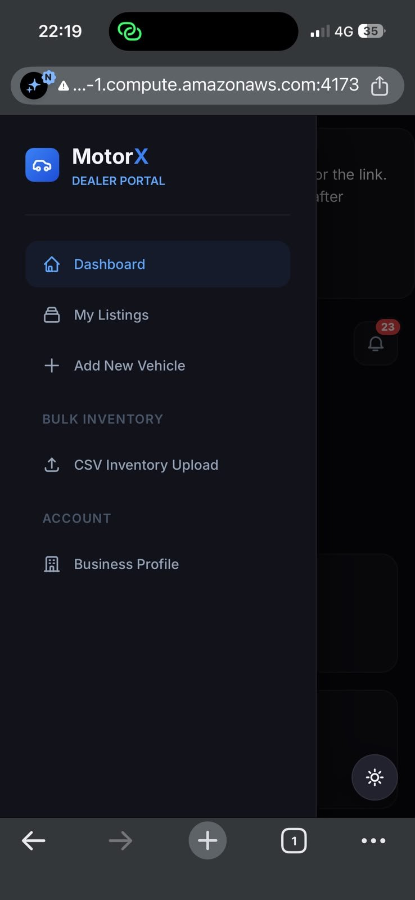
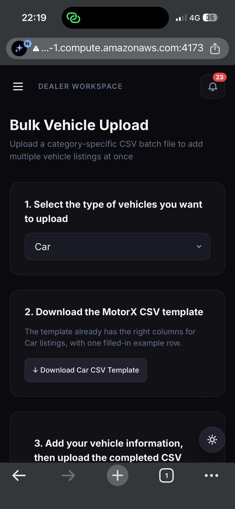

*Figure 12: MotorX on the EC2 deployment, opened on a phone over 4G through the public host name (port 4173)*

Figure 12 confirms that the deployment answers on its public DNS name from outside the AWS network (CT-05, E2E-A3), and that the buyer marketplace, the dealer navigation and the bulk-upload page are laid out for a phone screen (UR-16–17; supporting E2E-07 and E2E-12). The warning sign in the address bar is the browser reporting a plain-HTTP connection, recorded as F-15.

*Figure 13: Buyer marketplace on a desktop browser: natural-language search box, filters, sorting, result count and Compare buttons*

Figure 13 shows FR-MARKET-07 and FR-SEARCH-01–06 on screen: 30 active vehicles with their photos, the search box that accepts everyday language, the filter panel, “Newest First” sorting, and the Compare toggle on each card (E2E-07, E2E-08).

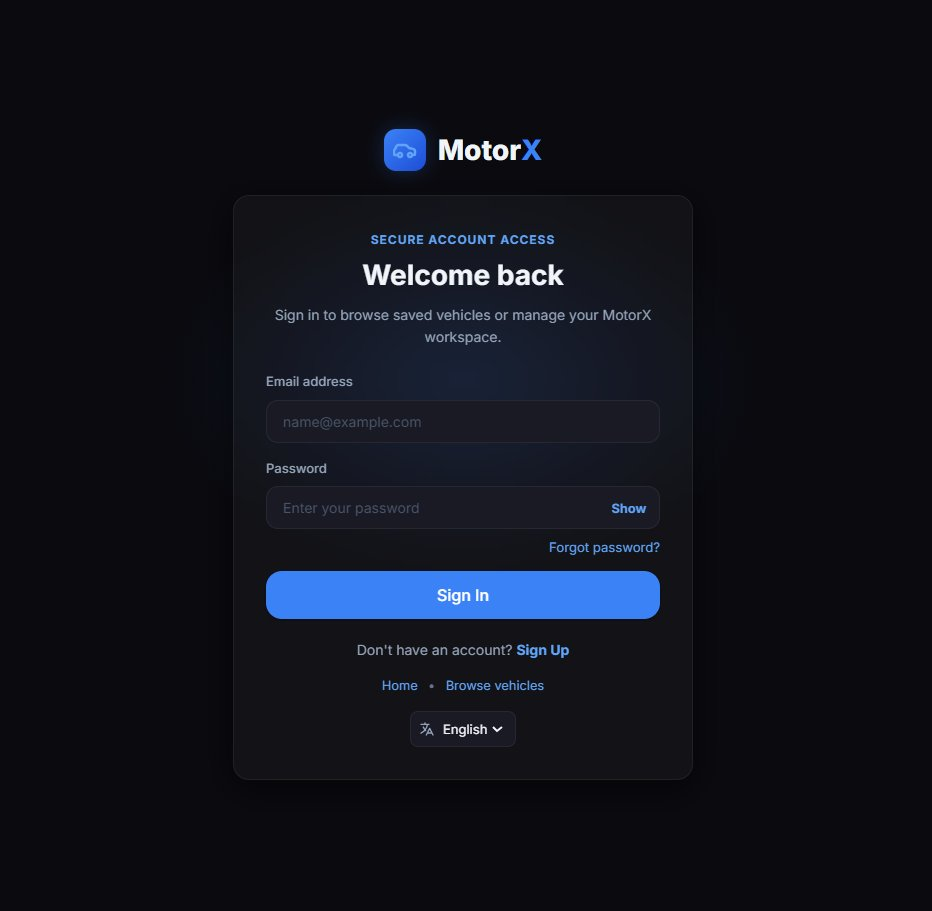

*Figure 14: Sign-in page backed by Firebase Authentication, with password reset and the language selector*

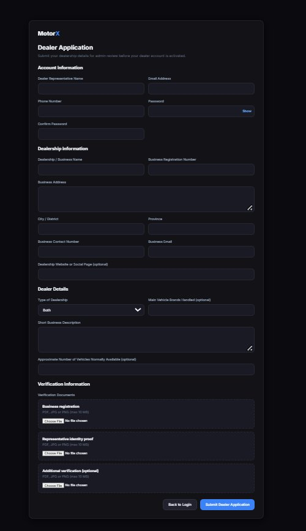

*Figure 15: Dealer application form: representative, dealership and dealer details, and the three verification-document uploads*

Figures 14 and 15 show the entry points for E2E-01 and E2E-02: sign-in with password reset (FR-USER-04–05) and the dealer application with its required fields and document uploads (FR-DEALER-09; PDF, JPG or PNG up to 10 MB, checked by UT-04, UT-05 and IT-01).

*Figure 16: Dealer dashboard: listing totals by status, recent inventory and recent CSV uploads with their final status*

Figure 16 shows FR-DEALER-05–07 and FR-ETL-31: 67 listings split into active, draft, sold and archived, and four CSV imports ending as “completed” or “completedWithErrors”. The raw status wording is finding F-16. The banner above the dashboard asks the dealer to verify their e-mail address before an application can be approved.

*Figure 17: Manage Inventory: tabs for listings needing attention and archived stock, a “Last confirmed” column, row selection and one-click Mark sold / Archive*

Figure 17 shows the stock tools added in this cycle (Extension: bulk actions and stale stock; E2E-09): the “Needs attention” tab that collects stale listings, the date each listing was last confirmed, check boxes for bulk actions, and the per-row Mark sold and Archive buttons (UT-27, UT-34, IT-10).

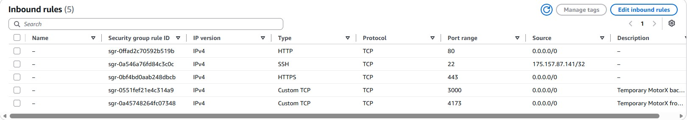

*Figure 18: Inbound rules of the EC2 security group motorx-staging-sg (account details cropped out)*

Figure 18 is the network-level half of CT-04. SSH is open to a single address, and web traffic to ports 80 and 443. Ports 3000 (API) and 4173 (website) are open to everyone and marked temporary; they stay open until F-15 is fixed, after which only 443 (and 80, redirecting to it) should remain. Redis (6379) and MinIO (9000/9001) have no rule, which matches the 127.0.0.1 binding checked in compose-ec2-ports.txt (F-14).

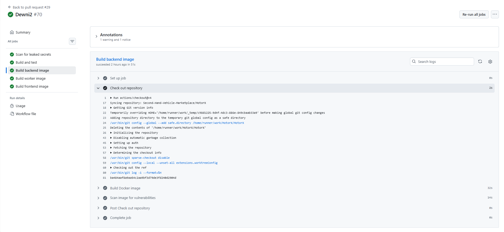

*Figure 19: GitHub Actions run #70 for pull request #29 (branch Dewni2): all five CI jobs passed*

Figure 19 is the CI evidence for NF-05 and for the automated suites. Every job of the MotorX workflow passed on this pull request: the scan of the full history for leaked secrets, the build-and-test job that runs the automated tests, and the backend, worker and frontend image builds, each followed by a vulnerability scan of the built image. The checkout step shows the repository and the exact commit tested (ba484aaf). The run also carries one warning and one notice annotation, not shown here.

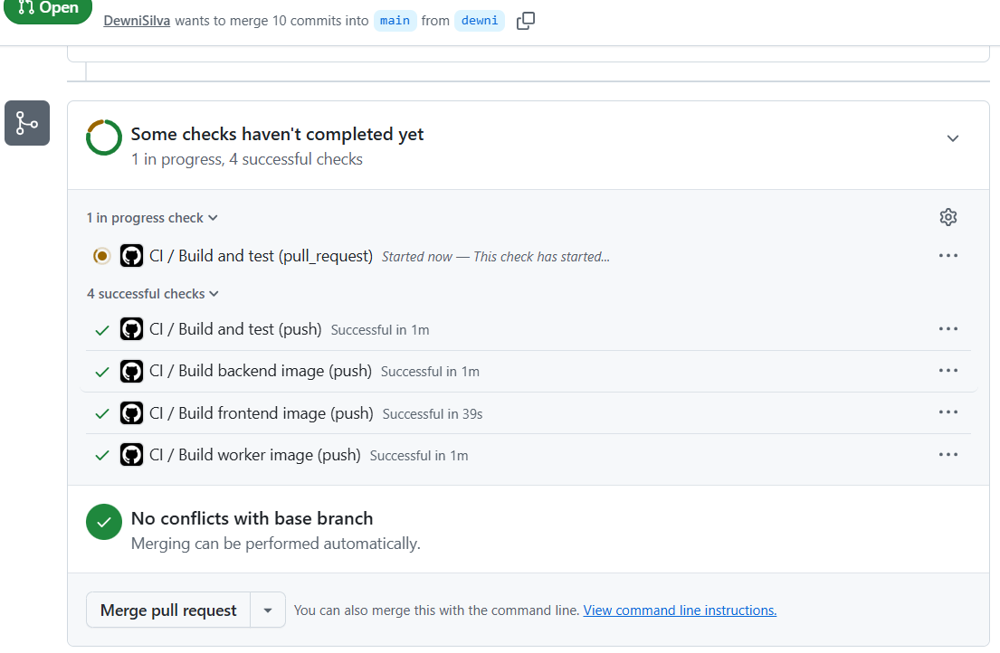

*Figure 20: Checks on an earlier pull request from branch dewni into main (14 Aug 2026), taken while the pull-request build was still running*

Figure 20 shows that CI runs on both events: the four checks triggered by the push (build and test, and the backend, frontend and worker images) had passed, and the same build-and-test job triggered by the pull request had just started. It also shows that GitHub offered “Merge pull request” before that check finished, so at the time passing CI was not a required condition for merging into main (F-17).
