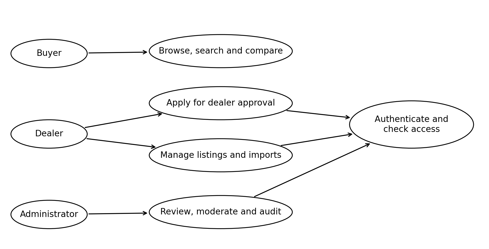
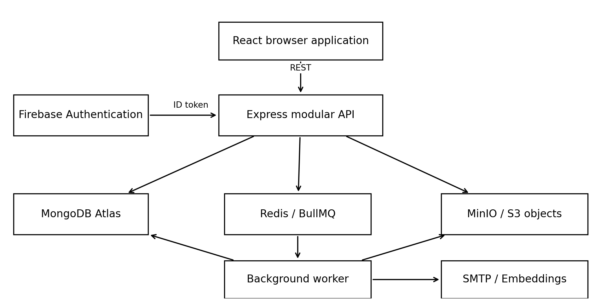
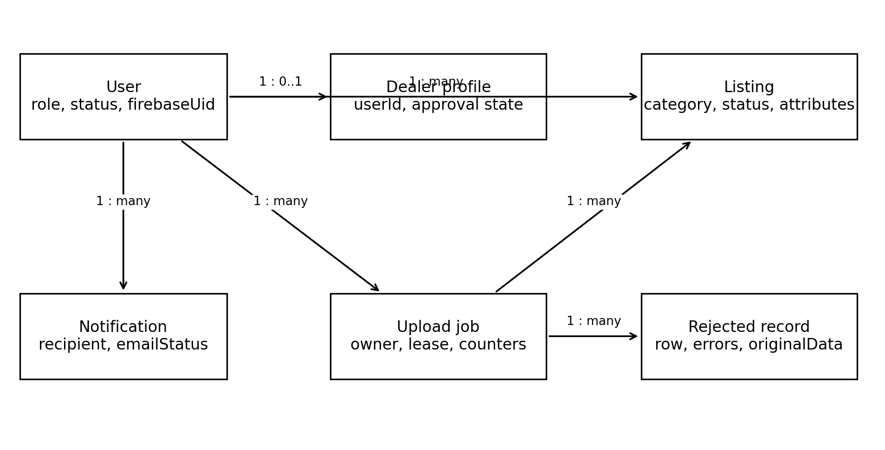
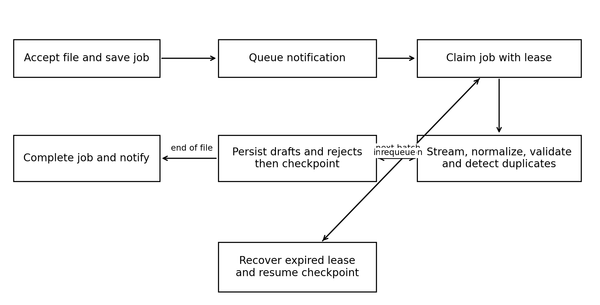
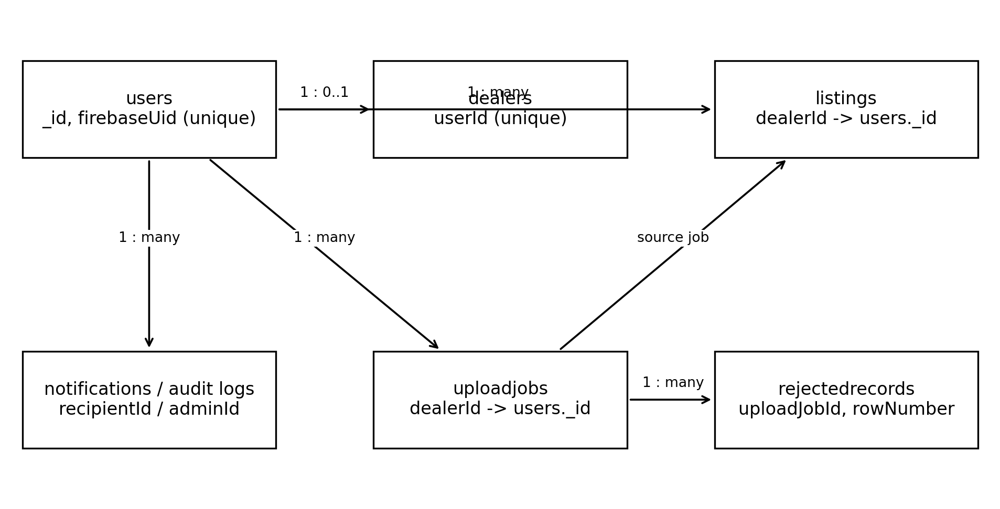
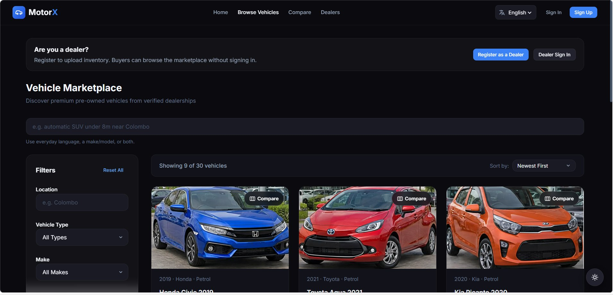
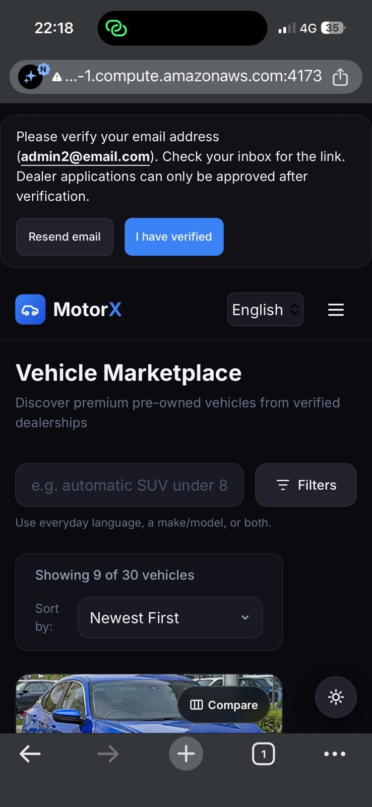
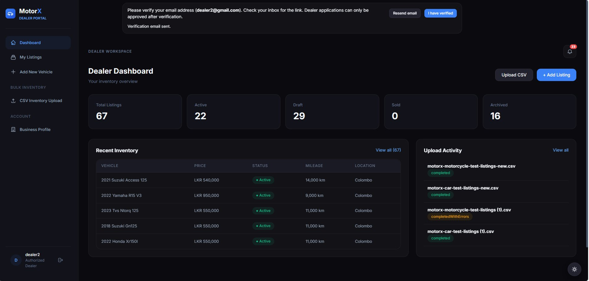
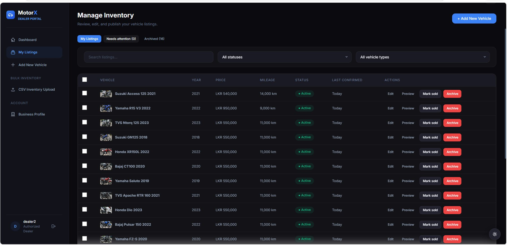

## MotorX

### Second-Hand Vehicle Marketplace with Intelligent Search and Automated Inventory Processing

CS3202 Final Project Report | 3 October 2026

Department of Computer Science and Engineering
University of Moratuwa

Project ID: 11
Group number: 23
Mentor: Mr. Bhanuka Siriwardana

| Index number | Name |
| --- | --- |
| 230616B | Silva T.D.R. |
| 230621K | Somarathna M.D.A.M. |
| 230633A | Thadshakan J. |

Prepared from the implemented MotorX system, the project requirements specification, and retained engineering evidence. Team and mentor details follow the existing project test report; they should be checked before submission.


---

## Abstract / Executive Summary

MotorX addresses two connected problems in second-hand vehicle trading: buyers must interpret inconsistent advertisements, while dealers spend time entering and maintaining inventory manually. The system provides a web marketplace with public vehicle discovery, approved dealer access, and administrator oversight. Its React and TypeScript frontend communicates with an Express modular API, while MongoDB Atlas stores application records, Redis and BullMQ coordinate background work, and S3-compatible object storage retains inventory files, images, and verification documents. Firebase Authentication supplies identity. A separate worker streams category-specific CSV inventories, normalizes and validates records, detects duplicates, stores valid vehicles as drafts, and preserves rejected rows for correction. Job leases, checkpoints, and database uniqueness constraints support recovery after interruption. Buyer discovery combines structured filters, natural-language interpretation, typo correction, and bounded semantic and lexical ranking, with lexical fallback when semantic services are unavailable. Six vehicle categories share validated contracts across the applications. The retained automated results contain 348 passing tests, comprising 147 backend, 94 worker, and 107 frontend tests. Recorded local benchmarks imported 5,000 rows in 11.1 and 11.2 seconds, while a documented worker interruption drill completed 60,000 distinct imported rows without duplicate source rows. These observations demonstrate useful functional and recovery behavior within the recorded environments; they do not establish production-scale capacity or continuous availability. Missing legacy image objects, incomplete browser acceptance journeys, and plain HTTP in the recorded EC2 demonstration remain material limitations. The outcome is an implemented marketplace that connects inventory preparation, buyer discovery, and administrative governance through traceable workflows. Future work should prioritize secure deployment, complete acceptance testing, measured search relevance, and sustained performance evaluation.


---

## Table of Contents

| Section | Page |
| --- | --- |
| Abstract / Executive Summary | 2 |
| 1. Introduction | 4 |
| 2. Literature Review | 5 |
| 3. System Models | 6 |
| 3.1 System Requirements | 6 |
| 3.2 System Design: Architecture | 7 |
| 3.2.1 Logical View | 8 |
| 3.2.2 Process View | 9 |
| 3.3 Database Design | 10 |
| 4. System Implementation / 4.1 Implementation Procedure | 11 |
| 4.2 Materials | 12 |
| 4.3 The Algorithm | 13 |
| 4.4 Main Interfaces: Buyer | 14 |
| 4.4.1 Dealer and Administrator Interfaces | 15 |
| 5. System Testing and Analysis | 16 |
| 5.3 Performance, Security and Failure Analysis | 17 |
| 6. Conclusion and Future Work | 18 |
| 7. References | 19 |
| Appendix A. Evidence and Submission Notes | 20 |

Figures 1–5 present system models; Fig. 6 presents algorithm pseudocode; Figs. 7–10 show existing interface captures. Page numbers correspond to the accompanying PDF. Appendix material is excluded from the nineteen-page main report.


---

## 1. Introduction

### 1.1 Background of the Application Domain

Used-vehicle discovery in Sri Lanka is supported by online classified services, including ikman and Riyasewana, where buyers inspect advertisements and contact sellers [1], [2]. Vehicle descriptions combine structured facts with seller-written text. A buyer may know a price ceiling, a fuel preference, or an intended use without knowing the exact model. Dealer stock introduces a related information problem: records prepared in spreadsheets must become consistent advertisements without losing the identity of the original vehicle or the history of its submission.

### 1.2 Motivation and Main Purpose

MotorX was developed to join vehicle discovery with controlled inventory preparation. The project requirements define public browsing, verified dealer participation, listing management, bulk inventory processing, intelligent search, notifications, and administrator control [3]. Manual entry alone does not address repeated uploads, invalid spreadsheet rows, or interrupted background work. Search alone cannot compensate for incorrectly categorized vehicles or advertisements that remain visible after their owner is suspended. The system therefore treats data preparation and access control as foundations of discovery.

### 1.3 System Overview and Outcome

The implemented product contains buyer, dealer, and administrator portals connected to a common API. Dealers prepare category-specific CSV files and subsequently attach photographs through a registration-number-based ZIP workflow. Imported vehicles remain drafts until publication. Buyers browse six categories and use filters, free-text search, comparison, and related-vehicle discovery. Administrators review dealer applications, moderate listings, inspect uploads, and consult audit records. The principal outcome is an operational software implementation with retained automated and deployment evidence. Its practical value lies in consistent vehicle records and visible processing outcomes; commercial adoption and reduced dealer effort have not yet been measured in a user study.


---

## 2. Literature Review

### 2.1 Related Systems and Retrieval Theory

The public catalogue pages of ikman and Riyasewana illustrate an established advertisement-based vehicle-discovery model. They provide relevant local comparison points, but their public pages do not reveal internal ingestion, moderation, or recovery mechanisms. Consequently, the comparison concerns observable workflows rather than claims that those systems lack particular internal capabilities. MotorX focuses on integrating dealer uploads and review controls with the marketplace described in its project specification.

Sentence-BERT demonstrates that sentence representations can support similarity retrieval by encoding meaning into vectors [4]. This provides a theoretical basis for matching descriptive requests to vehicle text. It does not imply that any particular embedding model understands every local phrase, abbreviation, or vehicle trade term. MotorX uses embedding-based retrieval as one component alongside exact filters and lexical matching; empirical relevance evaluation is still needed.

MongoDB documents hybrid retrieval as a combination of text and vector search [5]. The inspected MotorX service implements its own bounded merge and weighted ranking over lexical and vector candidates. Numeric budgets and category constraints remain filters. The service rechecks full constraints for merged vector results and falls back to lexical candidates when embedding generation or vector retrieval fails. This separates a buyer’s hard constraints from descriptive preferences.

### 2.2 Identity, Background Work and Contribution

Firebase documents server verification of client-issued ID tokens [6]. MotorX combines that identity check with local role, account-status, and ownership checks. BullMQ supports retries and configurable backoff for failed jobs [7]. MotorX adds persistent MongoDB job records, owner-token leases, checkpointed counters, and source-row uniqueness so that queue retries do not become duplicate vehicle advertisements. The contribution is an integration of established techniques for this vehicle workflow, rather than a new retrieval or queueing theory. No controlled comparison currently establishes that MotorX outperforms the commercial services in relevance, throughput, or usability.


---

## 3. System Models

### 3.1 System Requirements

Functional requirements center on three actors. A buyer must browse active inventory, narrow results by vehicle properties, inspect photographs and dealer details, and compare vehicles. An applicant must submit a dealer profile and verification materials; an approved dealer must maintain listings, upload category-specific inventory, attach photographs, review rejected rows, and publish drafts. An administrator must approve or reject applications, suspend accounts, moderate inventory, inspect upload activity, and consult audit information. Notifications communicate review and processing outcomes without making email delivery a prerequisite for completing the initiating action.

Non-functional requirements address consistent validation, authorization, responsive interfaces, maintainability, performance, and recovery. The specification includes a 5,000-row processing target and broader availability and response-time goals. Such goals remain acceptance criteria until demonstrated in the relevant environment. Shared TypeScript contracts and Zod schemas reduce rule drift, while asynchronous work prevents long imports from occupying an HTTP request. Private files require controlled access, and only publicly eligible listings should appear in buyer discovery.



Fig. 1 separates public discovery from authenticated operations. Dealer approval is an administrative decision, while listing and import actions require approved dealer access. The diagram groups related use cases to keep the overview readable; it is not a complete endpoint inventory.


---

## 3.2 System Design: Architecture

MotorX uses an Express modular monolith for interactive application behavior and a separate worker process for background work. The API is divided into feature modules for authentication users, dealers, marketplace listings, inventory, search, buyers, administration, and notifications. Controllers handle requests, services coordinate rules, and repositories implement persistence. This arrangement keeps deployment simpler than an independent service for every feature while isolating long-running processing from buyer requests.



Fig. 2 shows the browser communicating with the API through REST and JSON. MongoDB Atlas stores durable business state. Redis carries BullMQ work notifications and supports rate limiting. MinIO provides the S3-compatible object interface used by the local and recorded EC2 stacks. Firebase provides identity; the API verifies the token before applying MotorX access rules. The worker also accesses storage and MongoDB and uses external services for embedding generation and SMTP delivery when configured.

A shared-contracts workspace supplies schemas and types to the frontend, API, and worker. This is particularly important for category-specific validation: a motorcycle, bus, and electric car must not silently accept incompatible attributes. Docker Compose assembles the development and demonstration stack. The repository also defines an AWS ECS deployment workflow, but the retained live evaluation concerns a single EC2 Compose deployment. An available deployment definition is distinct from evidence that that deployment has been executed.


---

## 3.2.1 Logical View



Fig. 3 presents a domain class view rather than a diagram of every TypeScript class. A User links the external Firebase identity to a local role and account status. A Dealer profile contains business and verification information and belongs to one user. Listings are owned through the user identifier of the dealer account, an association that is important when joining business-profile information for public display.

A Listing stores common vehicle facts, a category-specific attributes object, images, lifecycle status, and optional import provenance. An Upload job records the dealer account, selected category, input object, processing status, counters, and lease state. It may produce many listings and rejected records. A Rejected record preserves the input row, row number, reason, and validation messages, allowing the dealer to correct the source spreadsheet rather than infer what failed.

Notifications belong to recipients and retain read state and email-delivery status. Audit records capture significant administrator actions and document access. The model separates identity, business approval, publication, and processing states. Approval does not publish every imported vehicle automatically, and a completed upload does not imply that every row was valid. These distinctions make the interface and administration views explainable.


---

## 3.2.2 Process View



Fig. 4 follows the CSV upload process. The API validates access and file acceptance, stores the object, and creates a durable pending job. A BullMQ message requests processing, but MongoDB remains the source of job truth. If queue publication is unavailable, the reconciler can rediscover pending work. The worker claims the job with a unique owner token and renews its lease while work continues.

The worker reads the file as a stream and processes bounded batches. Normalization and category validation precede duplicate checks. Valid rows become draft listings; invalid or duplicate rows produce rejected records. Persistence is followed by a checkpoint containing cumulative counters. Recovery resumes after the last checkpoint, while source-row uniqueness handles data that may have been stored before an interruption prevented its checkpoint.

Completion reports whether processing succeeded cleanly or with rejected rows. A transient dependency failure returns work for retry; permanent input failures result in a failed job. Lease-owner checks prevent an older attempt from updating job progress after another worker takes over. The photographs ZIP is processed as a separate job matched to listings created by the earlier upload. Notifications expose the outcome, and email is delivered through a retrying outbox.


---

## 3.3 Database Design



Fig. 5 is an entity-relationship view of references in a document database; it does not imply relational foreign-key enforcement. Users retain Firebase identity and local authorization state. Dealer profiles reference users, and listing dealerId also references users rather than the dealer-profile collection. Upload jobs reference their owner and object-storage key. Rejected records reference the upload job and source row. Notification recipients and administrator audit actors link actions back to local accounts.

Listing documents contain title, make, model, year, price, currency, location, category, status, and images. Category-specific attributes are stored as a flexible object but validated at the application boundary by shared discriminated schemas. Registration values are normalized separately from their display form. Import provenance includes sourceUploadJobId and sourceRowNumber. Object contents are retained in storage rather than embedded as image or CSV binaries in MongoDB.

The current listing schema defines a partial unique index for normalized registration numbers in draft or active status, preventing simultaneous open advertisements for the same plate. A second unique index on upload job and source row prevents duplicate imported rows on retry. Compound indexes support publication order, dealer inventory, category, price, year, fuel, transmission, and other filters. Older database prose describes registration uniqueness as service-only; the inspected schema is the authoritative description for this report. Backend and worker model definitions must remain aligned when shared collection fields change.


---

## 4. System Implementation

### 4.1 Implementation Procedure

Implementation is organized as an npm workspace repository containing frontend, backend, worker, and shared-contracts packages. TypeScript makes domain and API shapes explicit across those boundaries. React provides the portal interfaces and Vite produces the browser build. Express implements the REST API, Mongoose defines application persistence, and Zod validates request and vehicle data. The shared vehicle contract supports cars, motorcycles, vans, trucks, three-wheelers, and buses with conditional powertrain attributes.

The worker implements streaming extraction, normalization, validation, transformation, duplicate detection, persistence, and optional embedding generation. A small concurrency pool limits simultaneous embedding requests. Missing embeddings do not prevent otherwise valid inventory from being retained. Image processing rebuilds uploaded images from decoded pixels and creates smaller copies for display. Inventory data, dealer documents, and public listing images use distinct storage paths and access routes.

The frontend separates buyer, dealer, and administrator navigation and supplies responsive layouts and English, Sinhala, and Tamil interface resources. Server-side authorization remains necessary even when the interface hides unavailable actions. Query and application state are cleared or refreshed around account changes so that one session does not expose another account’s cached private data.

Continuous integration builds the workspaces, executes automated checks, and scans repository secrets and container dependencies. Deployment configuration uses immutable release images and health checks. For development, the documented runtime is Node 24 in application containers, with remote Atlas and Firebase configuration. Environment variables provide credentials and service addresses; their live values are deliberately excluded from this report. The existing CI and deployment guides provide reproducible procedures, but no unrecorded release is assumed to have succeeded.


---

## 4.2 Materials

The principal operational materials are dealer-supplied inventory CSV files, vehicle-image ZIP archives, dealer-verification documents, and manually entered business and vehicle profiles. A category is selected before CSV upload so that every row is validated against the relevant template. Shared fields include registration number, vehicle make and model, year, price, and location; attributes depend on vehicle category and powertrain. The downloadable template and field guide reduce ambiguity at the point of preparation.

A photograph archive uses one folder per registration number. The second upload step matches those folders to vehicles created by the preceding CSV import. This separates row validation from image processing and allows image failures to be reported without discarding valid inventory records. Stored object keys maintain provenance, while rejected rows retain originalData and human-readable errors. Verification documents are private materials with content checks and controlled administrator access, rather than public advertisement assets.

Development and evaluation use synthetic records to exercise valid rows, malformed values, duplicates, category boundaries, and interruption behavior. The recorded local throughput benchmark uses 5,000 rows. A separate documented crash drill uses 60,000 rows. These are test workloads, not measurements of the number of commercial vehicles in MotorX. The retained EC2 smoke result observed 31 active listings at its execution time; this is a dated snapshot rather than the current catalogue size.

Existing repository screenshots provide interface illustrations, and JSON, text, and CSV evidence files provide evaluation results. The requirements specification and test report provide project context and traceability. No third-party vehicle catalogue or scraping dataset was established by the inspected implementation materials. The two supplied example PDFs guided organization and presentation only; their prose, screenshots, architecture, group details, and numerical results have not been transferred into MotorX findings.


---

## 4.3 The Algorithm

The most consequential algorithm is resumable inventory ingestion because one upload can create many persistent advertisements. Its objective is to retain valid records, explain rejection, and recover safely when processing stops between persistence and checkpointing. Fig. 6 expresses the control flow in pseudocode rather than reproducing source code.

```text
PROCEDURE ImportInventory(jobId)
  owner <- new unique token
  job <- claim pending job using owner
  IF claim fails THEN RETURN
  renew lease while processing
  counts <- stored checkpoint counters
  stream <- open stored CSV
  FOR EACH batch after checkpoint
    assert current lease is held
    prepared <- normalize and validate(batch, category)
    resumed <- find rows already stored for this job
    candidates <- prepared.valid excluding resumed
    unique, duplicates <- detect open registration matches(candidates)
    enforce remaining dealer listing capacity
    store unique rows as drafts with jobId and sourceRowNumber
    store invalid and duplicate rows with reasons, insert once
    update counts including rows already persisted
    checkpoint counts only if owner still holds lease
  END FOR
  complete job only with current owner token
  record outcome notifications
ON ERROR
  IF lease lost THEN stop this attempt
  ELSE IF transient and retry budget remains THEN return job to pending
  ELSE fail job and record reason
FINALLY stop renewal and release local lease tracking
```

Fig. 6. Pseudocode for checkpointed CSV ingestion with lease ownership.

The unique source-job and source-row pair is the retry invariant. If persistence succeeds and checkpointing fails, the next attempt recognizes stored rows instead of inserting them again. Registration normalization supplies a separate business duplicate rule, while the database index protects against concurrent open advertisements. Invalid data does not force valid rows in the same file to fail. Streaming batches bound parsing memory, although the registration-key set can still grow with processed valid rows.

Search uses a complementary algorithm. Query analysis extracts structured constraints and corrects recognized terms; explicit filters override inferred values. Descriptive requests merge bounded lexical and vector candidates, check constraints, and rank with 0.65 semantic score plus 0.35 lexical score. Structured-only requests take a direct query path. Semantic-service errors select lexical fallback. These inspected weights are implementation settings, not an experimentally proven optimum.


---

## 4.4 Main Interfaces: Buyer

The buyer marketplace presents vehicle cards with search, categories, and filter controls. A buyer can move from broad discovery to a vehicle detail page, inspect photographs and specifications, and obtain the corresponding dealer profile. Comparison and related-vehicle views support a decision across alternatives. The interface avoids requiring an account merely to inspect public inventory.



Fig. 7 shows the catalogue presentation captured during earlier project evaluation. Its displayed inventory belongs to that capture date. Category-dependent filtering corresponds to the shared vehicle model rather than assuming every vehicle has car-specific fields.



Fig. 8 illustrates the responsive buyer layout. A screenshot demonstrates visible presentation at one device size; it does not substitute for keyboard, screen-reader, or complete browser journey testing.


---

## 4.4.1 Dealer and Administrator Interfaces

The dealer portal provides an overview of stock and processing activity. Inventory management supports listing lifecycle actions, category-aware editing, photographs, and bulk operations. The upload flow provides a category template, CSV submission, progress and rejection information, and the subsequent image archive step. This makes processing visible rather than leaving a dealer to infer whether a background task completed.





Figs. 9 and 10 show existing dealer views from retained evidence. Imported drafts can be reviewed before publication, and rejected rows remain tied to their source upload. The administrator portal provides application review, user and listing moderation, upload monitoring, audit logs, and system health. Document access is controlled and audited. An administrator interface screenshot was not identified among the retained captures, so the administration description is based on the implemented portal and routes.


---

## 5. System Testing and Analysis

### 5.1 Testing Approach

Evaluation combines isolated unit and component tests, real-database integration tests, HTTP journeys through the Express application, container recovery drills, and read-only smoke procedures. Validation tests use boundary and invalid-input cases. Authorization tests exercise role and ownership restrictions, including attempts to use another dealer’s resource identifiers. Worker tests examine duplicate handling, lease loss, interruption, notification retries, and malformed archives. Frontend component tests exercise user-facing behavior under jsdom, while manual browser procedures cover layout and complete workflows.

The stored backend and worker runs use an isolated Docker test environment with MongoDB 7 configured as a replica set, Redis, and MinIO. HTTP journeys replace Firebase verification and the object-storage client where specified, so those results do not prove live identity-provider or SMTP integration. Results below are retained runs from September 2026, not a fresh execution performed while preparing this final report [8].

### 5.2 Automated Results and Coverage

| Workspace | Passed / total | Statement coverage | Branch coverage |
| --- | --- | --- | --- |
| Backend | 147 / 147 | 66.90% | 53.69% |
| Worker | 94 / 94 | 62.22% | 55.52% |
| Frontend | 107 / 107 | 69.01% | 68.36% |
| Total | 348 / 348 | Reported by workspace | Reported by workspace |

The figures are taken directly from the retained Vitest JSON files and total coverage objects. The older run-metadata and evidence README retain a 50-test frontend baseline; the later frontend results contain 107, explaining the increase from 291 to 348 total tests. Coverage files are separate retained artifacts, and are not asserted to share exactly the same execution timestamp as every result file. Statement coverage is distinct from line coverage: the corresponding line percentages are 72.57%, 63.17%, and 71.23%.

All saved automated cases passed, but branches remain untested and a passing component test does not demonstrate a complete production workflow. The existing test report records fifteen browser journeys as unexecuted. Search relevance scoring, concurrent buyer-and-upload load, and response-time percentiles remain evaluation gaps. These gaps are retained rather than converted into passing claims.


---

## 5.3 Performance, Security and Failure Analysis

The local 5,000-row benchmark recorded 11.1 and 11.2 seconds, approximately 450 and 445 records per second, against a 120-second target. This supports the target in the benchmark configuration. It does not establish the same throughput with a live embedding provider, concurrent uploads, a larger catalogue, or different compute capacity. The documented interruption drill completed 60,000 listings from 60,000 distinct source rows after a worker was killed, in a recorded total of 4 minutes 43 seconds. It supports CSV recovery under the tested fault, rather than every storage, network, and deployment failure.

The EC2 smoke artifact dated 27 September 2026 records fifteen passing and two failing checks. Public browse returned only active listings, protected unauthenticated routes rejected requests, and readiness confirmed database access. Missing image objects account for the recorded image failures. A natural-language search call took 228 milliseconds in that smoke run and reported structured mode; it should not be presented as a measurement of semantic retrieval. Single observations cannot establish a p95 latency target.

The test report records Lighthouse performance scores of 26 on a development-served marketplace page and 84 on the production-served home page. Different pages were audited, so the figures indicate a deployment improvement without constituting a controlled before-and-after comparison. Accessibility remained 94 and best practices 56 in those reported audits. Plain HTTP on the recorded EC2 deployment remains a security acceptance issue, and browser acceptance was incomplete.

Implemented security measures include token verification, account-status and ownership checks, private document access, image reconstruction, rate limits, and administrator audit records. Internal Redis and MinIO exposure was restricted in the recorded deployment. Email delivery uses a persisted outbox and retry schedule, so SMTP errors do not roll back successful moderation or ingestion actions. Sustainable availability, backup restoration, real-provider integration, and production transport security require further evidence. Production recommendations in the resilience guide are design intentions until deployed and tested.


---

## 6. Conclusion and Future Work

### 6.1 Conclusion

MotorX delivers the central workflow proposed in the introduction: dealer inventory can be prepared and checked in bulk, published through a controlled lifecycle, and discovered through a public vehicle marketplace. The category-aware contract connects form input and CSV processing, reducing inconsistent interpretation of vehicle properties. Rejection records explain failed input, while import provenance and audit records connect outcomes to their source actions. Role and ownership checks separate public discovery from dealer and administrator responsibilities.

The modular API and separate worker provide a practical architecture for the project scope. Durable job records, leases, checkpoints, and database uniqueness constraints address the risk that interrupted work will disappear or create duplicate advertisements. Retained tests and the crash drill provide evidence for these mechanisms. Search combines exact constraints with descriptive ranking and a fallback path, although its relevance advantage has not yet been measured with representative buyer judgments.

The evaluation supports an implemented and testable system rather than unconditional production readiness. All 348 retained automated tests passed, and the local processing target was met. Missing historical images, incomplete browser acceptance, plain HTTP in the documented demonstration, and unmeasured concurrency remain practical constraints. These limitations qualify the outcome and define the remaining work before a public release.

### 6.2 Future Work

The immediate priority is a secure public endpoint with HTTPS, corrected legacy image storage, and completed browser journeys for onboarding, upload, publication, comparison, and administrator moderation. Acceptance should include actual Firebase and SMTP paths as well as keyboard access and representative mobile devices. Deployment and data restore procedures should be exercised rather than assessed from configuration alone.

Further evaluation should use realistic simultaneous buyer traffic and dealer imports, reporting latency percentiles and error rates. Search quality should be measured on a labeled set of local buyer requests, including Sinhala and Tamil intent, before tuning weights or adopting another embedding model. Provider outages and large archives should be included in resilience trials. Longer-term monitoring and user observation can establish availability, data-quality improvements, and whether bulk workflows reduce dealer effort in practice.


---

## 7. References

[1] ikman, “Used Cars for Sale in Sri Lanka.” [Online]. Available: https://ikman.lk/en/ads/sri-lanka/cars?enum.condition=used. Accessed: Oct. 3, 2026.

[2] Riyasewana, “Vehicles for Sale in Sri Lanka.” [Online]. Available: https://riyasewana.com/search/0-0. Accessed: Oct. 3, 2026.

[3] MotorX Group 23, “MotorX — Software Requirements Specification,” ver. 1.0, Aug. 2026. Project document: Gropu23_SRS.pdf.

[4] N. Reimers and I. Gurevych, “Sentence-BERT: Sentence Embeddings using Siamese BERT-Networks,” in Proc. EMNLP-IJCNLP, 2019, pp. 3982–3992, doi: 10.18653/v1/D19-1410. Available: https://aclanthology.org/D19-1410/.

[5] MongoDB, “How to Perform Hybrid Search.” [Online]. Available: https://www.mongodb.com/docs/vector-search/hybrid-search/hybrid-search-overview/. Accessed: Oct. 3, 2026.

[6] Google Firebase, “Verify ID Tokens.” [Online]. Available: https://firebase.google.com/docs/auth/admin/verify-id-tokens. Accessed: Oct. 3, 2026.

[7] BullMQ, “Retrying Failing Jobs.” [Online]. Available: https://docs.bullmq.io/guide/retrying-failing-jobs. Accessed: Oct. 3, 2026.

[8] MotorX Group 23, “Master Test Plan and Test Evaluation Report,” ver. 3.1, Sep. 28, 2026, with retained test-evidence JSON, text, CSV and screenshot artifacts. Project documents: docs/MotorX_Test_Plan_Report.md and docs/test-evidence/.


---

## Appendix A. Evidence and Submission Notes

### A.1 Evidence Provenance

Architecture and algorithm descriptions were checked against README.md, backend search.service.ts and listing.model.ts, worker uploadJob.service.ts and pipeline/persist.ts, the shared vehicle contracts, and RESILIENCE.md. Database prose was reconciled with current schema indexes. No live credentials from .env were used in this report.

| Evidence path under docs/test-evidence/ | Use in report |
| --- | --- |
| backend-results.json; worker-results.json; frontend-results.json | 348 passing tests |
| coverage-backend.json; coverage-worker.json; coverage-frontend.json | Coverage totals |
| benchmark-output.txt | Two 5,000-row runs |
| ec2-smoke-results.json | 15 passes, 2 failures; dated deployment snapshot |
| run-metadata.json; README.md | Older baseline and environment |
| screenshots/marketplace-desktop.jpg; ec2-phone-marketplace.jpg | Buyer interfaces |
| screenshots/dealer-dashboard.jpg; manage-inventory.jpg | Dealer interfaces |

### A.2 Submission Checks

The nineteen-page PDF before this appendix follows the template’s 15–20-page range. Main prose is 12 point, diagrams have numbered captions, and pseudocode uses Courier New at 8 point inside a bordered box. The table of contents uses the accompanying PDF pagination. Word pagination can vary with installed fonts and printer settings; the PDF is the fixed-layout version.

The filename contains the three index numbers retained in the project documents. If submission is individual, use the submitting member’s index number followed by the project title. Confirm the mentor spelling and cover details against the official course record. Existing screenshots and test results describe prior evaluation dates. Before claiming current acceptance, rerun the relevant checks and update results, unresolved findings, screenshots, and dates together.
